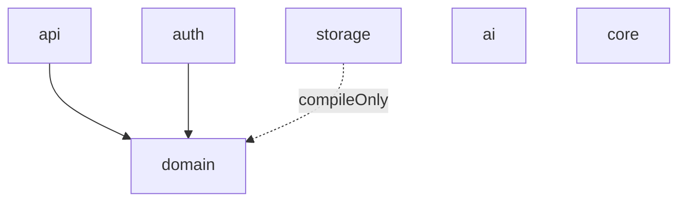

# 들어가며

[설명 문서]()에서 다룬 모듈 경계 설계를 실제로 어떻게 `settings.gradle`과 각 모듈의 `build.gradle.kts`에 구현했는지, 그리고 모듈을 분리하는 과정에서 storage·ai 모듈 내부를 어떻게 정리했는지를 정리한다.

# 1. 모듈 선언

`settings.gradle`에 6개 모듈을 등록했다.

```groovy
rootProject.name = 'littleWriter'

include 'domain'
include 'api'
include 'auth'
include 'storage'
include 'ai'
include 'core'
```

# 2. 모듈별 의존성 그래프

각 모듈의 `build.gradle.kts`에 선언된 의존성을 그대로 옮기면 다음과 같다.

**domain** — 그래프의 뿌리, 어떤 모듈도 의존하지 않음

```kotlin
dependencies {
    compileOnly("org.springframework:spring-context")
}
```

**api** — domain만 의존

```kotlin
dependencies {
    compileOnly("org.springframework.boot:spring-boot-starter-web")
    implementation(project(":domain"))
}
```

**auth** — domain만 의존, JWT 라이브러리 추가

```kotlin
dependencies {
    compileOnly("org.springframework.boot:spring-boot-starter-web")
    implementation(project(":domain"))
    implementation("com.auth0:java-jwt:4.4.0")

    testImplementation("org.springframework.boot:spring-boot-starter-web")
}
```

**storage** — domain을 `compileOnly`로만 참조(구현체가 domain의 인터페이스만 알면 되는 관계), JPA/Redis/S3 구현체를 여기 몰아넣음

```kotlin
dependencies {
    implementation("org.springframework.boot:spring-boot-starter-data-jpa")
    implementation("org.springframework.boot:spring-boot-starter-data-redis")
    implementation("software.amazon.awssdk:s3:2.35.1")

    runtimeOnly("com.mysql:mysql-connector-j")
    runtimeOnly("com.h2database:h2")

    compileOnly(project(":domain"))
}
```

**ai** — 다른 모듈을 전혀 의존하지 않는 독립 모듈

```kotlin
dependencies {
    implementation("org.springframework.cloud:spring-cloud-starter-openfeign")
    testImplementation(platform("org.junit:junit-bom:5.10.0"))
    testImplementation("org.junit.jupiter:junit-jupiter")
}
```

의존성 그래프로 그리면 다음과 같은 방사형 구조가 된다.



`ai`가 domain조차 의존하지 않는 건 의도적인 설계다 — AI 파이프라인 자체는 도메인 개념(Book, BookInProgress 등)을 몰라도 되고, 순수하게 "입력을 받아 텍스트/이미지를 생성해 반환하는" 역할만 하도록 격리했다. domain과의 연결은 이 모듈을 사용하는 쪽(어댑터)에서 담당한다.

# 3. storage 모듈 정리 (`eadad79`)

모듈을 나눈 직후, storage 모듈에는 아직 설정이 제대로 자리 잡지 못한 상태였다. 이 커밋에서 정리한 것:

- 루트 `build.gradle`에 남아있던 설정 일부를 storage 모듈로 이동
- `AwsS3Config`, `JpaConfig`, `RedisConfig`, `StorageDataSourceConfig`를 storage 모듈 내부로 위치시켜, "영속성 관련 설정은 storage가 전담한다"는 경계를 설정 클래스 배치로도 일치시킴
- `BookJpaEntity`, `BookJpaRepository` 등 JPA 관련 클래스를 정리

# 4. ai 모듈 내부 재작성 (`7ab8c27`, `a04fe16`)

## 4.1 기존 구조 삭제

모듈 분리 이전의 ai 관련 코드는 `com.pkg.core` 패키지에 `Ai`, `AiApiClient`, `AiContextQuestionGenerator`, `AiImageGenerator`, `ContextAndQuestionGeneratorAdapter`, `GenerateContextClient`, `GenerateIllustrationClient`, `ImageGeneratorAdapter` 같은 클래스들이 개별적으로 흩어져 있는 구조였다. `7ab8c27` 커밋에서 이 클래스들을 전부 삭제했다.

## 4.2 LLMChain/LLMStep 패턴으로 재작성

`a04fe16` 커밋에서 이를 대체하는 구조를 새로 만들었다.

```
ai/src/main/java/com/pkg/
├── adapter/
│   └── BookPageGeneratorAdapter.java
└── core/
    ├── CallStep.java
    ├── ImageGenerator.java
    ├── LLMChain.java
    ├── LLMStep.java
    └── TextGenerator.java
```

기존에는 텍스트 생성용 클라이언트와 이미지 생성용 클라이언트가 각자 별개의 클래스로 존재해 호출 순서나 실패 처리 로직이 클래스마다 따로 구현돼 있었다. `LLMChain`/`LLMStep`으로 재구성하면서, 여러 단계(`CallStep`)로 이어지는 생성 흐름을 하나의 체인으로 표현할 수 있게 됐고, `TextGenerator`/`ImageGenerator`는 각 단계가 구현해야 할 인터페이스로 정리됐다. `BookPageGeneratorAdapter`는 domain 쪽 인터페이스와 이 체인을 연결하는 어댑터 역할을 한다 — ai 모듈이 domain을 직접 의존하지 않는 대신, adapter 계층에서 두 모듈을 이어주는 구조다.

OpenAI 호출도 이 시점에 Feign 기반(`spring-cloud-starter-openfeign`)으로 재구성해, 기존의 수작업 HTTP 클라이언트 코드를 선언적 인터페이스로 대체했다.

# 5. 정리

| 모듈 | 의존 대상 | 역할 |
|---|---|---|
| domain | (없음) | 순수 도메인 로직, 인터페이스 정의 |
| api | domain | HTTP 진입점 |
| auth | domain | 인증/인가, JWT |
| storage | domain(compileOnly) | JPA/Redis/S3 구현체 |
| ai | (없음) | LLM/이미지 생성 파이프라인, LLMChain/LLMStep |
| core | (없음) | 공통 유틸 |

모듈 경계를 Gradle 프로젝트 의존성으로 강제한 뒤 가장 체감이 컸던 부분은, 이후 ai 모듈 내부를 통째로 갈아엎은 `7ab8c27`/`a04fe16` 두 커밋에서 다른 모듈은 전혀 건드릴 필요가 없었다는 점이다 — 애초에 ai를 참조하는 모듈이 없으니, 내부 구현을 자유롭게 재작성해도 영향 범위가 ai 모듈 자체로 한정됐다.
