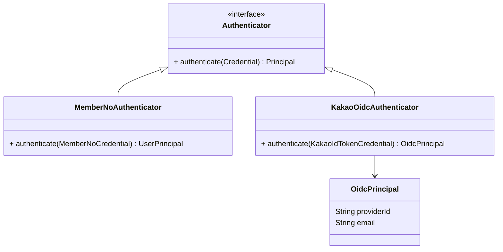

# 들어가며

[설명 문서]()에서 다룬 회원가입 도메인 재설계의 실제 구현을 정리한다.

# 1. id_token 검증: 기존 Authenticator 확장하기

## 1.1 KakaoOidcAuthenticator

기존 인증 코어의 `Authenticator` 인터페이스를 그대로 구현하는 `KakaoOidcAuthenticator`를 추가했다. 회원번호 기반 인증(`MemberNoAuthenticator`)과 동일한 인터페이스를 따르기 때문에, 인증 이후 단계(필터, 컨트롤러)는 인증 수단이 무엇인지 몰라도 되는 구조가 그대로 유지됐다.



`KakaoOidcAuthenticator`는 카카오가 발급한 `id_token`을 카카오 공개키로 검증하고, 검증에 성공하면 토큰의 클레임(providerId, email 등)을 담은 `OidcPrincipal`을 반환한다. 이 시점에서는 아직 내부 회원(Member)과 연결되지 않은, "카카오가 보증하는 신원 정보"일 뿐이다.

# 2. 회원가입 도메인: 최종 구조

## 2.1 커맨드 기반 구조

앞서 설명 문서에서 다룬 두 번의 재설계 끝에, 최종적으로는 `MemberRegisterService`가 두 개의 커맨드를 순서대로 실행하는 구조로 정리됐다.

```mermaid
sequenceDiagram
    participant Controller as AuthController
    participant Authn as KakaoOidcAuthenticator
    participant Service as MemberRegisterService
    participant Create as MemberCreateCommand
    participant Promote as MemberPromoteCommand
    participant Provider as AuthProviderService

    Controller->>Authn: authenticate(idToken)
    Authn-->>Controller: OidcPrincipal
    Controller->>Service: register(OidcPrincipal)
    Service->>Provider: findOrNull(providerId)
    alt 기존 연결 있음
        Service->>Controller: 로그인 처리(AccessToken 발급)
    else 신규
        Service->>Create: execute()
        Create-->>Service: Member
        Service->>Promote: execute(Member)
        Service->>Provider: link(Member, providerId)
        Service->>Controller: 회원가입+로그인 처리(AccessToken 발급)
    end
```

- `MemberCreateCommand`는 최소한의 회원 레코드를 생성하는 책임만 가진다.
- `MemberPromoteCommand`는 게스트/신규 상태의 회원을 정식 회원으로 전환하는 책임을 분리해서 가진다 — 게스트로 앱을 쓰다가 나중에 소셜 로그인으로 전환하는 케이스도 같은 커맨드로 처리할 수 있도록 하기 위함이었다.
- `AuthProviderService`가 "이 카카오 providerId가 이미 내부 회원과 연결돼 있는가"를 판별해, 로그인/회원가입 분기를 여기서 결정한다.

## 2.2 약관 동의와 탈퇴

```kotlin
// 개념적 구조 예시
class Term(val id: TermId, val required: Boolean, val version: String)
class TermAgreement(val memberId: MemberId, val termId: TermId, val agreedAt: Instant)
```

`Term`/`TermAgreement`를 회원가입 로직과 분리된 별도 저장소 계층(`TermJpaEntity`)으로 두고, `TermController`에서 약관 목록 조회와 동의 처리를 담당하게 했다. 회원가입 시점에 필수 약관 동의 여부만 확인하고, 약관 자체의 CRUD는 별도 도메인이 담당하는 구조다.

탈퇴는 `MemberUserWithdrawalProcessor`로 별도 구현했다. 가입의 역방향이라고 해서 같은 커맨드 체인을 재사용하지 않고, "탈퇴 시점에 정리해야 할 것(연결된 AuthProvider 해제, 회원 상태 전환)"을 독립적으로 처리하도록 분리했다.

## 2.3 패키지 구조

```
core/domain/account/
  ├─ create/         (MemberCreateCommand)
  ├─ device/
  ├─ login/          (AuthController, 로그인 판별)
  ├─ term/           (TermController, Term/TermAgreement)
  ├─ withdrawal/      (MemberUserWithdrawalProcessor)
  └─ authprovider/    (AuthProviderService, AuthProviderJpaEntity)
```

feature-first로 나눈 덕분에, 이후 다른 소셜 로그인 제공자를 추가하게 되면 `authprovider` 패키지 안에서 `KakaoOidcAuthenticator`와 나란히 새 `Authenticator` 구현체를 추가하는 정도로 확장할 수 있는 구조가 됐다.

# 3. 테스트

OIDC 회원가입/탈퇴 API에 대한 인수 테스트(acceptance test)를 작성해, 실제 컨트롤러-서비스-저장소 계층을 관통하는 시나리오(신규 가입, 재로그인, 탈퇴)를 검증했다.

# 4. 정리

| 단계 | 구조 | 비고 |
|---|---|---|
| 인증 | `KakaoOidcAuthenticator` (기존 `Authenticator` 구현체 추가) | 인증 이후 단계는 인증 수단을 몰라도 됨 |
| 가입/로그인 분기 | `AuthProviderService`가 providerId 연결 여부로 판별 | |
| 가입 처리 | `MemberCreateCommand` → `MemberPromoteCommand` | 게스트→정식 회원 전환과 같은 커맨드 재사용 |
| 약관 | `Term`/`TermAgreement` 별도 도메인 | 회원가입 로직과 분리 |
| 탈퇴 | `MemberUserWithdrawalProcessor` | 가입의 역방향 로직 재사용하지 않음 |

기존 인증 코어의 `Authenticator` 추상화가 있었기 때문에, 새 인증 수단을 추가하는 작업이 "인터페이스를 구현하는 문제"로 좁혀졌다는 게 이번 작업에서 가장 크게 체감한 부분이다.
