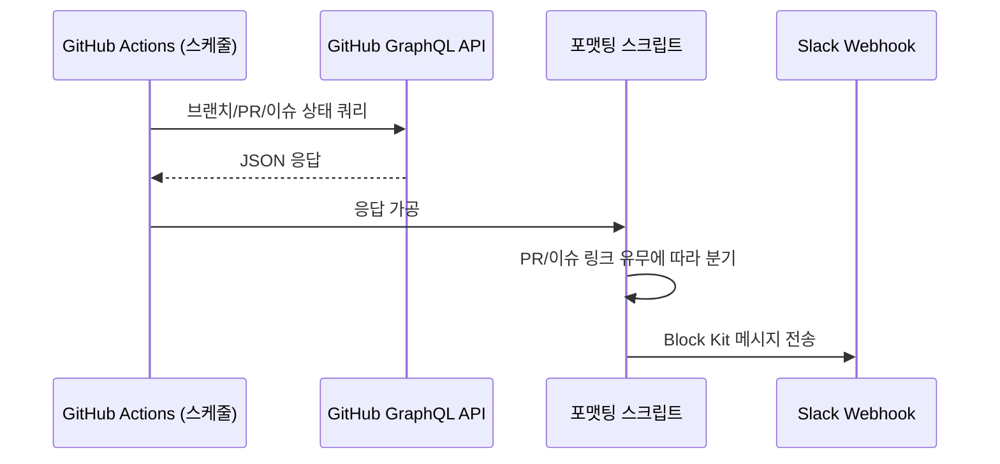
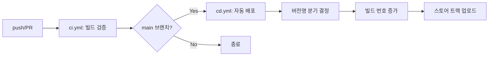
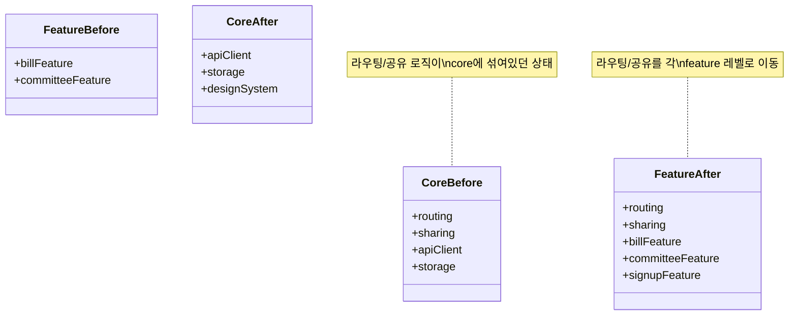
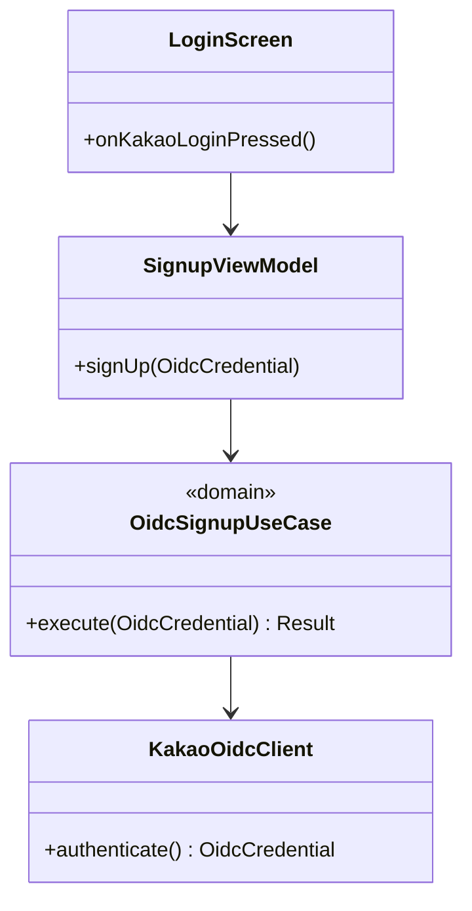

# 들어가며

[설명 문서]()에서 다룬 세 가지 작업(Slack 상태 알림, CI/CD, 카카오 로그인)의 실제 구현을 정리한다.

# 1. GitHub Actions + GraphQL로 저장소 상태를 Slack에 흘려보내기

## 1.1 왜 REST가 아니라 GraphQL인가

브랜치별 PR/이슈 상태, 리뷰 여부, 링크까지 한 번에 가져오려면 REST API로는 여러 번 호출해야 하는 정보를 GraphQL 쿼리 하나로 묶을 수 있었다. GitHub Actions 워크플로우에서 GraphQL 쿼리를 실행하고, 응답을 가공해 Slack Block Kit 포맷으로 변환하는 구조다.

## 1.2 실제로 반복 수정이 필요했던 지점

- **escape 문자 문제**: GraphQL 쿼리 문자열 안에 커밋 메시지나 브랜치명이 포함될 때, 특수문자가 쿼리를 깨뜨리는 경우가 있어 이스케이프 처리를 두 차례 수정했다.
- **빈 링크 분기**: PR이나 이슈가 없는 브랜치의 경우 링크 필드가 비어있는데, 이걸 그대로 Slack 메시지에 넣으면 깨진 링크가 노출된다. 빈 값일 때 별도 문구로 대체하는 분기 처리가 필요했다.
- **Block 레이아웃**: Slack Block Kit은 정적 미리보기로는 실제 렌더링을 확인하기 어려워서, 실제 채널에 보내보고 레이아웃을 고치는 과정을 11차례 반복했다. 텍스트 줄바꿈, 필드 정렬, 이모지 위치 같은 디테일이 대부분이었다.

# 2. CI/CD: ci.yml / cd.yml

## 2.1 파이프라인 구조

- `ci.yml`은 PR/push 시점에 빌드가 깨지지 않는지 검증하는 역할로, 12차례에 걸쳐 수정됐다. 대부분 Flutter/Dart 버전 호환성, 캐시 설정, 시크릿 주입 방식과 관련된 수정이었다.
- `cd.yml`은 실제 배포를 담당하며 16차례 수정을 거쳤다. 버전명 분기(alpha/release 등)를 스크립트가 아니라 GitHub Actions 조건문에 위임해서, 브랜치나 태그 규칙만으로 배포 트랙이 결정되도록 만들었다.
- 빌드 번호는 배포할 때마다 자동으로 증가하도록 만들었는데(버전 10 → 24), 실제로 배포를 반복하면서 번호 충돌이나 트랙 반영 누락 같은 문제가 몇 차례 나왔고, 그때마다 "배포 시 트랙에 커밋 반영" 같은 로직을 추가해 안정화했다.
- 사소하지만 실제로 파이프라인을 멈춰 세웠던 버그도 있었다 — `fix\`` 같은 오타로 인한 쉘 스크립트 문법 오류(백틱 하나가 스크립트를 깨뜨렸다)를 `fi`로 수정한 케이스.

## 2.2 왜 반복 수정이 이렇게 많았나

빌드/배포 자동화는 로컬에서 완벽하게 재현하기 어려운 환경(CI 러너의 OS/아키텍처, 시크릿 주입 방식, 스토어 API 정책)에 의존하기 때문에, 설계 단계에서 모든 실패 케이스를 예측하기보다 실제 배포를 여러 버전에 걸쳐 돌려보면서 드러나는 문제를 그때그때 고치는 접근이 현실적이었다. 버전 10부터 24까지, 총 15개 버전의 배포를 거치며 파이프라인이 안정화됐다.

# 3. core/feature 모듈 경계 정리

## 3.1 이동 전/후 구조

- 라우팅 로직을 `package:core/`에서 `package:feature/`로 이동시켜, feature마다 자기 라우팅을 스스로 책임지게 했다.
- 이미지 저장/공유 기능을 별도 모듈로 분리했다.
- 의존성 주입을 `getIt`(서비스 로케이터 방식)에서 `injectable`(코드 생성 기반)로 마이그레이션해서, DI 등록 누락을 컴파일 타임에 잡을 수 있게 했다.
- asset 관련 기능은 `design_system` 패키지로 옮겨서, UI 자산과 비즈니스 로직의 경계를 분리했다.

# 4. 카카오 OIDC 로그인/회원가입

## 4.1 레이어 구조

- `kakao_sdk_user` 의존성을 추가하고 OIDC 초기화 로직을 붙였다. 카카오 native app key는 하드코딩하지 않고 외부 주입 방식(빌드 시 dart-define 등)으로 바꿔서, 코드 저장소에 키가 노출되지 않도록 했다.
- 회원가입 흐름은 도메인 레이어(usecase)와 뷰모델을 분리해서 구현했고, `ErrorHandlerInterceptor`를 통해 회원가입 중 에러 발생 시 다이얼로그로 안내하고 초기 화면으로 복귀시키는 처리를 넣었다.
- 게스트 회원가입 도메인 레이어를 `TermAgreementNotifier`와 연동해서, 온보딩 → 약관 동의 → 회원가입/로그인으로 이어지는 분기 흐름을 구성했다.
- presentation 레이어는 screen/widget 단위로 분리하고 네이밍 규칙을 문서화해서, 이후 유사한 화면을 추가할 때 참고할 수 있게 했다.

## 4.2 앞서 정리한 모듈 구조가 준 이점

로그인 관련 코드를 `core/lib/oidc/`(카카오 SDK 초기화, OIDC 클라이언트)와 `features/lib/signup/`(도메인/뷰모델/화면)으로 명확히 나눠 넣을 수 있었던 건, 앞서 core/feature 경계를 정리해둔 덕분이었다. 만약 경계 정리 없이 로그인 기능을 먼저 얹었다면, 인증 관련 로직이 다른 feature들처럼 core에 뒤섞였을 가능성이 크다.

# 5. 요약

| 작업 | 반복 횟수 | 핵심 교훈 |
|---|---|---|
| Slack 상태 알림 | Block 레이아웃 11회 수정 | 정적 미리보기로 검증 안 되는 건 실제로 보내보고 고쳐야 한다 |
| CI/CD (ci.yml/cd.yml) | 각각 12회, 16회 수정, 버전 10~24 배포 검증 | 배포 자동화는 실제 배포를 반복하며 안정화하는 게 현실적이다 |
| 카카오 OIDC | 경계 정리 이후 진행 | 구조 정리를 먼저 해두면 신규 기능 추가가 수월해진다 |
