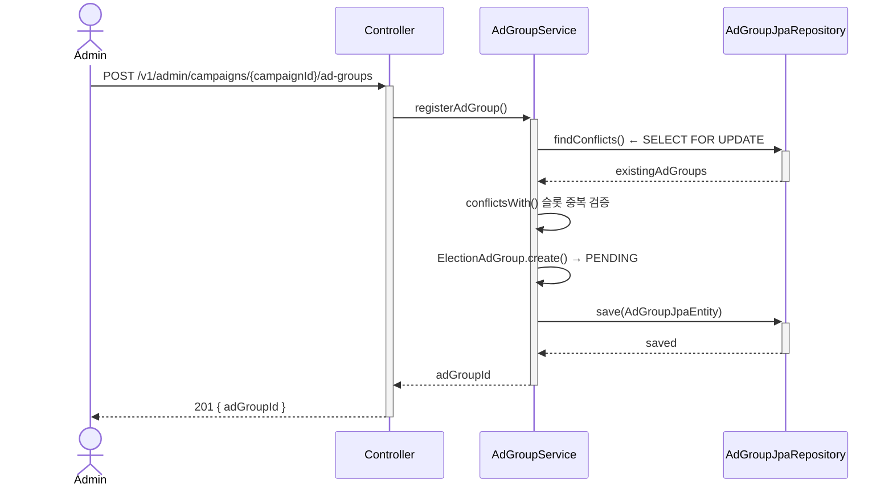

# 들어가며

2026년 6월 3일 전국동시지방선거를 앞두고, 바로 앱에 지역 후보자 전용 광고 상품을 얹어야 했다. "지역 × 광고타입 × 기간" 단위로 독점 노출을 보장하는 상품이었고, **개발 기간은 5일**이었다.

앱에는 그때까지 수익화를 위한 광고 노출 채널이 전무했다. 홈, 아고라, digest 등 여러 화면에 걸쳐 광고를 새로 통합해야 하는 상황에서, 기획 문서부터 API, UI 컴포넌트, 노출 로직까지 클라이언트·백엔드 양쪽을 처음부터 끝까지 구축하는 작업이었다.

# 1. 5일이라는 제약이 설계를 결정했다

일정이 짧으면 가장 먼저 손대야 하는 건 기능이 아니라 **범위**다. 처음부터 "무엇을 뺄 것인가"를 정해야 나머지 5일 계획이 성립한다.

## 1.1 MVP에서 뺀 것들

| 항목 | 이유 |
|---|---|
| 실시간 예산 소진 체크 | 기간 단위 운영이라 실시간 정산이 불필요 |
| 어뷰징 필터링 | 초기 트래픽 볼륨이 작아 이후 추가해도 늦지 않음 |
| S3 presigned URL | admin이 직접 업로드하는 걸로 단순화 (서버 경유) |
| admin 역할 분리 | 운영 인원이 소수라 단일 계정으로 시작 |

이 목록에서 중요한 건 "안 만든 이유"가 전부 **볼륨/운영 규모 대비 과설계 방지**라는 점이다. 선거 기간이라는 한시적 이벤트성 기능에 상시 서비스 수준의 정교함을 요구하지 않기로 판단했다.

## 1.2 하루 단위로 쪼갠 계획

| 일차 | 서버 | 클라이언트 |
|---|---|---|
| Day 1 | DB 스키마 + API 뼈대 + S3/CloudFront 설정 | 광고 영역 UI 컴포넌트 |
| Day 2 | 광고 조회 API (선거구 매핑 포함) | 광고 API 연동 + 미노출 처리 |
| Day 3 | AdEvent 수집 API + admin 광고주·캠페인 CRUD | Impression 뷰포트 감지 + 중복 제거 |
| Day 4 | admin 이미지 업로드 + AdEvent 조회·필터링 | Click 트래킹 + 외부 브라우저 오픈 |
| Day 5 | 통합 QA + 엣지케이스 처리 | 통합 QA + 엣지케이스 처리 |

서버와 클라이언트가 매일 같은 레이어(스키마→조회→이벤트→관리자→QA)를 나란히 진행하도록 짜서, 하루 끝나면 그날 만든 기능을 바로 통합 확인할 수 있게 했다.

# 2. 도메인 모델링

## 2.1 왜 Campaign과 Ad를 분리했나

| 용어 | 역할 | 예시 |
|---|---|---|
| Advertiser | 광고비를 지불하는 광고주 | 지역 후보자 |
| Campaign | 광고 집행 단위. 지역·타입·기간을 가짐 | "OO 후보 배너 광고" |
| Ad (소재) | 사용자에게 실제 노출되는 크리에이티브 | 배너 이미지 + 랜딩 URL |
| AdEvent | 광고에서 발생한 사용자 행동 로그 | impression / click |

초기 기획 단계에서는 "소재 1개 = 캠페인 1개"인 단일 패키지로 두고 Campaign/Ad 분리는 MVP 제외 항목으로 잡았다. 후보자당 광고 소재가 여러 개일 필요가 없다고 봤기 때문이다.

실제 구현 과정에서는 여기서 한 단계 더 나아가 **AdGroup**이라는 중간 계층이 생겼다. 같은 캠페인 안에서도 "지역구 × 노출 지면(placement)" 슬롯이 겹치는지 검증해야 할 필요가 생겼기 때문이다.



"지역 × 광고타입 × 기간" 단위 독점 노출이 상품의 핵심 약속이었기 때문에, 같은 슬롯에 두 캠페인이 겹쳐 등록되는 걸 애플리케이션 레벨에서 막아야 했다. `SELECT FOR UPDATE`로 조회 시점의 락을 잡고 `conflictsWith()`로 겹침을 검증한 뒤에야 `PENDING` 상태로 생성하도록 했다 — 승인 전까지는 노출되지 않고, 운영자가 최종 확인 후 승인(approve)해야 `ACTIVE`로 전환되는 2단계 흐름이다.

## 2.2 이벤트와 지표

| 이벤트 | 설명 | 처리 방식 |
|---|---|---|
| Impression | 광고가 뷰포트에 노출됨 | 클라이언트 POST → 서버 기록 |
| Click | 사용자가 광고를 클릭함 | 클라이언트 POST → 서버 기록 → landing_url 반환 |

집계 지표는 CTR(클릭 수 / 노출 수 × 100)과 Frequency(동일 사용자에게 같은 광고가 노출된 횟수, 세션 단위 클라이언트 Set으로 중복 제거)만 두었다. 실시간 집계 대신 admin에서 기간 필터로 조회하는 배치성 집계로 충분하다고 판단했다 — 선거 광고는 실시간 대시보드가 필요한 성격의 상품이 아니었다.

# 3. 노출 로직

```
화면 진입
  → RegionStore.subDistrictId 없음 → API 호출 skip → 미노출
  → GET /api/ads?placement=banner&sub_district_id={subDistrictId}
  → 서버: subDistrictId → 선거구 코드 조회 (기존 electionAreaService 재사용)
  → 캠페인 있으면 반환, 없으면 null → 미노출
```

| 상황 | 처리 |
|---|---|
| subDistrictId 없음 | API 호출 skip → 미노출 |
| 해당 선거구에 캠페인 없음 | 미노출 |
| 캠페인 기간 종료 | 자동 미노출 (end_date 조건) |
| API 실패 | 미노출, 앱 크래시 없어야 함 |

선거구 코드 조회는 새로 만들지 않고 기존 `electionAreaService`를 그대로 재사용했다. 5일짜리 기능에 새 선거구 매핑 로직을 다시 만들 이유가 없었고, 이미 검증된 경로를 타는 게 리스크도 적었다.

API 실패 시 무조건 미노출로 떨어지게 한 것도 의도적인 선택이다 — 광고 노출 실패가 앱 크래시나 메인 기능 장애로 번지면 안 되기 때문에, 광고 관련 흐름 전체를 "실패해도 조용히 사라지는" 방향으로 설계했다.

# 4. 인프라 선택

| 항목 | 선택 | 이유 |
|---|---|---|
| AdEvent 수집 | 자체 API → RDB (PostgreSQL) | 볼륨이 작아 빠르게 구현 가능 |
| 이미지 저장 | S3 | 단순하고 저렴 |
| 이미지 서빙 | CloudFront | 빠른 로딩, 설정 30분이면 충분 |
| 집계 | RDB 직접 SQL | S3+Athena는 이 볼륨에 오버엔지니어링 |
| 실시간 집계 | 도입 안 함 | 기간 단위 운영 상품이라 불필요 |

여기서도 원칙은 동일했다: 상품 수명과 트래픽 규모에 맞는 만큼만 인프라를 쓴다. S3+Athena 같은 분석 스택은 이 볼륨에서는 관리 비용만 늘리는 선택이라 처음부터 배제했다.

# Result

5일 안에 기획 문서부터 API, 클라이언트 UI, 광고 서빙 캐시까지 끝까지 구축해 6월 3일 선거 전 홈/아고라/digest/피드 전 영역에 광고 배너를 통합했다. 슬롯 단위 중복 노출 방지, 실패 시 조용히 미노출되는 방어적 설계, MVP 범위를 명확히 자른 5일 계획이 짧은 일정에도 광고 상품을 사고 없이 출시할 수 있었던 핵심이었다.

노출 위치·빈도, Redis 캐싱, 소재 업로드 재시도 같은 실제 구현 디테일은 [구현 문서]()에서 다룬다.
