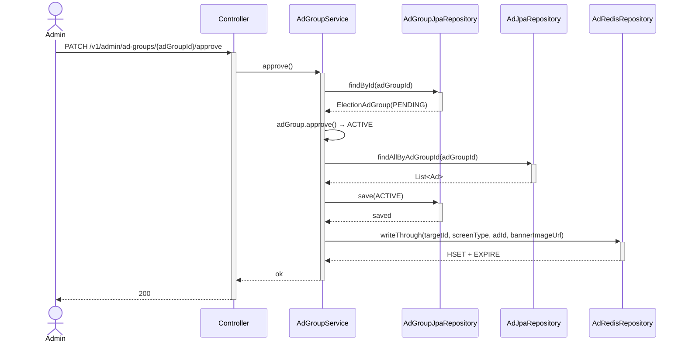
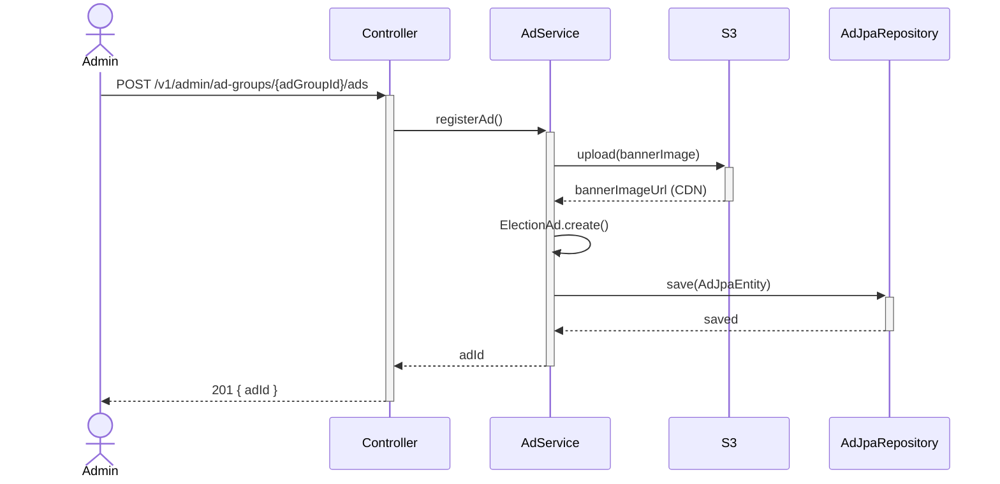

# 들어가며

[설계 문서]()에서 다룬 광고 배너 시스템의 실제 구현 디테일을 정리한다. 승인된 광고를 어떻게 빠르게 서빙했는지, 소재 업로드 실패를 어떻게 복구했는지, 그리고 노출 위치를 몇 번이나 갈아엎었는지의 기록이다.

# 1. 광고 서빙: Redis Write-Through 캐시

광고 조회(`GET /api/ads`)는 사용자가 화면에 진입할 때마다 호출되는 경로다. 매 요청마다 RDB에서 캠페인·소재를 조인해서 가져오는 대신, **승인 시점에 미리 캐시를 채워두는 write-through 방식**을 택했다.



핵심은 **읽기 경로에서 RDB를 건드리지 않는 것**이다. 운영자가 광고 그룹을 승인(approve)하는 시점에 `AdRedisAdapter`/`AdRedisRepository`가 `AdServingCache`를 갱신해두고, 실제 사용자 트래픽은 항상 Redis만 조회한다. 트래픽이 몰리는 건 사용자 쪽(조회)이고 쓰기는 운영자의 승인 액션 하나뿐이니, 쓰기 시점에 캐시를 채우는 편이 매 조회마다 캐시 미스를 확인하고 채우는 lazy 캐싱보다 구조가 단순했다.

캐시 어댑터를 처음 만들 때는 Redis 테스트가 없는 상태로 붙였는데, 이후 별도로 Redis 통합 테스트를 추가하고 불필요한 프로퍼티를 정리하는 과정을 거쳤다. 캐시 계층은 장애가 나면 광고가 안 뜨는 정도로 끝나야지, 다른 기능까지 끌고 들어가면 안 되기 때문에 테스트로 캐시 read/write 동작을 명시적으로 검증해뒀다.

# 2. Impression / Click 수집 API

```json
"POST /api/events"

Request:
{
  "campaign_id": 42,
  "type": "impression"
}

Response 200:
{
  "ok": true
}
```

클라이언트 쪽 중복 방지는 세션 단위 `Set`으로 처리한다.

```typescript
const impressedAds = new Set<number>()

// 뷰포트 50% 이상 진입 시
if (impressedAds.has(campaign_id)) return
await POST /api/events { campaign_id, type: "impression" }
impressedAds.add(campaign_id)
```

클릭은 이벤트 기록과 랜딩 URL 반환을 한 요청에서 처리한다.

```typescript
const res = await POST /api/events { campaign_id, type: "click" }
openURL(res.landing_url)  // 외부 브라우저 오픈
```

집계는 실시간이 아니라 admin에서 기간별로 SQL을 직접 돌리는 구조다.

```sql
SELECT
  c.id,
  c.region_id,
  c.placement,
  COUNT(*) FILTER (WHERE e.type = 'impression') AS impressions,
  COUNT(*) FILTER (WHERE e.type = 'click')      AS clicks,
  ROUND(
    COUNT(*) FILTER (WHERE e.type = 'click')::numeric /
    NULLIF(COUNT(*) FILTER (WHERE e.type = 'impression'), 0) * 100,
  2) AS ctr
FROM campaign c
LEFT JOIN ad_event e ON e.campaign_id = c.id
WHERE e.occurred_at BETWEEN :start AND :end
GROUP BY c.id, c.region_id, c.placement
```

# 3. 소재 업로드: 재시도와 실패 알림

광고 소재 등록은 S3 업로드를 수반하는 흐름이라, 네트워크 실패나 S3 장애로 중간에 끊길 가능성을 감안해야 했다. 처음에는 등록/수정 API를 단순하게 구현했다가, 이벤트·리포지토리 구조를 어댑터 패턴으로 재정리하면서 다시 구현했다.



S3 업로드가 실패하면 재시도 로직을 태우고, 재시도 자체가 실패하면 Slack으로 알림이 가도록 붙였다. 선거 기간 중에는 운영자가 매번 admin 화면을 지켜보고 있지 않기 때문에, 업로드 실패가 조용히 묻히지 않게 하는 게 중요했다.

재시도 로직을 붙이고 나서 발견한 버그가 하나 있었다 — 배너 수정 재시도 시, **이미 완료된 S3 업로드 단계까지 처음부터 다시 실행**되는 문제였다. 재시도가 "실패한 단계부터"가 아니라 "전체 흐름을 처음부터"로 동작하고 있었던 것이다. 이미 성공한 S3 업로드 결과(URL)를 재사용하지 않고 다시 파일을 올리려 시도하면서 불필요한 S3 쓰기가 중복 발생했고, 이 부분을 수정해 이미 완료된 단계는 건너뛰도록 고쳤다.

# 4. 클라이언트: 노출 위치 튜닝은 한 번에 끝나지 않았다

배너 자체는 초반에 캐러셀 + impression/click을 지원하는 `AdBanner` 컴포넌트와 인앱 WebView 화면으로 어렵지 않게 만들었다. 어려웠던 건 **아고라/인물 피드처럼 스크롤되는 리스트 안에 광고를 얼마나 자주, 어디에 넣을지**였다.

실제로 튜닝은 한 번에 정해지지 않고 여러 차례 반복됐다:

1. **홀수 번째 fetch마다 삽입** — 처음 시도. 페이지네이션 fetch 주기에 맞춰 넣었더니 스크롤 위치에 따라 광고가 나타났다 사라지는 문제가 있었다.
2. **고정 위치 삽입** — 리스트의 특정 인덱스에 고정. 여전히 리스트 갱신(새로고침, 필터 변경) 시 위치가 틀어지는 문제가 남았다.
3. **영구 아이템화** — 광고를 리스트 아이템 배열 자체에 항목으로 박아 넣어, 일반 리스트 아이템과 동일하게 취급되도록 변경. 스크롤 중 사라지는 문제는 해결됐지만 필터링 로직과 충돌이 생겼다.
4. **필터 하단 배치** — 최종적으로 필터 영역 아래, 리스트 최상단에 가깝게 고정하는 것으로 정리.

시행착오를 감수한 이유는 단순하다 — "리스트 안 광고 삽입"은 문서만 보고 한 번에 맞는 답을 찾기 어려운 영역이고, 실제 스크롤 동작에서 눈으로 확인하지 않으면 어떤 접근이 자연스러운지 판단하기 어려웠다. 5일이라는 일정 안에서도 이 부분만큼은 실측 없이 넘어가지 않았다.

# 5. 캐시 TTL과 API 단순화

이미지 갱신 이슈도 하나 있었다. 배너 이미지를 CloudFront로 서빙하다 보니 admin에서 이미지를 교체해도 클라이언트에 옛날 이미지가 한동안 남아있는 문제가 있었다. dev 환경에서는 1분, prod 환경에서는 24시간 TTL로 나눠 적용해 해결했다 — 운영 환경에서는 배너 교체가 자주 일어나는 일이 아니라서 과도하게 짧은 TTL로 캐시 효율을 깎을 이유가 없었고, 반대로 개발 중에는 1분 TTL로 바로바로 확인 가능하게 했다.

API 스펙도 한 차례 단순화를 거쳤다. 처음에는 광고 조회 API가 `districtId`를 받는 구조였는데, 이후 `screenType` 기반 서빙으로 정리하면서 `districtId` 파라미터를 제거했다. 화면(placement)별로 노출 여부만 결정하면 되는 구조에서 지역 파라미터를 클라이언트가 직접 넘길 필요가 없었고, 서버 쪽에서 이미 세션/지역 컨텍스트로 해석 가능한 값을 API 계약에 중복으로 노출할 이유가 없다고 판단했다.

# Result

승인 시점 write-through 캐싱으로 사용자 조회 경로에서 RDB를 완전히 배제했고, S3 업로드 실패에 재시도 + Slack 알림을 붙여 운영자가 매번 확인하지 않아도 되게 만들었다. 재시도 로직 자체의 버그(완료 단계 중복 실행)도 잡아서 재시도가 오히려 불필요한 쓰기를 유발하는 상황을 막았다. 피드 내 노출 위치는 네 번의 반복 끝에 스크롤 중 사라지지 않는 형태로 정착했고, 이미지 캐시 TTL을 환경별로 분리해 운영 중 배너 교체가 즉시 반영되지 않는 문제도 해결했다.
