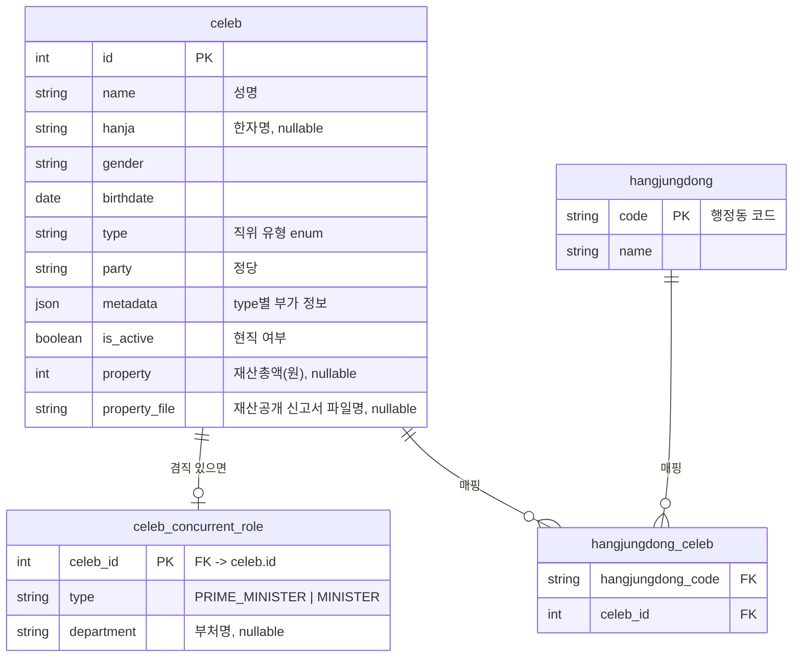

# 들어가며

지방선거가 끝나면 '바로' 앱이 보여줘야 하는 대표자 정보가 통째로 바뀐다. 국회의원은 그대로지만 시도지사·교육감·시도의원·구시군의장·구시군의원이 새로 채워져야 하고, 이 인물들을 행정동 기준으로 조회할 수 있어야 한다. 이 글은 그 데이터를 어떤 구조로 담을지 설계한 과정을 정리한 것이다. 실제 무결성 문제를 어떻게 진단하고 고쳤는지는 [구현 문서]()에서 다룬다.

# 1. 상황: 왜 새 스키마가 필요했나

기존 구조로는 다음 케이스들을 명확하게 표현할 방법이 없었다.

- **국회의원의 행정부 겸직** — 국무총리·장관을 겸하는 국회의원
- **비례대표** — 특정 행정동에 속하지 않는 당선자
- **행정동 단위 대표자 조회** — "우리 동" 기준으로 국회의원부터 구시군의회까지 한 번에 보여주는 화면

규모도 작지 않았다. 국회의원 약 300명, 행정부 약 40명, 그 외 지방선거로 새로 채워지는 인물이 약 3,500명 — 겸직·비례대표 같은 예외 케이스가 전체 대비 적은 비율이라도 실제 건수로는 무시할 수 없는 수준이었다.

# 2. 과제: 무엇을 만족해야 했나

설계에 들어가기 전에 먼저 확정해야 했던 조회 패턴은 다섯 가지였다.

1. 행정동 기준 대표자 조회 (국회의원 ~ 구시군의회)
2. 개별 인물 상세 조회
3. 비례대표 전체 조회 (행정동 매핑과 무관하게)
4. 행정부(겸직) 전체 조회
5. 재산 상위 N명 조회

여기에 더해, 인물 데이터가 여러 소스(국회 공개 데이터, 지방선거 결과, 재산공개 신고서)에서 들어오기 때문에 "같은 사람"을 어떻게 판별할지도 스키마 설계 단계에서 같이 정해야 했다.

# 3. 설계: 4개 테이블로 정리하기

## 3.1 왜 인물 테이블을 하나로 합쳤나

처음 떠올리기 쉬운 접근은 국회의원/행정부/지방의원을 각각 별도 테이블로 나누는 것이다. 하지만 그렇게 하면 "겸직"이 테이블 두 개에 걸친 조인 문제가 되고, 인물 상세 조회 API도 타입별로 분기해야 한다.

대신 인물 정보는 `celeb` 테이블 하나로 통합하고, 타입별로 달라지는 부가 정보는 `metadata`(JSON) 컬럼에 몰아넣는 방식을 택했다.

- **`celeb`**: 인물 1명 = 1 row. 국회의원이든 지방의원이든 동일 테이블.
- **`celeb_concurrent_role`**: 국회의원이 행정부를 겸직하는 경우만 별도 row로 존재. 국무총리/장관 여부와 부처명을 담는다.
- **`hangjungdong`**: 행정동 자체는 비정규화된 참조 테이블.
- **`hangjungdong_celeb`**: 행정동-인물 매핑. 조회 패턴 1번(행정동 기준 대표자 조회)이 사실상 이 테이블 하나로 해결된다.

## 3.2 비례대표는 왜 별도 타입이 아닌가

비례대표는 특정 행정동에 매핑되지 않는다는 점에서 다른 인물들과 조회 경로가 다르다. 별도 테이블을 만들 수도 있었지만, 그러면 "전체 대표자 목록"을 뽑을 때 두 테이블을 항상 UNION해야 한다.

대신 `metadata.is_proportional = true`라는 플래그로만 구분하기로 했다. `hangjungdong_celeb` 매핑에서는 자연스럽게 제외되고(애초에 매핑할 행정동이 없으니), 개별 조회나 전체 목록 조회에서는 다른 인물과 동일하게 취급된다. 조회 패턴 3번(비례대표 전체 조회)은 이 플래그로 필터링하면 끝난다.

## 3.3 재산공개 데이터는 왜 이름만으로 매칭하지 않았나

재산공개 신고서(`재산.csv`)를 `celeb`에 매칭해서 `property`/`property_file` 필드를 채워야 했는데, 이름만으로 매칭하면 동명이인 문제가 바로 터진다. 흔한 성씨·이름 조합이면 국회의원/지방의원 3,800명 규모에서 동명이인이 실제로 발생한다.

그래서 **(이름, 생년월일) exact match**로만 결합하도록 규칙을 정했다. 생년월일까지 일치하지 않으면 매칭하지 않고 `property`를 비워둔다 — 틀린 사람에게 재산 정보를 붙이는 것보다, 일부 인물의 재산 정보가 비어있는 편이 낫다는 판단이었다.

돌이켜보면 이 "이름만으로는 동일 인물을 판별하지 않는다"는 원칙은 이후 지방선거 당선자를 현역 데이터로 전환하는 작업에서도 그대로 이어졌다 — 이름·생년월일·성별 세 값을 함께 봐야 동일 인물로 판단할 수 있다는 걸, 이 스키마를 설계하면서 먼저 배운 셈이다.

# 4. 결과

`celeb` / `celeb_concurrent_role` / `hangjungdong` / `hangjungdong_celeb` 4개 테이블로 겸직·비례대표·행정동 매핑까지 포함한 스키마를 완성했고, 앞서 정리한 5가지 조회 패턴을 스키마 설계 단계에서 모두 커버할 수 있게 했다. 대용량 CSV 데이터(국회의원 ~300명, 행정부 ~40명, 지방선거 당선자 ~3,500명) 반영까지 마이그레이션에 함께 포함해 배포했다.

기술적인 무결성 이슈 대응 과정은 [구현 문서]()에서 이어진다.
