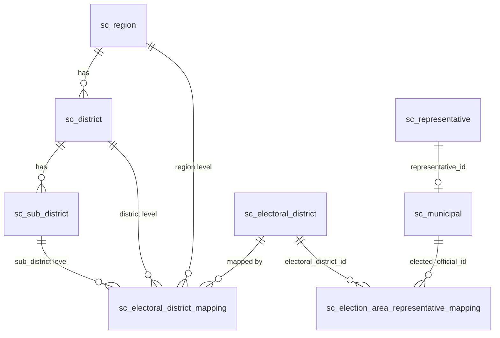

# 들어가며

[설명 문서]()에서 다룬 새 스키마(`celeb`/`hangjungdong`)를 설계하면서, 왜 "이름만으로 동일 인물을 판별하지 않는다"는 원칙을 세웠는지는 여기서 발견한 문제와 직접 관련이 있다. 지역·선거구·대표자를 잇는 매핑 구조를 점검하다가 발견한 정합성 문제와, 그걸 어떻게 진단하고 복구했는지를 정리한다. 등장하는 인물명은 모두 가명으로 대체했다.

# 1. 매핑 구조

지역 계층(시/도 → 구/군 → 동)과 선거구, 그리고 그 선거구에 매핑된 대표자 사이의 관계는 다음과 같은 구조로 되어 있었다.



지역 기반 조회는 `sc_electoral_district_mapping`을 거쳐가는 구조인데, 이 매핑 테이블이 정확하지 않으면 "우리 동 대표자 조회" 같은 화면이 조용히 비거나 엉뚱한 사람을 보여주게 된다.

# 2. 진단: 고아 레코드 찾기

## 2.1 완전 고아 — 선거구 자체가 없는 매핑

```sql
SELECT edm.electoral_district_id, r.name, d.name, sd.name
FROM sc_electoral_district_mapping edm
LEFT JOIN sc_region r        ON r.id  = edm.region_id
LEFT JOIN sc_district d      ON d.id  = edm.district_id
LEFT JOIN sc_sub_district sd ON sd.id = edm.sub_district_id
LEFT JOIN sc_electoral_district ed ON ed.id = edm.electoral_district_id
WHERE edm.sub_district_id IS NULL
  AND ed.id IS NULL;
```

`sub_district_id`가 `NULL`인 매핑은 비례대표로 추정되는 케이스인데, 그중 일부는 `electoral_district_id`로 실제 선거구를 찾을 수 없는 상태였다. 이 조건에 걸리는 레코드가 254건 있었다.

이 254건이 실제로 문제가 되는지 확인하기 위해, 대표자 매핑에서 참조되고 있는지를 먼저 확인했다.

```sql
SELECT COUNT(*) FROM sc_election_area_representative_mapping
WHERE electoral_district_id IN (
  SELECT edm.electoral_district_id
  FROM sc_electoral_district_mapping edm
  LEFT JOIN sc_electoral_district ed ON ed.id = edm.electoral_district_id
  WHERE edm.sub_district_id IS NULL AND ed.id IS NULL
);
```

결과는 0건 — 즉 이 254건은 어떤 대표자와도 연결되지 않은 완전한 고아 레코드였다. 참조하는 곳이 없으므로 삭제로 정리했다.

## 2.2 대표자-선거구 매핑 고아

`sc_election_area_representative_mapping`은 `elected_official_id`가 `sc_municipal` 또는 `sc_politician` 둘 중 하나를 가리켜야 하는 다형(polymorphic) 참조 구조였다. 양쪽 다 못 찾는 레코드가 있는지 확인했다.

```sql
SELECT earm.*
FROM sc_election_area_representative_mapping earm
LEFT JOIN sc_municipal  m ON m.id = earm.elected_official_id
LEFT JOIN sc_politician p ON p.id = earm.elected_official_id
WHERE m.id IS NULL
  AND p.id IS NULL;
```

결과에서 두 가지 다른 패턴의 문제가 나왔다.

**패턴 A — 컬럼이 뒤바뀐 경우**

```
id: 7f000001-...-0112 | elected_official_id: ED11633 | electoral_district_id: SC000254
id: 7f000001-...-0113 | elected_official_id: ED11634 | electoral_district_id: SC000255
```

`elected_official_id`와 `electoral_district_id` 값이 서로 자리가 바뀐 채로 들어가 있었다 — 두 시(市)의 시장 데이터가 대상이었다. INSERT 시점에 컬럼 순서를 착각한 것으로 추정된다.

```sql
UPDATE sc_election_area_representative_mapping
SET elected_official_id   = 'SC000254',
    electoral_district_id = 'ED11633'
WHERE id = '7f000001-...-0112';

UPDATE sc_election_area_representative_mapping
SET elected_official_id   = 'SC000255',
    electoral_district_id = 'ED11634'
WHERE id = '7f000001-...-0113';
```

**패턴 B — 중복 매핑**

`elected_official_id`가 `NULL`인 채로 특정 선거구를 가리키는 중복 레코드가 하나 있었다(이미 정상 매핑이 존재하는 선거구였다). 이건 단순히 삭제로 정리했다.

## 2.3 매핑 자체가 누락된 현역 — 반대 방향 검증

앞의 두 진단은 "매핑은 있는데 대상이 없는" 케이스였다. 반대로 "현역인데 매핑 자체가 없는" 케이스도 확인이 필요했다.

```sql
SELECT m.id, m.type, m.district_name, r.name
FROM sc_municipal m
LEFT JOIN sc_election_area_representative_mapping earm
  ON earm.elected_official_id = m.id
LEFT JOIN sc_representative r ON m.representative_id = r.id
WHERE earm.id IS NULL
  AND m.is_incumbent IS TRUE
  AND m.type NOT IN ('PROPORTIONAL_MEMBER');
```

여기서 나온 결과 중 하나는 앞의 패턴 A에서 컬럼이 뒤바뀌어 있던 두 시장 데이터(이미 위에서 수정)였고, 나머지는 특정 지역 교육의원 대상자 여러 명이 매핑 자체가 빠져있는 경우, 그리고 특정 선거구 지방의회 의원 한 명이 매핑 없이 존재하는 경우였다.

교육의원 쪽은 별도 제도가 곧 폐지될 예정이라 우선순위를 낮췄고, 지방의회 의원 매핑 누락 건은 매핑을 직접 추가했다.

```sql
INSERT INTO sc_election_area_representative_mapping
  (id, elected_official_id, electoral_district_id)
VALUES
  (gen_random_uuid(), 'LE08274', '7f000001-...-070e');
```

# 3. 더 큰 문제: 조용히 숨어있는 고아

앞의 케이스들은 전부 조회 시 데이터가 비거나 엉뚱하게 나오는, 발견하기 쉬운 문제였다. 그런데 하나는 훨씬 조용히 숨어있었다.

`sc_election_area_representative_mapping`에 `sub_district_id`가 값으로 채워져 있는데, 실제 `sc_sub_district` 테이블에는 그 ID가 존재하지 않는 고아 레코드가 있었다. 원래대로라면 이것도 문제여야 하는데 — **실제 서비스 조회 쿼리는 `sc_sub_district`를 직접 조인하지 않고 매핑 테이블에서 바로 조회하는 구조**라서, 겉으로는 아무 문제 없이 동작하는 것처럼 보였다.

이게 왜 더 큰 문제인가 하면, 지금은 우연히 조회 경로가 이 고아 참조를 건드리지 않아서 괜찮을 뿐이지, 이후 `sc_sub_district`를 조인하는 조회가 하나라도 추가되는 순간 바로 터질 수 있는 잠재 결함이기 때문이다. 발견 당시엔 서비스 영향이 없어 즉시 수정 대상에서는 제외했지만, 조인 경로가 바뀌는 변경이 있을 때 반드시 먼저 확인해야 할 항목으로 남겨두었다.

# 4. 정리

이번 진단에서 확인한 문제 유형은 세 가지로 나뉜다.

| 유형 | 예시 | 발견 방법 | 처리 |
|---|---|---|---|
| 참조 대상 없음 (완전 고아) | 선거구 매핑 254건 | LEFT JOIN + 역참조 카운트 | 삭제 |
| 값이 잘못 들어감 | 시장 2명 컬럼 뒤바뀜 | 결과 셋 수작업 검토 | UPDATE로 스왑 |
| 매핑 자체가 누락 | 지방의회 의원 1명 | 반대 방향 LEFT JOIN | INSERT |

가장 인상 깊었던 건 세 번째, 조용히 숨어있는 고아였다. `LEFT JOIN + WHERE IS NULL`로 고아를 찾는 패턴 자체는 흔하지만, 그 고아가 **현재 조회 경로에서 우연히 건드려지지 않아 증상이 없는 경우**는 일반적인 "에러 로그를 보고 문제를 찾는" 방식으로는 절대 발견되지 않는다. 정합성 점검은 증상이 있는 데이터를 쫓는 것만으로는 부족하고, 스키마 전체를 놓고 "이 외래키가 실제로 가리키는 대상이 존재하는가"를 주기적으로 역으로 검증해야 한다는 걸 확인한 계기였다.
