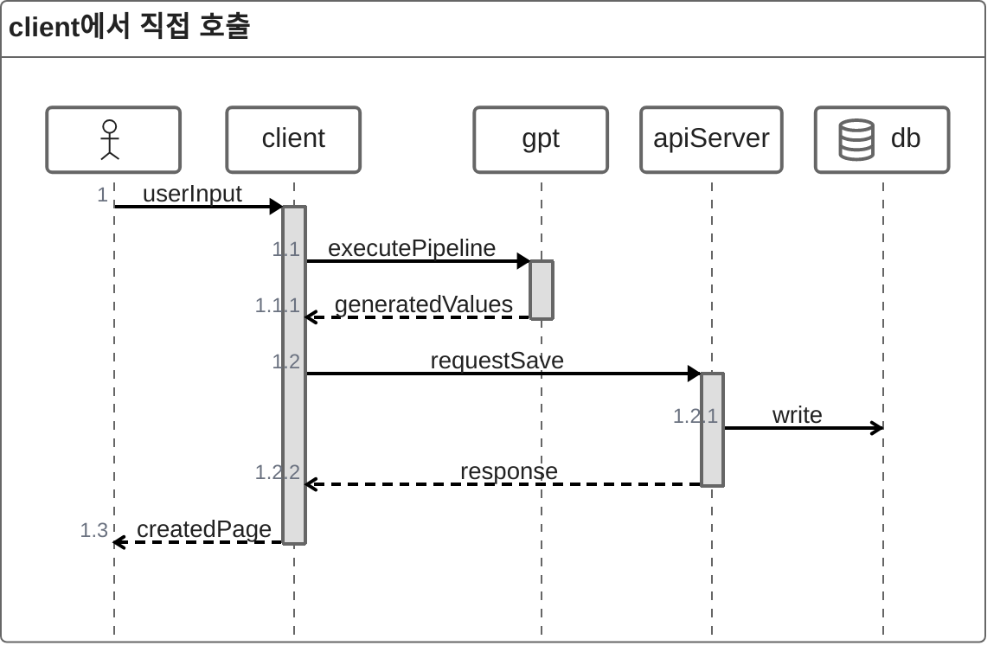
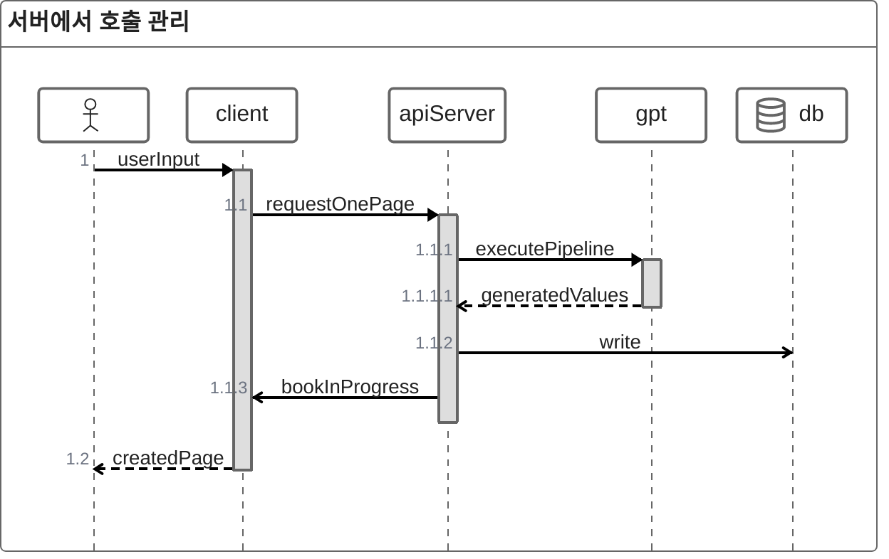
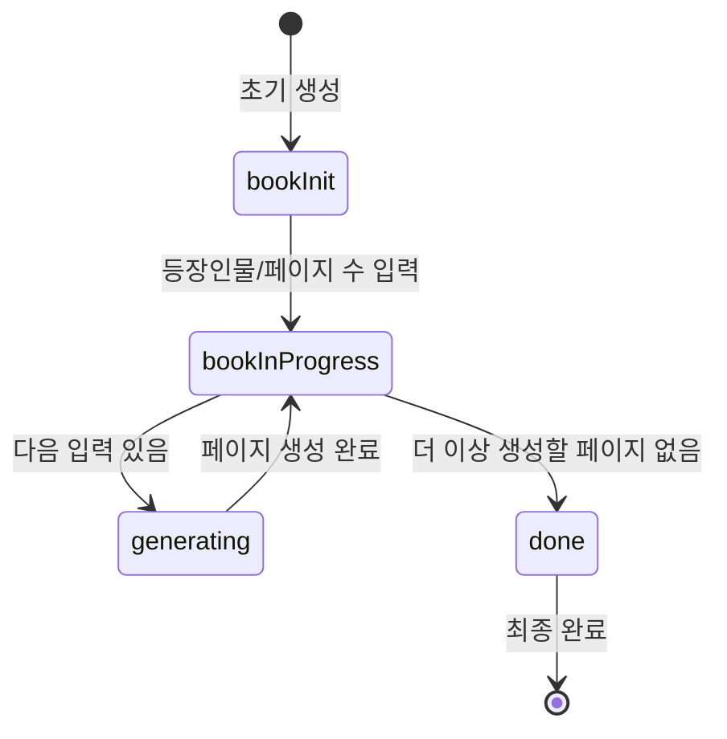
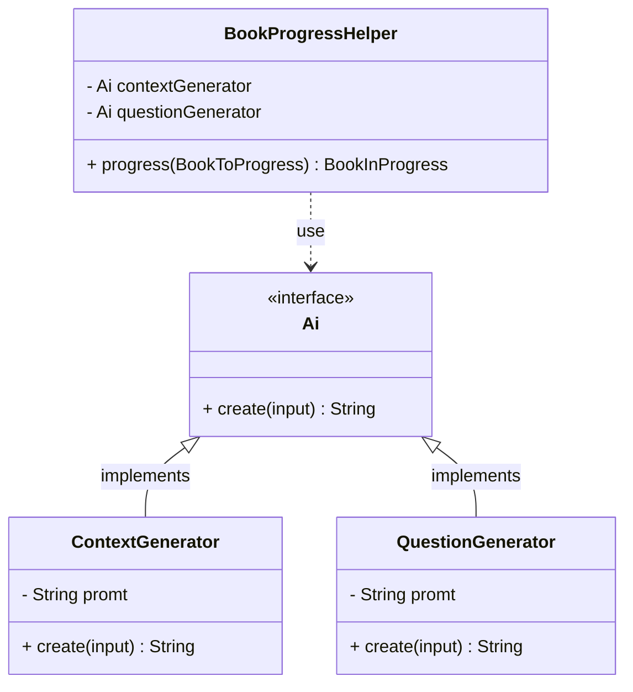
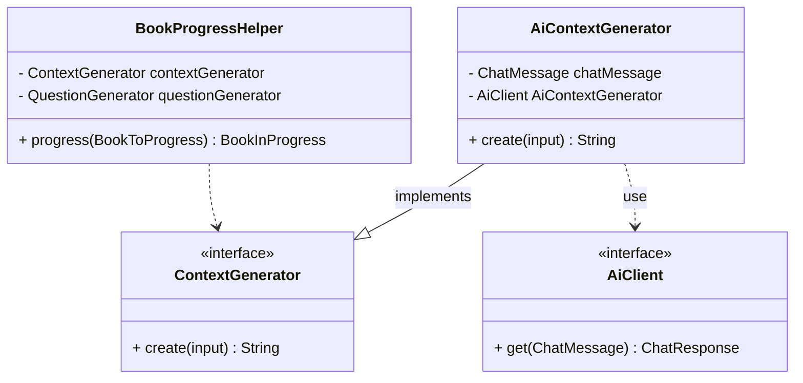
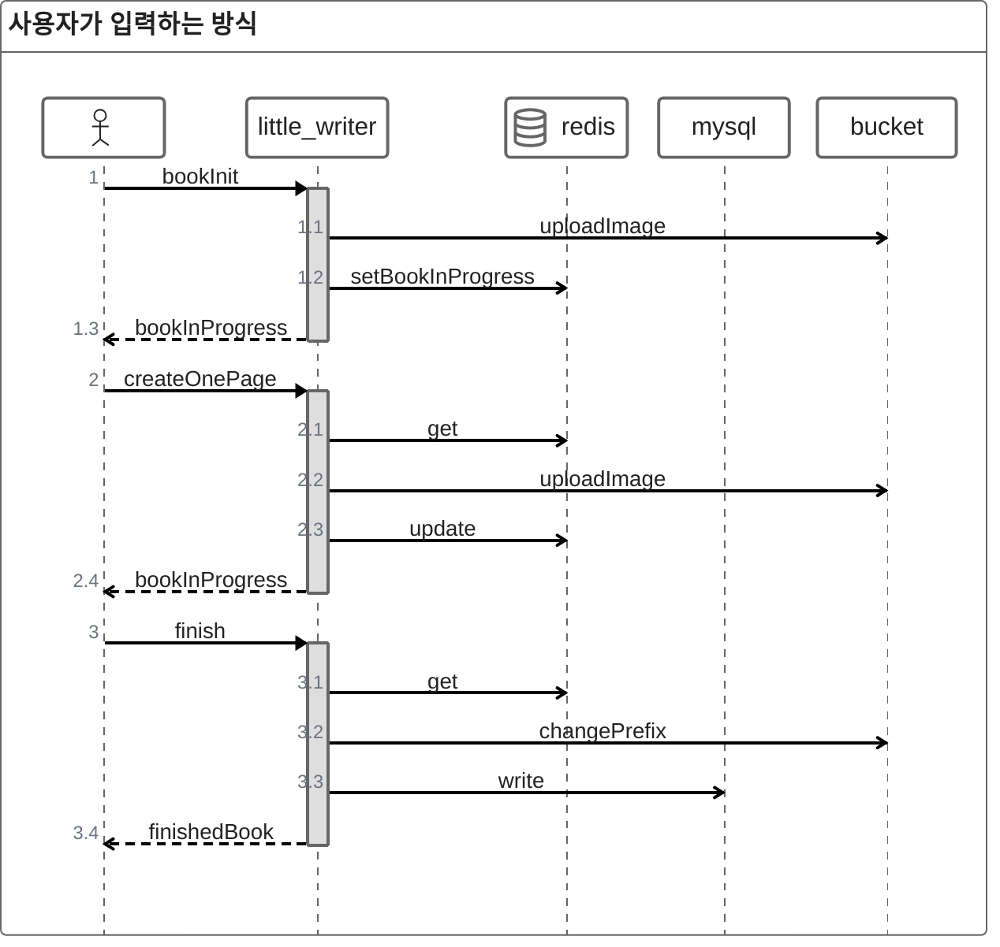

* TOC
{:toc}

 

## 1. 생성형 AI 프로젝트에서 사용하기

### 1.1 호출 구조

생성형 AI를 서비스에 적용할 때는 API 호출을 어디에서 수행하고, 파이프라인을 어떤 계층에서 관리할 것인지를 먼저 결정해야 합니다.

아래의 내용을 통해 AI 호출 구조의 방식을 비교하고 장단점과 한계를 비교하여 어떤 구조가 서비스 목적에 적합한지 살펴 보겠습니다.

### 1.1.1 클라이언트에서 직접 사용하기 ###

`executePipeline`단계에서는 여러 호출을 조합하여 사용합니다.

클라이언트가 곧바로 생성 API를 호출하고, 이를 통해 파이프라인을 구성하는 방식입니다. 속도 측면에서는 빠른 응답을 기대할 수 있다는 장점이 있습니다.

 

**문제점**

>**도메인 관리 책임 분산**

- 핵심 도메인인 사용자 입력을 받아 페이지 한 장을 생성하는 기능이 클라이언트에 위치하여 관리 주체가 분산됩니다.

>**문맥 전달의 복잡성**

 - 생성형 AI 요청 시 이전 대화/문맥 정보를 함께 전송해야 합니다.
 - 이를 클라이언트에서 직접 처리하면 데이터 누락·불일치 위험이 있으며, 전체 파이프라인 관리가 복잡해집니다.

>**보안 취약점**

 - 클라이언트에 API 키를 포함해야 하므로 키 노출 위험이 있습니다.
 - 무단 사용·과금 폭주·서비스 남용 등으로 이어질 수 있습니다.

 

### 1.1.2 api서버에서 파이프라인을구축하고 사용하기 ###

>**일관성 유지**

- 책 한 장 생성이 서버에서 통합 관리되면 데이터 흐름과 규칙을 관리하기 용이합니다.

>**책임 집중**

- `책 한장 생성`은 현재 서비스의 핵심 도메인 이므로 이를 서버에서 관리해야 합니다.
이는 도메인 내에서 `bookInProgress`객체로 관리됩니다.

>**보안 및 비용 관리 용이**

- 클라이언트 직접 호출 시 발생할 수 있는 API 키 노출 위험과 rateLimit을 자체적으로 관리 할 수 있습니다.

**한계**

현재 구조는 단일 서버 인스턴스에서 모든 기능을 처리하는 방식으로 운영되고 있습니다.
즉, 하나의 서버가 동시에 `사용자 요청 처리`, `도메인 로직 수행`, `외부 API 호출`까지 모두 담당하고 있습니다. 또한 하나의 실행파일을 통해 실행되기에 특정 작업에 대한 스케일링에 한계가 있습니다.

### 1.2 생성형 AI와 서비스 도메인

#### 1.2.1 핵심 도메인 분석하기 ####

 

**LittleWriter 핵심 도메인 정의**

LittleWriter 서비스의 가장 중요한 기능은 **"사용자와의 상호작용을 통해 동화를 만들어 내는 것"**입니다.

따라서 이 서비스의 핵심 도메인은 다음과 같이 정의할 수 있습니다.

>**"책이 어떻게 만들어지고 관리되는가"**

 

**도메인 분석 관점**

LittleWriter가 사용자에게 제공하는 최종 결과물은 **책(Book)**입니다.

따라서 책은 핵심 도메인 엔티티로 자리 잡습니다.

설계의 핵심은 바로 이 책이 어떻게 생성되고, 어떤 과정을 거쳐 사용자에게 제공되는가를 모델링하는 것입니다.

책은 생성 과정에서 아래와 같은 상태 전이를 거치며 완성됩니다.

1. **bookInit (초기화)**
    - 책을 처음 만든 상태
    - 사용자 입력: 등장인물, 전체 페이지 수

2. **bookInProgress (작성 중)**
    - 한 장씩 책을 채워 나가는 상태
    - 책은 이미 생성된 이전 내용을 가지고 있으며, 사용자는 다음 페이지 생성을 위한 입력을 제공

3. **generating (생성 중)**
    - 사용자 입력을 바탕으로 새로운 페이지 생성
    - 이 과정에서 AI 호출 같은 전략이 실행됨

4. **done (완성)**
    - 모든 페이지가 생성 완료된 상태
    - 사용자가 책 제목을 입력 → 최종 책 완성

**책 생성 과정의 네 가지 상태(bookInit, bookInProgress, generating, done)**를 중심으로 각 상태가 어떻게 전이되고, 그 과정에서 어떤 규칙이 적용되어야 하는지를 고려하여 도메인을 정의하고 흐름을 정의하는 접근 방식으로 설계하였습니다.

#### 1.2.2 의존성 분리 ####

**문제**

 `BookProgressHelper`가 Ai에 직접 의존하게 되며, 결과적으로 도메인과 AI 기술(프롬프트, 모델 교체 등)이 강하게 결합됩니다. 따라서 프롬프트 전략이나 모델이 바뀔 때마다 도메인 내의 코드까지 수정해야 일이 발생합니다.

서비스의 도메인이 다루어야 할 핵심은 **"책을 어떻게 만들고 관리하는가"**입니다. 즉 도메인의 책임은 페이지 순서, 책 완성 여부, 상태 전이 등과 같이 **"책이 어떤 규칙과 흐름에 따라 생성·관리되는가"** 를 정의하는 것입니다.

반면 AI를 사용하여 완성하는 방식은 **책을 채우는 여러 전략 중 하나**에 불과합니다.LLM 호출뿐 아니라 사람이 직접 입력, 외부 API 요약 등 다양한 대안이 존재하며 시스템은 이에 열려있어야 합니다.

**의존성 역전을 통한 분리**

`ContextGenerator`를 interface로 추상화하고 이를 구현한 세부 사항은 infraStructure영역에 속하며 `AiContextGenerator`로서 구현됩니다.

## 2. 사용자 입력기반 동화 생성하기

### 2.1 사용자 context 문제
동화 생성 서비스에서 가장 중요한 점은 사용자의 입력을 기반으로 이야기를 이어갈 수 있어야 한다는 것입니다. 이를 위해서는 서버가 현재 사용자가 진행 중인 동화 상태(bookInProgress)를 반드시 기억하고 있어야 합니다.

**이전 페이지 맥락 반영 필요**

사용자가 새로운 입력을 제공하면 단순히 그 입력만으로 이야기를 생성할 수는 없습니다. 이미 작성된 이전 페이지의 내용, 등장인물, 줄거리 전개 방향 등을 함께 고려해야 새로운 페이지가 자연스럽게 이어집니다. 따라서 서버는 항상 해당 사용자의 진행 중인 동화 상태를 유지하고 있어야 합니다.

**생성형 AI API의 Context**

생성형 AI 모델(OpenAI API 등)에 요청을 보낼 때는 각 요청이 독립적으로 처리됩니다. 즉, 생성형 AI 서버가 자체적으로 이전 대화에 관한 맥락을 관리하지 않으며 이전 대화에 관한 내용을 AI API를 호출하는 주체가 저장하고 관리해야 합니다.

**이미지 URL의 유효기간 문제**

DALL·E와 같은 이미지 생성 모델은 결과물의 URL을 반환하지만, 이 URL은 약 1시간 정도만 유효합니다. 따라서 이미지를 생성한 직후 빠르게 저장해야 하며, 그렇지 않으면 링크가 만료되어 접근이 불가능해집니다.

따라서 현재 진행상황에 관한 정보를 서버 측에서 관리하는 방식을 통해 AI의 Context문제와 이미지 Url의 유효시간 문제를 해결하고자 하였습니다.

### 2.2 Redis를 사용하여 관리하기

`bookInProgress` 상태를 관리하는 방법에는 여러 대안이 존재하며 각각의 장단점이 있습니다.

**1.인메모리 캐시 사용**
- 장점: 속도가 매우 빠르며 구현이 간단하다.
- 단점: 서버 재시작 시 데이터가 휘발되고, 다중 서버 환경에서는 캐시 일관성을 유지하기 어렵다.

 

**2. 데이터베이스(Mysql) 사용**
- 장점: 영속성이 보장되어 데이터가 사라지지 않는다.
- 단점:
    - bookInProgress 전용 테이블을 별도로 생성해야 하며, 이를 위한 스키마 관리 비용이 발생한다.
    - 사용자가 한 페이지를 생성할 때마다 매번 DB에 접근하여 진행 상태를 갱신해야 하므로, 잦은 읽기/쓰기 요청으로 인하여 잦은 트랜잭션이 발생할 수 있다.
    - 데이터 만료를 자동으로 처리할 수 있는 TTL 기능이 기본적으로 제공되지 않아, 만료 로직을 별도로 구현해야 한다.

결과적으로 단순히 임시 상태를 관리하기 위해 DB를 사용하면 구조가 복잡해지고 성능상 비효율이 생한다는 단점이 있습니다.

 

**3. Redis 사용** (최종 선택)
- 장점: 인메모리 기반이라 빠르면서 영속성도 제공한다.
- TTL 기능이 내장되어 있어 자동으로 만료를 관리할 수 있다.

따라서 Redis를 통해 사용자별 bookInProgress 상태를 TTL과 함께 관리하는 방식으로 구현하였습니다.

{: width="700"}_redis를 사용하여 진행중인 내용 관리_

### 2.3 동화 생성 상태 관리 방식 ###

**진행 상태 관리**

사용자가 동화를 생성하기 시작하면 `bookInProgress` 객체가 Redis에 저장됩니다.
조회는 사용자 ID를 기반으로 이루어져, 사용자별로 고유한 진행 상황을 유지할 수 있고 사용자 당 하나의 책만 생성 가능하도록 제한할 수 있습니다.

**이미지 관리**

생성된 이미지는 S3 버킷에 업로드되며, 버킷의 수명주기 정책을 통해 매일 자정에 자동으로 삭제됩니다.
동화가 최종적으로 완성되면, 이미지 파일의 **prefix(경로명)**를 변경하여  수명주기에 의해 관리되지 않고 영구 보관 대상으로 전환됩니다.

**최종 저장**

동화가 완료되면 bookInProgress에 있던 내용은 MySQL DB에 저장됩니다.
이후 Redis에 있던 상태 값은 삭제되며, 이후 다시 동화를 시작하면 새로운 `bookInProgress`가 생성됩니다.

