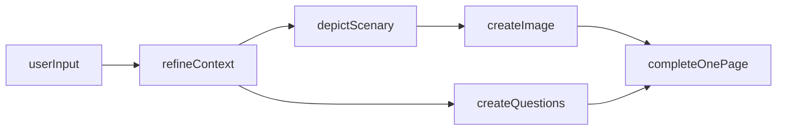
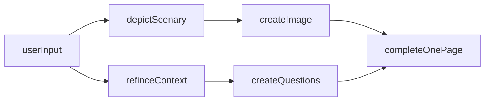
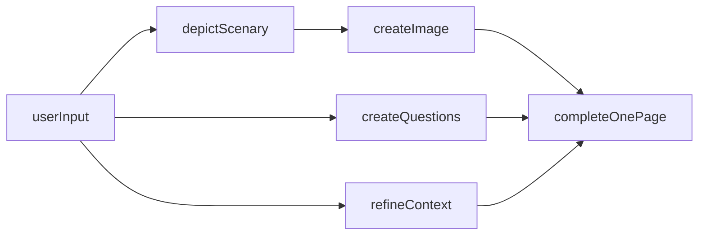
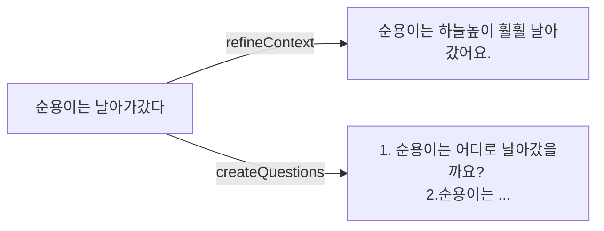
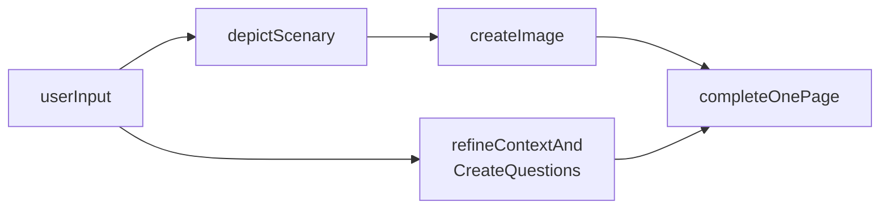

* TOC
{:toc}

 

# 들어가며

## 요구사항
> 사용자에게 이어질 동화 내용을 입력받는다
>
> 입력받은 동화 내용을 통해 삽화를 생성해야 한다.
>
> 입력받은 동화 내용을 통해 이어질 내용을 위한 질문 3개를 생성해야 한다.
>
> 삽화에는 주인공이 등장해야 한다.

 

다음과 같은 기능을 개발해야 했으며, 이 기능이 프로젝트의 핵심이었습니다.

## 변경사항
이 프로젝트는 2023.12 ~ 2024.6 까지 진행하였으며, 현재의 생성형 AI 모델과 차이가 많이 날 수 있습니다.

설계 문제들은 성능 향상으로 인해 고민하지 않아도 될 만큼 개선되었고, 비용도 훨씬 저렴해졌습니다.

이러한 점을 감안하여 보시기 바랍니다.

 

## 1. 파이프라인 구성

### 1.1 초기 파이프라인 구성
프로젝트 초기의 동작 파이프라인은 다음과 같았습니다.

- `userInput` : 사용자에게 이어질 동화 내용을 입력받습니다
- `refineContext` : 받은 문장을 정제하고 재가공합니다 (문장을 풍부하게 표현하게 바꾸거나 부자연스러운 문장을 자연스럽게 고칩니다)
- `depictScenary` : 가공된 문장을 통해 현재 상황을 묘사합니다
- `createImage` : 묘사하는 문장을 통해 이미지를 생성합니다
- `createQuestions` : 정제된 문장을 통해 질문을 생성합니다

`refineContext` 이후 질문 생성과 이미지 생성을 병렬적으로 실행시키는 구조입니다.
총 `4번`의 OpenAI API 요청을 거치게 됩니다.

**한계**
1. 느린 생성 시간
- 이미지를 생성하기 위해 `refineContext`, `depictScenary`를 거쳐야 하기 때문에 시간 소요가 많이 됩니다
2. 응답 안정성
- `refineContext`에서 문제가 생기면 모든 과정이 영향을 받게 됩니다
- 총 `4번`의 OpenAI API 요청이 필요합니다

### 1.2 개선 - 이미지 생성 분리

한 페이지를 완성시키기 위해서는 가장 느린 `createImage` 단계를 최대한 빨리 실행해야 합니다.

삽화 이미지 생성 이전에 사용자 입력을 정제하지 않고 그대로 사용하여 이미지를 생성하는 방식으로 변경하였습니다.
사용자 입력에서 바로 배경을 세세하게 묘사하는 텍스트를 추출하여 이미지를 생성합니다.

**한계**
`depictScenary`의 결과와 `refineContext`의 내용이 정확하게 일치하지 않을 가능성이 있습니다.

모두 `userInput`에 기반한 문장이지만 세부 내용에서 다를 수 있기 때문입니다.

`userInput`이 만약 _"순용이는 산으로 갔다"_ 라면...

`depictScenary`의 결과는 _"산, 많은 나무와 그늘, 강렬한 햇살이 비추고 있음, 평화롭고 조용한 분위기"_

`refineContext`의 결과는 _"순용이는 구름을 뚫을듯한 높은 산으로 갔다."_

와 같이 생성된 삽화와 생성된 동화 내용에서 조금 차이가 생길 수 있습니다.

그러나 그 정도가 심하지 않고 어차피 `userInput`을 기반으로 생성되기 때문에 사용자가 이질감을 느낄 정도로 차이가 발생하지 않는다고 판단하였습니다.
무엇보다 사용자 경험의 관점에서 생성 속도가 유의미하게 줄어들기에 이러한 방식을 채택하였습니다.

### 1.3 최종 파이프라인

**createQuestions와 refineContext 분리**

가장 단순한 방법이지만 한 가지 문제가 존재합니다.
createQuestions의 응답과 refineContext의 응답이 서로 맞지 않을 수 있기 때문입니다.
refineContext에서는 임의적으로 사용자 입력에 추가적인 세부 묘사 혹은 상황을 추가하기 때문입니다.
예를 들어

이런 식으로 됩니다.

사용자에게 다음 내용을 생성하기 편하게 하기 위한 도움 질문을 만드는 것이 핵심적인 기능 중 하나이기에 이 방식은 사용하지 않았습니다.

**최종**

따라서

이렇게 텍스트 정제 → 질문 생성을 하나의 요청으로 처리한 후 JSON 형식을 통해 응답받습니다.

두 가지 기능을 하나의 요청을 통해 비용을 최적화하였습니다.
