* TOC
{:toc}

<br>

# 들어가며

## 요구사항
> 사용자에게 이어질 동화 내용을 입력받는다
>
> 입력받은 동화 내용을 통해 삽화를 생성해야 한다.
>
> 입력받은 동화 내용을 통해 이어질 내용을 위한 질문 3개를 생성해야 한다.
> 
> 삽화에는 주인공이 등장해야 한다.

<br>


다음과 같은 기능을 개발해야 했으며, 이 기능이 프로젝트의 핵심이었습니다.

## 변경사항
이 프로젝트는 2023.12 ~ 2024.6 까지 진행하였으며, 현재의 생성형 AI 모델과 차이가 많이 날 수 있습니다.

설계 문제들은 성능 향상으로 인해 고민하지 않아도 될 만큼 개선되었고, 비용도 훨씬 저렴해졌습니다.

이러한 점을 감안하여 보시기 바랍니다.

<br>

## 1. 파이프라인 구성


### 1.1 초기 파이프라인 구성
프로젝트 초기의 동작 파이프라인은 다음과 같았습니다.

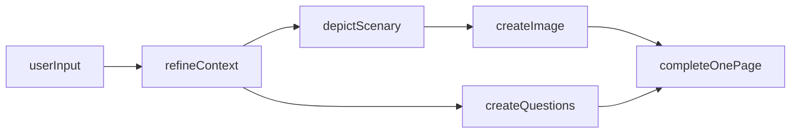

- `userInput` : 사용자에게 이어질 동화 내용을 입력받습니다
- `refineContext` : 받은 문장을 정제하고 재가공합니다 (문장을 풍부하게 표현하게 바꾸거나 부자연스러운 문장을 자연스럽게 고칩니다)
- `depictScenary` : 가공된 문장을 통해 현재 상황을 묘사합니다
- `createImage` : 묘사하는 문장을 통해 이미지를 생성합니다
- `createQuestions` : 정제된 문장을 통해 질문을 생성합니다

`refineContext` 이후 질문 생성과 이미지 생성을 병렬적으로 실행시키는 구조입니다.
총 `4번`의 OpenAI API 요청을 거치게 됩니다.

**한계** 
1. 느린 생성 시간
- 이미지를 생성하기 위해 `refineContext`, `depictScenary`를 거쳐야 하기 때문에 시간 소요가 많이 됩니다
2. 응답 안정성
- `refineContext`에서 문제가 생기면 모든 과정이 영향을 받게 됩니다
- 총 `4번`의 OpenAI API 요청이 필요합니다

### 1.2 개선 - 이미지 생성 분리

한 페이지를 완성시키기 위해서는 가장 느린 `createImage` 단계를 최대한 빨리 실행해야 합니다.

삽화 이미지 생성 이전에 사용자 입력을 정제하지 않고 그대로 사용하여 이미지를 생성하는 방식으로 변경하였습니다.
사용자 입력에서 바로 배경을 세세하게 묘사하는 텍스트를 추출하여 이미지를 생성합니다.

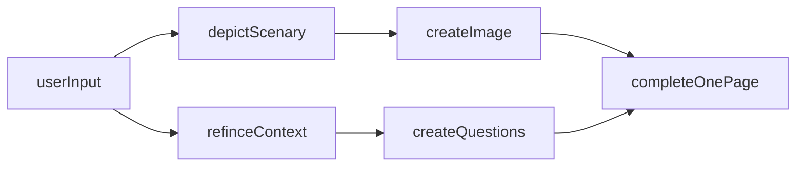

**한계**
`depictScenary`의 결과와 `refineContext`의 내용이 정확하게 일치하지 않을 가능성이 있습니다.

모두 `userInput`에 기반한 문장이지만 세부 내용에서 다를 수 있기 때문입니다.

`userInput`이 만약 _"순용이는 산으로 갔다"_ 라면...

 

`depictScenary`의 결과는 _"산, 많은 나무와 그늘, 강렬한 햇살이 비추고 있음, 평화롭고 조용한 분위기"_

`refineContext`의 결과는 _"순용이는 구름을 뚫을듯한 높은 산으로 갔다."_

와 같이 생성된 삽화와 생성된 동화 내용에서 조금 차이가 생길 수 있습니다.
 

그러나 그 정도가 심하지 않고 어차피 `userInput`을 기반으로 생성되기 때문에 사용자가 이질감을 느낄 정도로 차이가 발생하지 않는다고 판단하였습니다.
무엇보다 사용자 경험의 관점에서 생성 속도가 유의미하게 줄어들기에 이러한 방식을 채택하였습니다.

### 1.3 최종 파이프라인

**createQuestions와 refineContext 분리**

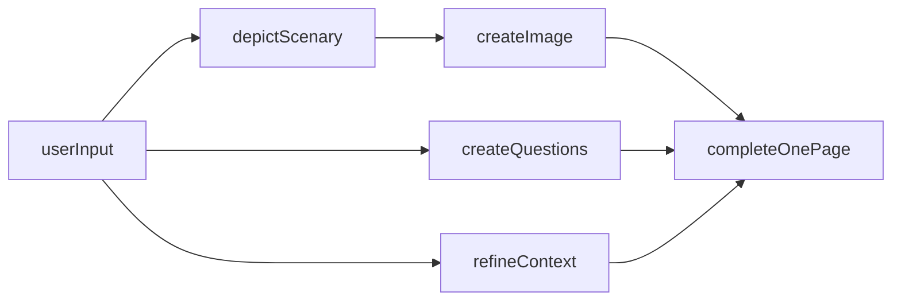
가장 단순한 방법이지만 한 가지 문제가 존재합니다.
createQuestions의 응답과 refineContext의 응답이 서로 맞지 않을 수 있기 때문입니다.
refineContext에서는 임의적으로 사용자 입력에 추가적인 세부 묘사 혹은 상황을 추가하기 때문입니다.
예를 들어

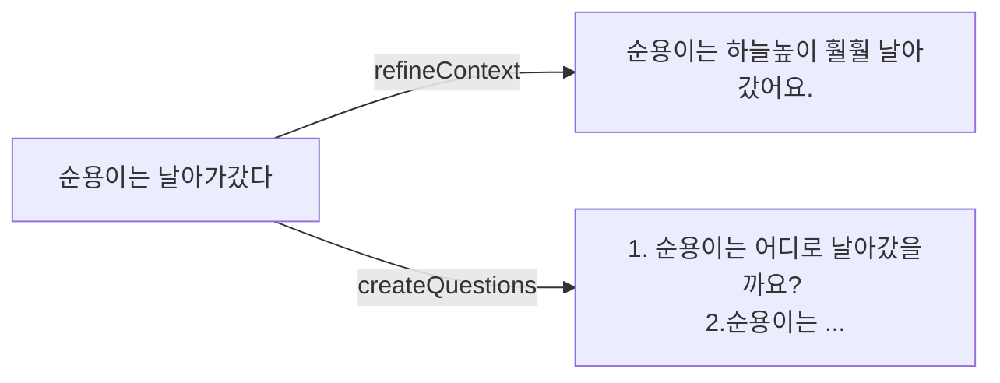

이런 식으로 됩니다.

사용자에게 다음 내용을 생성하기 편하게 하기 위한 도움 질문을 만드는 것이 핵심적인 기능 중 하나이기에 이 방식은 사용하지 않았습니다.

**최종**

따라서 

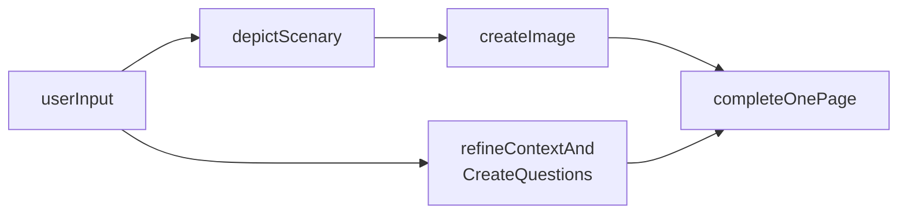
이렇게 텍스트 정제 → 질문 생성을 하나의 요청으로 처리한 후 JSON 형식을 통해 응답받습니다.

두 가지 기능을 하나의 요청을 통해 비용을 최적화하였습니다.

<br>

## 2. 생성형 AI 프로젝트에서 사용하기

### 2.1 호출 구조

생성형 AI를 서비스에 적용할 때는 API 호출을 어디에서 수행하고, 파이프라인을 어떤 계층에서 관리할 것인지를 먼저 결정해야 합니다.

아래의 내용을 통해 AI 호출 구조의 방식을 비교하고 장단점과 한계를 비교하여 어떤 구조가 서비스 목적에 적합한지 살펴 보겠습니다.

### 2.1.1 클라이언트에서 직접 사용하기 ###
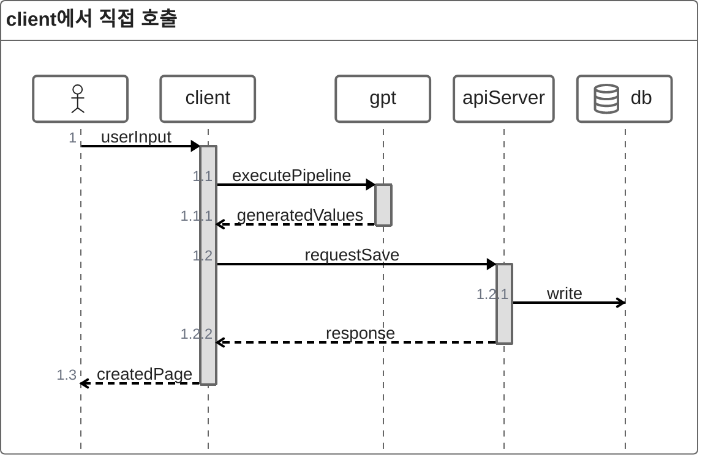
`executePipeline`단계에서는 [여러 호출을 조합](#13-최종-파이프라인)하여 사용합니다.

클라이언트가 곧바로 생성 API를 호출하고, 이를 통해 파이프라인을 구성하는 방식입니다. 속도 측면에서는 빠른 응답을 기대할 수 있다는 장점이 있습니다.

<br>

**문제점**

>**도메인 관리 책임 분산**

- 핵심 도메인인 사용자 입력을 받아 페이지 한 장을 생성하는 기능이 클라이언트에 위치하여 관리 주체가 분산됩니다.

>**문맥 전달의 복잡성**

 - 생성형 AI 요청 시 이전 대화/문맥 정보를 함께 전송해야 합니다.
 - 이를 클라이언트에서 직접 처리하면 데이터 누락·불일치 위험이 있으며, 전체 파이프라인 관리가 복잡해집니다.

>**보안 취약점**

 - 클라이언트에 API 키를 포함해야 하므로 키 노출 위험이 있습니다.
 - 무단 사용·과금 폭주·서비스 남용 등으로 이어질 수 있습니다.

<br>

### 2.1.2 api서버에서 파이프라인을구축하고 사용하기 ###
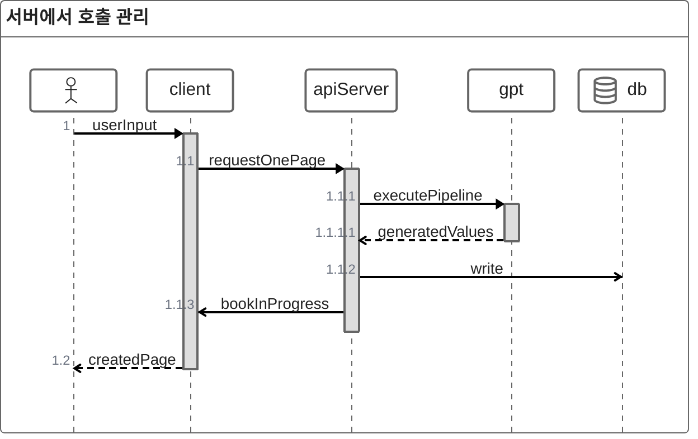

>**일관성 유지**

- 책 한 장 생성이 서버에서 통합 관리되면 데이터 흐름과 규칙을 관리하기 용이합니다.

>**책임 집중**

- `책 한장 생성`은 현재 서비스의 핵심 도메인 이므로 이를 서버에서 관리해야 합니다.
이는 도메인 내에서 `bookInProgress`객체로 관리됩니다.

>**보안 및 비용 관리 용이**

- 클라이언트 직접 호출 시 발생할 수 있는 API 키 노출 위험과 rateLimit을 자체적으로 관리 할 수 있습니다.

**한계**

현재 구조는 단일 서버 인스턴스에서 모든 기능을 처리하는 방식으로 운영되고 있습니다.
즉, 하나의 서버가 동시에 `사용자 요청 처리`, `도메인 로직 수행`, `외부 API 호출`까지 모두 담당하고 있습니다. 또한 하나의 실행파일을 통해 실행되기에 특정 작업에 대한 스케일링에 한계가 있습니다.

### 2.2 생성형 AI와 서비스 도메인

#### 2.2.1 핵심 도메인 분석하기 ####

<br>

**LittleWriter 핵심 도메인 정의**

LittleWriter 서비스의 가장 중요한 기능은 **“사용자와의 상호작용을 통해 동화를 만들어 내는 것”**입니다.

따라서 이 서비스의 핵심 도메인은 다음과 같이 정의할 수 있습니다.

>**“책이 어떻게 만들어지고 관리되는가”**

<br>

**도메인 분석 관점**

LittleWriter가 사용자에게 제공하는 최종 결과물은 **책(Book)**입니다.

따라서 책은 핵심 도메인 엔티티로 자리 잡습니다.

설계의 핵심은 바로 이 책이 어떻게 생성되고, 어떤 과정을 거쳐 사용자에게 제공되는가를 모델링하는 것입니다.

책은 생성 과정에서 아래와 같은 상태 전이를 거치며 완성됩니다.

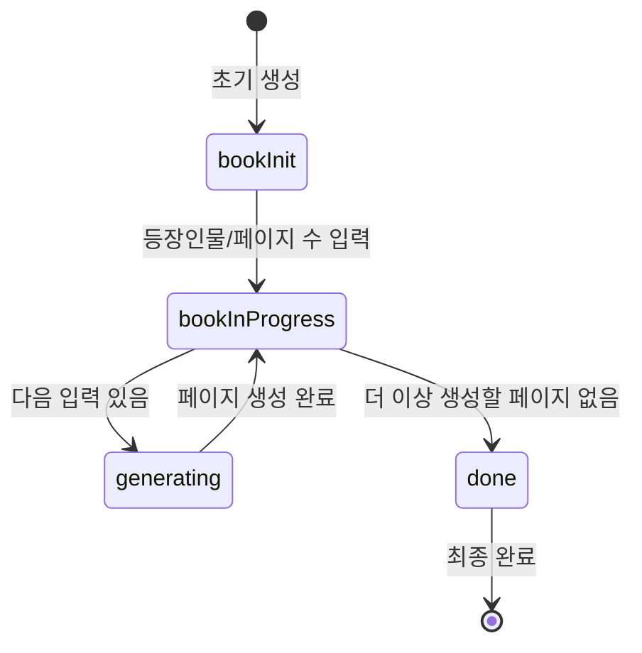

1. **bookInit (초기화)**
    - 책을 처음 만든 상태
    - 사용자 입력: 등장인물, 전체 페이지 수

2. **bookInProgress (작성 중)**
    - 한 장씩 책을 채워 나가는 상태
    - 책은 이미 생성된 이전 내용을 가지고 있으며, 사용자는 다음 페이지 생성을 위한 입력을 제공

3. **generating (생성 중)**
    - 사용자 입력을 바탕으로 새로운 페이지 생성
    - 이 과정에서 AI 호출 같은 전략이 실행됨

4. **done (완성)**
    - 모든 페이지가 생성 완료된 상태
    - 사용자가 책 제목을 입력 → 최종 책 완성

**책 생성 과정의 네 가지 상태(bookInit, bookInProgress, generating, done)**를 중심으로 각 상태가 어떻게 전이되고, 그 과정에서 어떤 규칙이 적용되어야 하는지를 고려하여 도메인을 정의하고 흐름을 정의하는 접근 방식으로 설계하였습니다.

#### 2.2.1 의존성 분리 ####

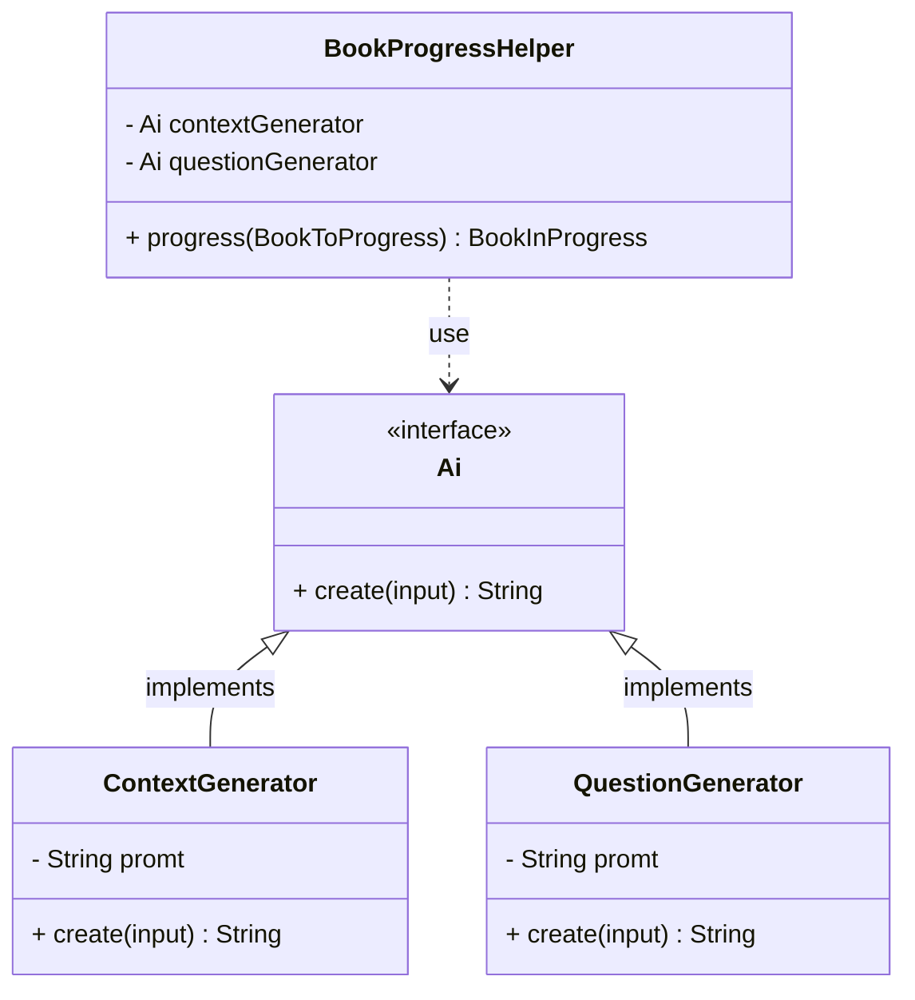
**문제**

 `BookProgressHelper`가 Ai에 직접 의존하게 되며, 결과적으로 도메인과 AI 기술(프롬프트, 모델 교체 등)이 강하게 결합됩니다. 따라서 프롬프트 전략이나 모델이 바뀔 때마다 도메인 내의 코드까지 수정해야 일이 발생합니다.

서비스의 도메인이 다루어야 할 핵심은 **“책을 어떻게 만들고 관리하는가”**입니다. 즉 도메인의 책임은 페이지 순서, 책 완성 여부, 상태 전이 등과 같이 **“책이 어떤 규칙과 흐름에 따라 생성·관리되는가”** 를 정의하는 것입니다.

반면 AI를 사용하여 완성하는 방식은 **책을 채우는 여러 전략 중 하나**에 불과합니다.LLM 호출뿐 아니라 사람이 직접 입력, 외부 API 요약 등 다양한 대안이 존재하며 시스템은 이에 열려있어야 합니다.

**의존성 역전을 통한 분리**

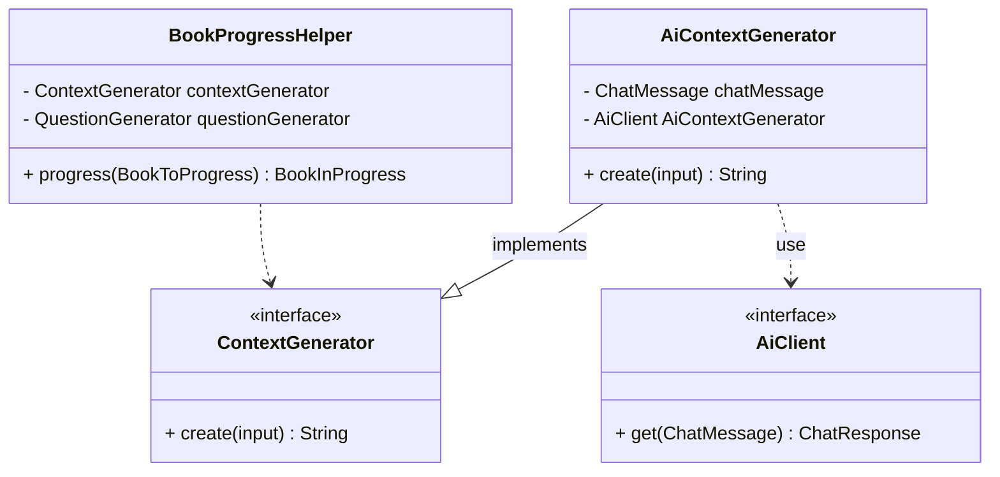

`ContextGenerator`를 interface로 추상화하고 이를 구현한 세부 사항은 infraStructure영역에 속하며 `AiContextGenerator`로서 구현됩니다.


### 2.3 사용자 입력기반 동화 생성하기

#### 2.3.1 사용자 context 문제
동화 생성 서비스에서 가장 중요한 점은 사용자의 입력을 기반으로 이야기를 이어갈 수 있어야 한다는 것입니다. 이를 위해서는 서버가 현재 사용자가 진행 중인 동화 상태(bookInProgress)를 반드시 기억하고 있어야 합니다.

**이전 페이지 맥락 반영 필요**

사용자가 새로운 입력을 제공하면 단순히 그 입력만으로 이야기를 생성할 수는 없습니다. 이미 작성된 이전 페이지의 내용, 등장인물, 줄거리 전개 방향 등을 함께 고려해야 새로운 페이지가 자연스럽게 이어집니다. 따라서 서버는 항상 해당 사용자의 진행 중인 동화 상태를 유지하고 있어야 합니다.

**생성형 AI API의 Context**

생성형 AI 모델(OpenAI API 등)에 요청을 보낼 때는 각 요청이 독립적으로 처리됩니다. 즉, 생성형 AI 서버가 자체적으로 이전 대화에 관한 맥락을 관리하지 않으며 이전 대화에 관한 내용을 AI API를 호출하는 주체가 저장하고 관리해야 합니다.

**이미지 URL의 유효기간 문제**

DALL·E와 같은 이미지 생성 모델은 결과물의 URL을 반환하지만, 이 URL은 약 1시간 정도만 유효합니다. 따라서 이미지를 생성한 직후 빠르게 저장해야 하며, 그렇지 않으면 링크가 만료되어 접근이 불가능해집니다.

따라서 현재 진행상황에 관한 정보를 서버 측에서 관리하는 방식을 통해 AI의 Context문제와 이미지 Url의 유효시간 문제를 해결하고자 하였습니다.

#### 2.3.2 Redis를 사용하여 관리하기

`bookInProgress` 상태를 관리하는 방법에는 여러 대안이 존재하며 각각의 장단점이 있습니다.

**1.인메모리 캐시 사용**
- 장점: 속도가 매우 빠르며 구현이 간단하다.
- 단점: 서버 재시작 시 데이터가 휘발되고, 다중 서버 환경에서는 캐시 일관성을 유지하기 어렵다.

<br>

**2. 데이터베이스(Mysql) 사용**
- 장점: 영속성이 보장되어 데이터가 사라지지 않는다.
- 단점: 
    - bookInProgress 전용 테이블을 별도로 생성해야 하며, 이를 위한 스키마 관리 비용이 발생한다.
    - 사용자가 한 페이지를 생성할 때마다 매번 DB에 접근하여 진행 상태를 갱신해야 하므로, 잦은 읽기/쓰기 요청으로 인하여 잦은 트랜잭션이 발생할 수 있다.
    - 데이터 만료를 자동으로 처리할 수 있는 TTL 기능이 기본적으로 제공되지 않아, 만료 로직을 별도로 구현해야 한다.

결과적으로 단순히 임시 상태를 관리하기 위해 DB를 사용하면 구조가 복잡해지고 성능상 비효율이 생한다는 단점이 있습니다.

<br>

**3. Redis 사용** (최종 선택)
- 장점: 인메모리 기반이라 빠르면서 영속성도 제공한다.
- TTL 기능이 내장되어 있어 자동으로 만료를 관리할 수 있다.

따라서 Redis를 통해 사용자별 bookInProgress 상태를 TTL과 함께 관리하는 방식으로 구현하였습니다.

{: width="700"}_redis를 사용하여 진행중인 내용 관리_

#### 2.3.3 동화 생성 상태 관리 방식 ####

**진행 상태 관리**

사용자가 동화를 생성하기 시작하면 `bookInProgress` 객체가 Redis에 저장됩니다.
조회는 사용자 ID를 기반으로 이루어져, 사용자별로 고유한 진행 상황을 유지할 수 있고 사용자 당 하나의 책만 생성 가능하도록 제한할 수 있습니다.

**이미지 관리**

생성된 이미지는 S3 버킷에 업로드되며, 버킷의 수명주기 정책을 통해 매일 자정에 자동으로 삭제됩니다.
동화가 최종적으로 완성되면, 이미지 파일의 **prefix(경로명)**를 변경하여  수명주기에 의해 관리되지 않고 영구 보관 대상으로 전환됩니다.

**최종 저장**

동화가 완료되면 bookInProgress에 있던 내용은 MySQL DB에 저장됩니다.
이후 Redis에 있던 상태 값은 삭제되며, 이후 다시 동화를 시작하면 새로운 `bookInProgress`가 생성됩니다.

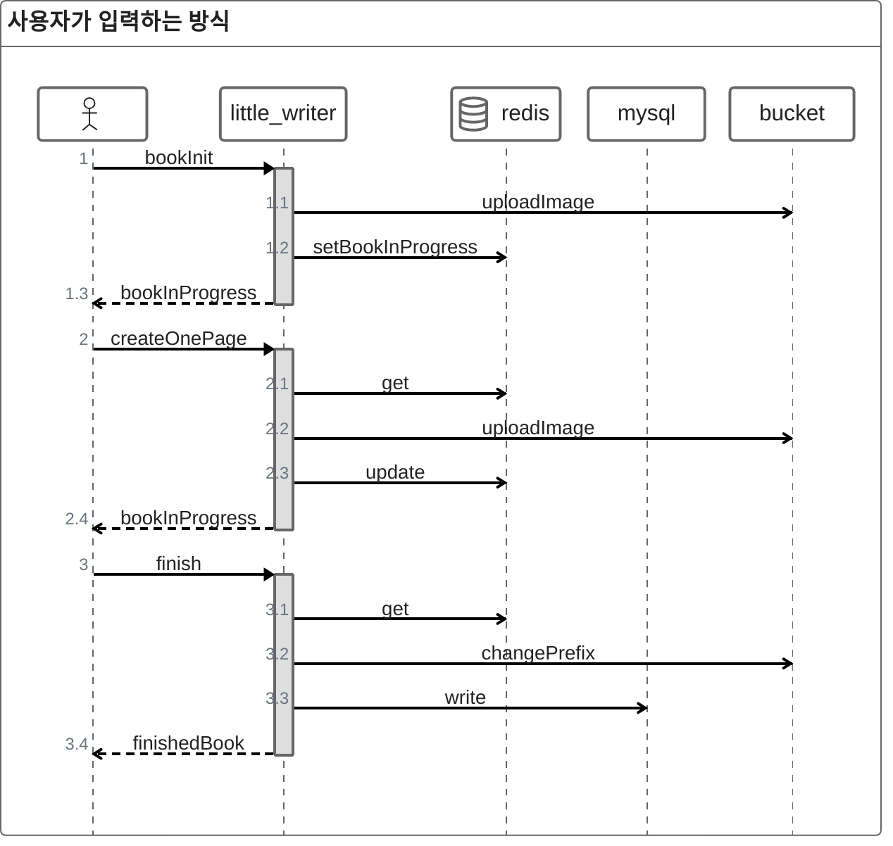

## 3. 이미지 생성하기

비용과 성능 사이에서 어떤 모델을 사용해야 할지 잘 선택하는 것이 중요합니다.
프로젝트를 진행하는 도중에도 모델의 개선이 이루어졌고, 처음 기획할 당시에 없었던 모델인 GPT-4 Turbo가 추가되기도 하였습니다.
(2024년 4월 기준)


### 3.1 캐릭터 이미지 생성하기

Little Writer에서는 다음과 같은 방식을 통해 사용자가 자신만의 캐릭터를 생성 할 수 있습니다.
이를 통해 자신이 만든 등장인물을 사용하여 동화 이야기를 이어나갈 수 있는 기능을 제공합니다.

```

[사용자가 캐릭터 스케치] → [성격, 이름 등 캐릭터 정보 입력] → [AI를 통해 완성된 캐릭터 저장]

이후 자신이 생성한 캐릭터를 통해 동화 생성

```

>**요구사항**
>- 생성된 캐릭터는 일관된 그림체를 가져야 한다.
>- 생성된 캐릭터는 사용자의 그림을 기반으로 만들어져야 한다.
>- 생성된 캐릭터로 동화를 만들 수 있어야 한다.
>

#### 3.1.1 모델 선택하기

캐릭터 생성에 있어 모델 선택의 가장 큰 기준을 다음 항목을 설정했습니다.

>1. 얼마나 비슷한 그림체로 생성되는가
>2. 사용자의 그림을 얼마나 잘 인식 하는가

`Stable Diffusion`은 LoRA를 적용하여 동일한 스타일을 반복적으로 유지하기 용이하며, ControlNet의 Canny 조건을 통해 사용자가 입력하신 스케치 라인을 통해 일관된 그림체의 캐릭터 이미지 생성이 가능했습니다. DALL·E의 경우 당시 모델의 image-to-image 기능의 성능이 기준에 부합하지 않아 사용하지 않았습니다.

{: width="500"}_사용자 입력의 스케치(좌) 와 stable diffusion을 사용하여 변환한 이미지(우)_

#### 3.1.2 `appearance_keyword`와 캐릭터 생성 전략

이 과정에서 캐릭터 엔티티에는 이미지에서 추출한 외형 설명 텍스트를 appearance_keyword로 함께 저장합니다. 
`appearance_keyword`는 _머리 색과 스타일, 피부 톤, 상·하의의 종류와 색상, 신발 및 소품(모자·가방 등), 표정과 포즈_ 와 같은 요소를 텍스트 형식으로 추출하여 저장하며, 이후 삽화 생성 시 text-to-image 프롬프트로 재사용되어 img2img와 text2img 환경을 자연스럽게 연결해 줍니다.

생성할 이미지에서 사용자가 그린 등장인물 포함하게 하는 방식으로 다음과 같은 방식을 검토했습니다.

>1. image-to-image 방식을 사용하여 생성된 캐릭터에 배경을 생성하기
>2. text-to-image를 사용하여 캐릭터 특징을 텍스트로 추출 후 프롬프트로만 생성하기

최종적으로 text-to-image 방식을 채택하였습니다.

**이유**
- image-to-image는 추론 시간이 급격히 증가하고, 모델 상태/리소스에 따라 성능 편차가 큼.
- 한 페이지 생성에 수 분이 소요되면 사용자 경험 측면에서 매우 적합하지 않음.
- text-to-image는 appearance_keyword만 잘 추출된다면 LLM과의 연계가 용이함.

**프롬프트 예시**
```
you're a helpful assistant who depict character's appearance. 
depict with details only using only nouns and adjectives seperated by comma, so that can redraw it with keywords again. 
depict with details using given description with only keywords seperated by comma without line break.
you must depict
- hairstyle
- top 
- pants 
- shoes
- hair color and length 

example : a boy with brown short hair, red shirt, blue shoes, brown pants if you cannot distinguish image return blank space
```

<br>

**최종 파이프 라인**
```
[사용자 스케치] → [stable diffusion을 통한 생성] → [gpt vision을 통한 키워드 텍스트 추출] → [저장]

이후 appearance_keyword와 캐릭터 테이블의 다른 속성을 조합하여 삽화에서 등장인물을 생성
```


### 3.2 동화 삽화 생성하기

동화의 삽화는 사용자의 입력을 기반으로 생성되며, 해당 입력을 묘사하는 그림 속에는 반드시 등장인물이 포함됩니다. 삽화를 생성할 때 다음의 기준을 중요한 원칙으로 설정하였습니다.

>**얼마나 일관된 그림체로 생성되는가**

- 삽화 전체가 동일한 화풍과 스타일을 유지하여 동화의 연속성이 보장되어야 합니다.

<br>

>**주인공이 삽화에 잘 나타나는가**

- 사용자가 직접 그린 캐릭터라고 인식될 수 있을 만큼 주인공의 특징이 명확히 표현되어야 하며 어색하지 않아야 합니다.

<br>

>**현재 진행되고 있는 내용을 얼마나 잘 표현하는가**

- 사용자의 입력 내용이 삽화 속 상황으로 자연스럽게 반영되어, 줄거리와 그림이 조화를 이루어야 합니다.

<br>

>**생성 속도가 얼마나 빠른가**

- 이미지를 생성하기까지의 시간이 사용자 경험을 해치지 않는 선에서 끝나야 합니다.

<br>

이 기준을 중심으로 여러 방식의 삽화 생성 방법을 비교·검토하였습니다.


#### 3.2.1 stable diffusion
삽화 생성 시 Stable Diffusion을 활용하면 `LoRA`를 적용하여 **일관된 그림체로 결과물을 만들 수 있습니다.** 동화의 분위기에 맞는 화풍을 유지할 수 있기 때문에 서비스의 **완성도와 통일성을 높이는 장점**이 있습니다.

{: width="500"}_stable diffusion예시_

**장점**
- lora를 통해 일관된 화풍의 그림으로 생성이 가능하다

**단점**
- 느린 생성 속도
    - 평균적으로 20초 + 시간이 생성되고 이전의 전처리 동작까지 포함하면 삽화 하나에 30초 ~ 1분의 시간이 소요됩니다.
- 텍스트 인식 성능
    - dalle에 비해 프롬프트 이해도가 현저히 떨어지기때문에 텍스트를 통한 장면 묘사가 부실합니다. 특히 삽화의 구도가 거의 항상 고정되어서 나오는 특징이 있습니다.

#### 3.2.2 dall-e와 stable-diffusion 같이 사용하기
Stable Diffusion을 단독으로 사용할 경우, LoRA를 적용하여 화풍을 통일할 수 있다는 장점이 있습니다. 그러나 텍스트만으로 사용자가 원하는 장면이나 분위기를 정확히 묘사하기에는 한계가 존재합니다. 특히 동화의 삽화는 단순히 캐릭터 이미지를 생성하는 것을 넘어, 특정 장면과 상황을 표현해야 하기 때문에 구도와 세부 묘사가 매우 중요합니다. Stable Diffusion은 이러한 구도를 다양하게 반영하는 데 약점을 보이며, 결과물이 자주 고정된 형태로 생성되는 문제가 있습니다.

반대로, DALL·E는 텍스트 이해 능력이 우수하여 사용자가 작성한 프롬프트를 기반으로 다양한 구도와 장면을 잘 표현할 수 있습니다. 즉, 텍스트 기반 장면 해석력은 DALL·E가 강점을 가지는 부분입니다. 하지만 DALL·E는 스타일의 일관성이 떨어지고, 삽화 전체를 하나의 화풍으로 통일하는 데는 적합하지 않습니다.

따라서 두 모델을 결합하는 접근을 고려할 수 있습니다. 먼저 DALL·E를 활용하여 프롬프트 기반으로 장면의 기본 구도와 배치를 생성하고, 이후 Stable Diffusion을 사용해 LoRA를 적용한 채색과 스타일 보정을 수행하는 방식입니다. 이렇게 하면 DALL·E의 장점인 텍스트 이해와 구도 생성 능력과 Stable Diffusion의 강점인 화풍 통일성과 세부 표현력을 동시에 활용할 수 있습니다.

이 방식은 다소 복잡한 파이프라인을 요구하지만, 최종적으로는 사용자가 원하는 동화풍의 일관된 삽화를 확보하면서도 각 장면마다 달라지는 상황적 표현을 담을 수 있다는 점에서 서비스의 완성도를 높일 수 있는 가능성이 있습니다.

{: width="800"}_통합 워크플로우 예시_

**단계1. 프롬프트 추출**

system promt
```
you're a helpful assistant that depict details to generate image.
using given json, depict "currentContext" scene.
you should follow
- depict current scene in "mainCharacter"'s perspect of view
- do not contain any information of "mainCharacter"
- depict info must follow one of these format
  [character] is [character's posture], in [background], [lights]
  [object] is in [background], [lights]
- answer must be in english
```

input
```
{
    "previousContext" : "순용이는 오두막을 발견했습니다. 오두막은 어두웠고 거기에는 곰이 살고 있었습니다.곰은 말했습니다. "안녕?" 순용이는 곰에게 꿀을 나누어주었습니다",
    "currentContext" : "곰은 꿀을 맛있게 먹었습니다.",
    "whereStoryBegins" : "오두막",
    "mainCharacterName" :"순용"
}
```

output
```
The bear is sitting and eating honey, in a dimly lit cabin.
```

<br>

**단계2. 스케치 생성**

dalle를 통해 이미지의 스케치 즉 윤곽선을 생성하고 이를 `controlnet:canny`를 사용하여 stable diffusion을 사용해 변환합니다.
단계1.의 output에 사전정의된 프롬프트(_"do a sketch"_ 와 같이)를 추가하여 이미지를 생성할 수 있습니다.

{: width="500"}_Revised Prompt from Dalle3 - A full sized image in black and white line sketch style, depicting a bear comfortably seated inside a dimly lit, rustic log cabin, indulging in a sweet jar of honey. The interior ambiance of the cabin shows minimal light sources creating natural shadows and highlights, perfectly resulting in a calm and serene atmosphere._

**단계3. 스케치를 통해 삽화 완성**

{: width="500"}_stable-diffusion에 의해 완성된 이미지_

<br>

**장점**
- 다양한 구도의 이미지를 생성 가능합니다.
    - dalle 의 텍스트 이해도가 stable diffusion보다 높기에 즉 다양한 구도의 스케치를 통해 완성하는 방식을 사용할 수 있습니다.
- 이미지 묘사 텍스트[`depictScenary`](#11-초기-파이프라인-구성)의 결과를 공통적으로 재사용 가능합니다.
- 어느정도 일관된 그림체(같은 lora적용)로 삽화가 생성됩니다.

**단점**
- 생성 시간 소모가 매우 늘어납니다.
    -  이 방식에서는 하나의 이미지를 생성하기 위해 생성형 AI를 3번이나 사용해야 한다. 채색된 이미지를 생성하기까지 거의 1분이 넘는 시간이 소요되기에 동화를 만드는 과정에는 스케치된 이미지만 보여준 후 동화를 완성하면 채색된 이미지를 보여줍니다.

- deformation된 이미지가 계속해서 검출됩니다.
    -  밑그림을 그리고 stable-diffusion으로 이미지를 생성하여도 deformation문제를 완전히 해결할 수는 없었습니다.

- 더욱 복잡해지는 파이프라인
    - 이러한 구조는 복잡하고 유지 보수 측면에서도 상당히 별로였다. 무엇보다 생성형 AI를 사용하는 과정에서 어느 한 단계라도 문제가 생기면 다시 과정을 반복해야 하는 문제가 생깁니다.

#### 3.2.3 Dall-e만 사용하기

이방식은 [방식1](#221-stable-diffusion)과 동일하나 dall-e-3만을 사용하여 삽화를 생성합니다.

```
private static final ChatMessage SYSTEM_MESSAGE = new ChatMessage("system",
        """
                you're a helpful assistant that depict details to generate image.
                 using given json, depict "currentContext" scene.
               - choose random format given below
                 [whole context of appearanceKeyword] is [what main character is doing], in [background], [lights]
                 [other character] is [what they're doing], in [background], [lights]
                 [object] is in [background], [lights]
                 [background], [lights]
               - answer must be in english"""
);
```

**장점**
- 생성속도가 가장 빠른 방식입니다.
- 텍스트 이해도가 가장 높아 묘사할 수 있는 능력이 가장 뛰어납니다.

**단점**
- `appearance_keyword`항목이 잘못 입력된다면 이상하게 출력되는 단점이 있습니다.
- 등장인물이 조금씩 다르게 그려지고 다소 일관적이지 못한 그림체로 생성됩니다.

동화 서비스의 핵심은 **실시간으로 한 페이지씩 생성하여 사용자에게 제공**하는 기능입니다. 따라서 무엇보다도 이 과정에서의 사용자 경험이 가장 중요한 요소로 고려되었습니다.

이에 따라 삽화 생성 과정에서는 일관된 그림체 유지보다 **생성 속도와 텍스트 이해도를 우선**시하였습니다. 한 페이지 생성에 과도한 시간이 소요된다면 서비스 사용성이 떨어질 수 있기 때문입니다. 따라서 프로젝트를 진행하며 [방식3.](#223-dall-e만-사용하기)을 사용하였습니다.

## 4.마치며
### 4.1 한계

아래의 예시는 전시 당시 실제 사용자가 만들어낸 삽화입니다.

{: width="500"}_워크플로우 전체, 사용자입력에서 캐릭터 생성은 몸 전체 이미지 생성을 강제했음_

**그림의 일관성 문제**

본 프로젝트에서는 Stable Diffusion과 DALL·E를 병행하여 삽화를 제작하였습니다. 그러나 이미지 생성 방식으로 img2img와 text2img를 혼용하다 보니 초기 이미지가 가지고 있던 세부적인 디테일이 점차 손실되는 현상이 발생했습니다. 특히 동일한 캐릭터를 반복적으로 등장시켜야 하는 동화 제작의 특성상, 그림체와 외형이 매번 달라지는 문제가 뚜렷하게 나타났습니다.

이러한 결과는 당시(2024년 4월 기준) 이미지 생성 모델이 전반적으로 일관성을 유지하기 어려운 수준에 머물러 있었음을 보여줍니다. 즉, 캐릭터나 배경의 주요 속성을 동일하게 유지하면서 장면을 이어나가는 것이 기술적으로 쉽지 않았습니다. 따라서 억지스럽게 보일 수 있는 결과물도 적지 않았으며, 사용자가 기대하는 ‘연속성 있는 동화 삽화’를 구현하기에는 모델의 성능이 아직 부족했던 것이 사실입니다.

더불어 실시간으로 사용자의 입력을 받아 즉시 삽화를 생성해야 하는 특성을 가지고 있었기 때문에 별도의 세밀한 후처리를 거칠 여유가 없었습니다. 이러한 제약 속에서 이미지의 일관성을 유지하는 것은 더욱 어려웠고, 결과적으로 생성된 삽화가 다소 부자연스럽게 보이는 한계가 있었습니다.

**실질적 비용의 한계**

또한 LLM과 이미지 생성 모델은 로컬 환경에서 직접 구동하기 어려웠기 때문에, 외부 서비스를 통한 호스팅 비용 혹은 API 호출 비용이 필연적으로 발생했습니다. 프로젝트 당시 기준으로 Stable Diffusion은 한 달 약 47달러의 비용이 필요했으며, OpenAI API의 경우 GPT-4 모델을 활용해 동화를 100회 생성할 때 약 20달러의 비용이 발생했습니다(2024년 6월 기준).

이러한 구조에서는 특별한 비즈니스 모델(BM) 없이 서비스를 지속적으로 운영하기가 사실상 어려웠습니다. 더구나 프로젝트가 학생 신분에서 진행된 만큼 고성능 모델을 장기간 안정적으로 활용하기에는 경제적 부담이 컸습니다. 따라서 성능을 더 끌어올리거나 고급 모델을 적용하는 데에는 현실적인 제약이 존재했고, 이는 서비스 확장 가능성을 제한하는 중요한 요인으로 작용했습니다.

### 4.2 Little-Writer v2

**개인 프로젝트 전환 계획**

**프로젝트 전환 배경**
팀 프로젝트 종료 이후에도 서비스가 단순히 사라지기엔 아쉬움이 남습니다. 또한 전시에서 실제 사용자들이 직접 동화를 만들어본 기록을 남겨두고 싶습니다. 그래서 초심을 되새기고 기록을 남기기 위한 목적으로 개인 프로젝트 형태로 전환하고자 합니다.

**개선 사항**
> 파이프라인 안정성 강화
- 생성 실패 시 처리 로직을 더욱 안전하게 보완하여, 사용자 경험에 문제가 없도록 개선한다.

> 운영 비용 한계 고려
- 실제 호스팅을 위해서는 크레딧 기반 결제가 필요한데, 이는 개인사업자 등록이 필수이나 취업 시 불이익을 받을만한 여지를 남기고 싶지 않음.
- 따라서 상업적 운영보다 제한적으로 생성할 수 있게 구성할 예정.

현재 작업 진행중이며 변경사항 발생시 이 [문서](/2025/08/21/littleWriter01)를 통해 정리할 예정입니다.
