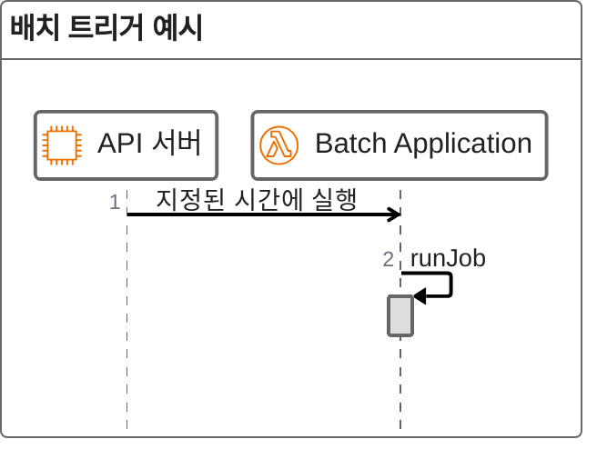
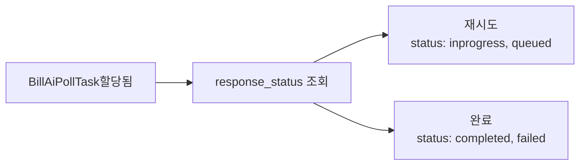

* TOC
{:toc}

<br>

## 1. AI를 통한 법안 요약 기능 추가하기

바로 앱 서비스의 목표는 사용자들에게 "오늘 나온 법안" 을 쉽게 제공하는 것에 있습니다. 추후 업데이트에 생성형 AI를 이용하여 사용자가 더욱 쉽게 법안을 읽어볼 수 있는 기능을 제공하는 것을 목표로 하며 다음의 원칙을 기준으로 잡고 기능을 개발하였습니다.

**유지비 줄이기**

현재는 2인 개발 체제이며, 아직 광고나 명확한 비즈니스 모델이 마련되지 않았습니다. 따라서 사용자가 늘어나기 전까지는 지속적으로 유지비가 발생할 수밖에 없습니다. 이에 따라 현 단계에서는 **서비스 유지에 드는 비용을 최소화**하면서 기능을 제공하는 것을 목표로 하였습니다.

**시간 효율성 높이기**

이상적으로는 완벽하게 설계된 확장 가능한 구조를 갖추는 것이 바람직합니다. 그러나 개발 시간 또한 중요한 자원이므로, 간단한 기능을 추가하는 데 완벽한 설계를 위하여 **지나치게 많은 시간을 투자하지 않고 구현**하는 것에 초점을 두었습니다.

### 1.1 설계

AI 요약 기능은 기본적인 기능이 개발된 이후 추가적으로 업데이트되는 기능입니다. 따라서 기존 시스템에 통합되어야 하며 이에 따라 고려할 사항이 몇가지 존재합니다.

#### 1.1.1 기존 Batch 분석 ####

Barlow 시스템은 정기적인 배치 처리를 통해 법안 데이터를 최신 상태로 유지하고 사용자에게 최신 정보를 제공합니다. 배치 작업은 외부 소스에서 데이터를 검색하고 내부 데이터베이스를 업데이트하기 위해 [지정된 간격](https://spring.io/guides/gs/scheduling-tasks)으로 실행됩니다.

**서버리스 환경에서의 실행**

Batch는 AWS Lambda 인스턴스를 사용하여 서버리스 환경에서 API 서버와 독립적으로 수행됩니다.



| 배치 작업 이름                  | 목적                              | 시간(평일)       | 호출 엔드포인트                            |
|---------------------------|---------------------------------|-------------|-------------------------------------|
| `PreAnnouncementBillJob` | 법안이 공식 발의되기 전 사전 공지된 법안을 추적 | 12:00 | `/api/v1/pre-announcement-bill-job` |
| `TrackingBillJob`         | 기존 법안 정보를 최신 상태로 갱신       | 15:30  | `/api/v1/tracking-bill-job`         |
| `TodayBillJob`            | 오늘의 새로운 법안 목록을 갱신           | 19:00  | `/api/v1/today-bill-job`            |

자세한 내용은 [여기](https://github.com/ogongchill/barlow/tree/develop/app/batch)참고


#### 1.1.2 `TodayBillJob` 분석

이 작업중 공공데이터 API를 통해 오늘 법안을 생성하는 `TodayBillJob`과 가장 긴밀하게 연결되어 있습니다.
`TodayBillJob`은 아래의 Step들로 구성되며 알림전송이 끝나면 Lambda인스턴스가 종료됩니다.


**요약 요청은 언제 이루어져야 하나?**

법안 요약은 `TodayBillJob`과 밀접하게 연결됩니다.
`TodayBillJob`은 외부 API에서 오늘 접수된 법안을 조회한 후 DB에 저장하는 역할을 합니다.

여기서 중요한 점은 **DB에 저장되기 이전에 요약 작업이 완료되어야 한다**는 것입니다.

현재 바로 서비스 구조에서 DB에 저장된 법안은 **_"최근 접수 법안"_** 탭에서 바로 조회가 가능하기 때문에 사용자가 조회하는 순간 요약이 함께 제공되어야 사용자 경험이 저하되지 않습니다.

따라서 요약 요청은 `TodayBillJob` 안에서, **DB 저장 이전 단계에 수행**하는 것이 가장 자연스럽습니다.

<br>

**문제점**

그러나 요약을 `TodayBillJob`의 Step으로 통합하면 안정성 문제가 발생할 수 있습니다.

- OpenAI API 서버 문제
- 응답 생성 실패

위와 같은 상황이 잦게 발생하면 `TodayBillJob` 자체가 실패하거나 중단될 위험이 있습니다.
이는 핵심 기능인 오늘의 법안 조회 및 저장까지 영향을 미칠 수 있습니다.

<br>

#### 1.1.3 꼭 Batch여야 하는가?

**LLM의 특성과 제약**

LLM은 혁신적인 기술이지만, 실제 서비스에 적용할 때는 여러 제약이 존재합니다.

>- 언제 어떻게 응답이 실패할지 예측할 수 없습니다.
>- 단순히 예외 처리로 무시하기에는 실패 빈도가 적지 않습니다.
>- 원하지 않는 응답을 생성할 수 있습니다.

Batch Job은 본래 대량의 데이터 처리나 정기적 업데이트를 목적으로 설계되기 때문에, **잦은 예외 상황을 발생시키는 작업**에 적합하지 않을 수 있습니다.

원하지 않는 응답을 처리하기 위해서는 검증 모델을 추가하는 방식을 도입 할 수 있겠으나 호출비용과 인스턴스 사용시간 모두 두배가 되므로 이는 배제합니다.

또한 요약요청정도는 현재 모델의 성능으로 충분히 안정적으로 응답 생성이 가능하다고 판단하였습니다.

<br>

**생성형 AI의 생성 실패는 예외 상황인가?**

- **서버 자체 장애(OpenAI API 장애)**
    - 천재지변에 가까운 상황으로, 예외 처리로 대응하는 것이 맞습니다.

- **생성 실패**
    -  언제든 발생할 수 있음을 이미 알고 있으며, 이는 **시스템적으로 예측 가능한 현상**입니다. 따라서 예외가 아니라 **정상 분기 처리**로 다룰 수 있습니다.
    - OpenAI API는 `HTTP 200` 응답과 함께 `status: incomplete` 또는 `status: failed`를 반환합니다

생성 실패를 정상 분기로 설계하고 실질적인 예외상황을 적절히 처리한다면, Batch 내에서도 충분히 안전하게 운용 가능하다고 판단하였습니다.

<br>

**대안**

- 메시지 큐 기반 방식도 가능하지만, 현재 환경에서는 새로운 인프라 도입이 필요합니다.

- 이 경우 학습곡선과 비용 부담이 크다는 한계가 있습니다.

**결론**

따라서 현 시점에서는 Batch 안에서 구현하는 것이 **가장 현실적**입니다. 다만, 생성 실패를 단순 예외로 처리하지 않고 정상 분기 처리로 다루어야 하며, 안정성을 보강할 수 있는 재시도·재처리 전략이 반드시 필요합니다.

<br>

## 2. 생성 시간 단축하기

### 2.1 생성시간 측정하기

**가정하기**

먼저 법안 요약 생성 속도를 동기적으로 측정합니다.
하루에 접수되는 의안은 평균 20~30개이며, 많을 때는 40개 이상 등록되기도 합니다.
따라서 **하루에 요약해야 하는 법안 수를 50개로 가정**하여 테스트를 진행하였습니다.

사용할 프롬프트는 다음과 같습니다.

```java
public static ChatCompletionRequest backgroundRequestFrom(String origin) {
    return ChatCompletionRequest.builder()
            .background(false)
            .model(GptModel.GPT_4_1_MINI)
            .addMessage(ChatMessage.ofDeveloper(
                """
                주어진 내용을 간단하게 요약할 것.
                3문단으로 요약 할 것.
                번호를 매기지 말 것.
                plain text만을 사용하고 마크다운 사용하지 말것.
                존댓말을 사용할 것.
                제목을 달 지 말것."""))
            .addMessage(ChatMessage.ofUser(origin))
            .build();
}

```

| 차시 |생성 시간 평균(ms)| 최댓값(ms) | 중앙값(ms) | 생성실패 |
|-----|------------|-------|--------|--------|
|1|3862|10529|3173| - |
|2|4272|13611|3501| - |
|3|5276|40315|3970| - |

법안 요약 요청을 동기적으로 측정한 결과, **평균 생성 속도는 약 4초**로 나타났습니다. 대부분 3~4초 안에 결과가 반환되었지만, 일부 요청은 최대 40초 이상 지연되기도 했습니다.

하루 평균 50개의 의안을 처리한다고 가정하면 총 소요 시간은 약 **200초(3분 20초)**가 됩니다. 그러나 동기적으로 순차 처리할 경우 대기 시간이 길어지므로, 실제 서비스에서는 비동기 처리 방식이 필수적입니다.

### 2.2 비동기 요청 분석하기

비동기 요청에서 최적의 시간은 언제일까?

**최적의 조건**

{: width="300"}_best-case-scenario_

{: width="300"}_worst-case-scenario_

위의 표는 생성형 AI 작업 요청을 **4개 단위**로 보냈을 때의 완료 시간을 나타냅니다.

- _**best-case-scenario**_ : 모든 요청이 평균 4초 내외에서 고르게 처리되는 이상적인 상황.
- _**worst-case-scenario**_ : 일부 요청이 비정상적으로 지연되면서 전체 작업 완료 시점을 늦추는 상황.

<br>

**문제상황 - _Tail Latency Amplification?_**
>**요약 요청 job에서 단 하나의 지연(Outlier) 때문에 전체 완료 시간이 크게 늘어난다.**

**Outlier 예측은 가능한가?**

이를 해결하기 위해 **"가장 오래 걸릴 요청을 미리 알 수 있을까?"**라는 질문을 던질 수 있습니다. 특히 Input Token이 많을수록 생성 시간이 길어지는가를 확인하면, 완료 시점을 예측할 수 있을지도 모릅니다.

{: width="400"}_input token과 생성시간 산점도_

- **Input Token 수와 생성 시간 사이의 상관계수는 r ≈ 0.15로 거의 의미가 없었습니다**
- 입력 토큰이 100개 늘어날 때 평균적으로 약 183ms 증가하긴 했지만, 실제 산점도를 보면 입력 토큰 수가 비슷해도 생성 시간은 2초에서 40초까지 크게 요동했습니다.

따라서 어떤 응답이 Outlier가 될지는 사전에 예측할 수 없으며 의안 요약 과정에서 Input Token과 생성 시간은 크게 상관관계가 없었습니다.

<br>

**결론**

Outlier는 피할 수 없는 호출자 입장에서 이를 미리 예측하거나 제거하는 방법은 없습니다.
또한 접수 의안 원문의 길이에 따라 우선순위를 통해 스케줄링 하는 방식도 무의미 합니다.

따라서 **언제 완료될지 예측**하는 것이 아닌, **완료되었을 때 가능한 한 빠르게 감지하고 수집하는 전략**을 통해 요약 batch job을 구현해야 합니다.

<br>

**목표**
>**생성이 완료됨을 빠르게 알아차려 결과를 수집하고, outlier 상황에 대응할 수 있는 체계를 마련해야 한다**


## 3. 정책 수립하기

**고려사항**

- **Outlier**
    - 제어 불가능, 예측 불가능
    - 최악 상황을 전제로 해도 정책적(속도) 최적화 여지는 제한적
    - 따라서 Outlier 대비 **'안정성'을** 우선해야 함

- **AWS Lambda환경**
    - 인스턴스 장애 발생 시 job 전체 실패
    - 서버리스 특성상 직접 제어·복구가 어려움

- **방향성**
    - 하루 1회 실행하기 때문에 속도 최적화도 중요하지만 **성공률과 안정성**이 높아야 함

<br>

### 3.1 방식1. 커넥션 유지하기

가장 기본적인 방식
요청을 보낸 후 응답완료까지 네트워크 커넥션을 유지하고 완료된 응답을 수집하는 방식입니다.

**장점:**

- 생성 여부를 바로 확인 가능

**단점:**

- 생성 완료까지 커넥션을 유지하고 대기해야함. -> 불필요한 자원 소모, 만약 outlier라도 걸리면?
- outlier에 너무 취약합니다.

<br>

### 3.2 방식2. Background 요청하기

`background: true`옵션을 통해 instant response와 `response_id`를 응답받고 추후 완료 여부를 이를 통해 확인할 수 있습니다.

**webhook 방식 고려**

- 추가 구성 필요: 전용 엔드포인트, 서명 검증, 재시도 처리, 장애 대응 등 인프라 작업이 큽니다.
- 환경 제약: 현재 시스템 구조를 꽤 손봐야 합니다.
- 제어권 이슈: 완료 통지 타이밍이 외부 API에 있어 운영 통제가 어렵습니다.
- 후속 조회 불가피: 다수의 API가 웹훅으로는 상태만 통지하므로, 실제 결과 취득을 위해 추가 조회 가 여전히 필요합니다.

→ 결국 **"생성 요청 → 웹훅 수신 → ID 기반 조회"**의 3단계를 거치게 됩니다.

**수동 조회 방식**

- 단계 단축 가능: 최적 조건에서는 **"생성 요청 → ID 기반 1회 조회"**로 바로 완료 감지가 가능합니다.
- 지연 관리 용이: 조회 간격을 우리 쪽 정책으로 조정해 지연·비용 균형을 잡기 쉽습니다.
- 복잡도감소: 웹훅 보안/재시도/엔드포인트 운영 없이도 구현이 단순합니다.

<br>

결론: 생성 요청 완료 이후 각 요청에 대한 완료 여부를 수동적으로 확인하는 방식을 사용합니다.


### 3.3 요청 보내기 Step

생성형 API의 완료 시점 예측이 어려워, **"어떻게 보내느냐"보다 이후 비동기 처리·검증 흐름이 중요**합니다. 따라서 단순 요청은 Spring Batch의 `ItemProcessor/Writer`를 통해 구현됩니다.

**처리는 프레임워크에 위임**
- `AsyncItemProcessor` `AsyncItemWriter`를 사용해 요약 요청 전송을 비동기화하고, 단순 전송 로직을 프레임워크에 위임합니다.

**분기·오류 처리는 다음 Step에서 수행**
- 생성 실패, 지연, 재시도 등은 Polling/검증 Step에서 일괄 처리하여 관심사 분리와 유지보수성을 확보합니다.

**기존 시스템과 통합**
- 현재는 `TodayBillJob`과 통합되어야 하므로, Spring Batch의 비동기 아이템 처리 구성을 활용합니다.

<br>

**ItemProcessor 예시**
```java
    @Bean
    public ItemProcessor<BillInfoItem, SummaryRequestStatus> backgroundRequestProcessor(
            ChatRequestFactory chatRequestFactory,
            OpenAiApiPort api
    ) {
        return item -> {
            if (item.summary() == null || item.progressStatus() != ProgressStatus.RECEIVED) {
                return null; // 본문이 없는 경우나 접수가 아닌 경우 요약 안함
            }
            ChatRequest req = chatRequestFactory.backgroundSummaryRequestFrom(item.summary());
            OpenAiResponse resp = api.getResponse(req);
            return new SummaryRequestStatus(item.billId(), resp.id(), resp.status());
        };
    }
```

**ItemWriter 예시**
```java
    @Override
    public void beforeStep(StepExecution stepExecution) {
        super.setCurrentExecutionContext(stepExecution.getJobExecution().getExecutionContext());
    }

    @Override
    public void write(Chunk<? extends SummaryRequestStatus> chunk) {
        chunk.getItems()
                .stream()
                .filter(Objects::nonNull)
                .forEach(item -> aggregationMap.put(item.billId(), item));
    }

    @Override
    public ExitStatus afterStep(StepExecution stepExecution) {
        BackgroundRequestStatusEntity entity = new BackgroundRequestStatusEntity(
                LocalDate.now(),
                List.copyOf(aggregationMap.values())
        );
        String newHashKey = HashUtil.generate(entity);
        super.putDataToExecutionContext(RecentBillConstant.BILL_AI_BACKGROUND_REQUEST_SHARE_KEY, newHashKey);
        backgroundRequestStatusRepository.save(newHashKey, entity);
        return ExitStatus.COMPLETED;
    }
```

Open AI API 응답에서 resposne_id별로 상태를 저장하여 다음 Step 에서 사용할 수 있게 respository에 저장한다.
이후 Polling Step에서 이를 조회할 수 있습니다.

<br>

### 3.4 Polling 전략 수립

이전 Step에서 요청한 작업의 완료 여부 확인은 비동기로 처리되며, `SummaryPollWorker`가 이를 수행합니다. `SummaryPollWorker`의 동작 흐름은 아래와 같습니다.



**문제**
> **BillAiPollTask를 공정하게 분배하여 전체 소요 시간을 단축할 수 있을까?**

<br>

**정적 균등 분배(모든 Task를 동일 분배)**

작업을 사전에 균등하게 worker에 나누어 투입하는 방식입니다. 구현이 가장 직관적이고 간단합니다.

특정 worker에 **outlier(유난히 오래 걸리는 작업)가 몰릴 경우, 전체 완료 시간이 불필요하게 지연**될 수 있습니다.

{: width="600"}_sublist기반 스케쥴링_

하위 목록(Sublist) 기반 분배 시, 한 워커가 느린 작업만 outlier에 대한 지연이 Step전체로 전파됩니다.

<br>

**FIFO 기반 BlockingQueue 사용**

작업을 큐에 적재하고, 워커가 선입선출(FIFO) 방식으로 가져가 처리합니다.
먼저 들어간 작업이 먼저 처리되므로, 자연스러운 부하 분산이 이루어집니다.
워커는 일이 끝나는 즉시 큐에서 다음 작업을 가져가므로 **outlier 편중을 완화**합니다.

{: width="600"}_queue기반 스케쥴링_

위와 같은 방식으로 생성 요청 `BillAiPollTask`를 BlockingQueue방식으로 비동기적으로 처리하는 방식을 사용하였습니다.


## 4. Polling Step 최적화하기

### 4.1 take() vs poll()

>**worker가 언제 작업을 마무리하고 스레드를 반납(종료)해야 할까요?**

작업 큐가 비어 있고, 모든 워커가 유휴 상태라면 종료해야 합니다.
이를 구현하기 위한 방식을 두가지가 존재합니다.

**poll(timeout) 방식**
- worker 내부에서 종료 시점을 스스로 판정할 수 있습니다.
- timeout 동안 대기하므로, 종료 감지와 새 작업 감지에 최대 timeout만큼 지연이 발생합니다.
- 코드 구조가 단순합니다.

<br>

**take() 방식**
- timeout 지연이 없어 새 작업 감지와 종료 신호 처리에 민첩합니다.
- 종료 시점을 외부에서 명시적으로 관리해야 합니다.

<br>

`BillAiSummaryPollExecutor`에서는 `posion pill`방식을 사용하며 `AsyncSummaryPollWorker`는 `take()`기반으로 작업 가져옵니다.

`AsyncSummaryPollWorker`는 "작업 처리"에만 집중, 종료/수명 관리는 `BillAiSummaryPollExecutor`가 담당하여 역할을 분리합니다.


```java
public class BillAiSummaryPollExecutor {

...

    public List<BillAiSummary> requestAsync(BackgroundRequestStatusEntity entity) {
        LinkedBlockingDeque<BillAiPollTask> taskQueue = entity.statuses()
                .stream()
                .map(BillAiPollTask::fromSummaryStatus)
                .collect(Collectors.toCollection(LinkedBlockingDeque::new));
        List<CompletableFuture<BillAiSummary>> futures = taskQueue.stream()
                .map(task -> task.billAiSummaryFuture()
                        .exceptionally(e -> {
                            log.info("{}", e.getMessage());
                            return null;
                        }))
                .toList();
        repeatWorkerSize(() -> worker.runAsync(taskQueue));
        List<BillAiSummary> result = waitUntilDone(futures);
        repeatWorkerSize(() -> taskQueue.addFirst(BillAiPollTask.ofPoisonPill()));
        return result;
    }
...
```

### 4.2 스레드 수 설정하기

Polling 후 상태 조회 시 `completed`,`failed`=**hit**, `queued`, `in_progress`=**miss**로 간주했을때,

>**어떻게 하면 hit율을 높여 효율적으로 처리할 수 있을까?**

<br>

요청이 많아질수록 초기 전송 단계(`BillAiSummaryRequestStep`)가 길어지고, 그만큼 Polling 단계의 **hit**율은 높아집니다.

과도한 병렬 실행으로는 hit율을 본질적으로 높일 수 없습니다.

최종 완료 시점은 **outlier(가장 느린 작업)**에 의해 결정되며, 마지막 구간은 소수 worker만 활동하는 형태가 됩니다.
→ **무작정 스레드를 늘려도 이득은 제한적이고 자원 소모만 커질 수 있습니다.**

작업량이 30~40개 수준일 때는 4개 스레드 할당 시 hit율과 속도의 균형이 가장 좋았습니다.

>실행 환경: AWS Lambda 1 vCPU / 1 GiB
>{: width="600"}_docker환경에서 테스트_


**총 소요시간:**
- 4스레드 vs 8스레드 → 유의미한 차이 없음(최적 조건에서 모두 약 17초 내외)

**Polling 단계 시간:**

- 8스레드: ~8초
- 4스레드: ~8초
- 2스레드: ~12초 → 스레드가 적으면 Polling 단계가 길어짐

<br>

현재 사양에서는 4개 스레드를 통해 `Polling Step`을 실행을 구성하는것이 적절합니다.
