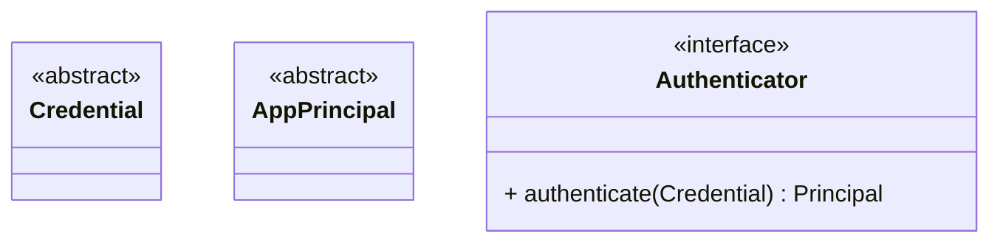
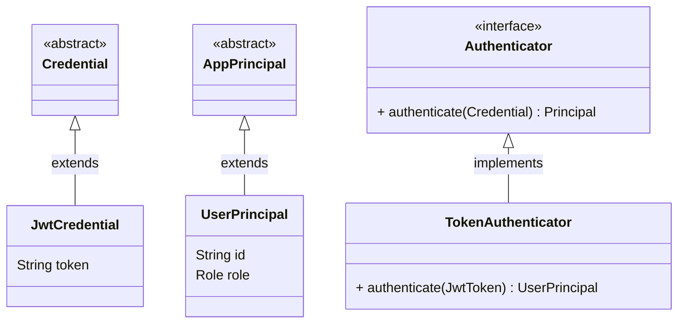
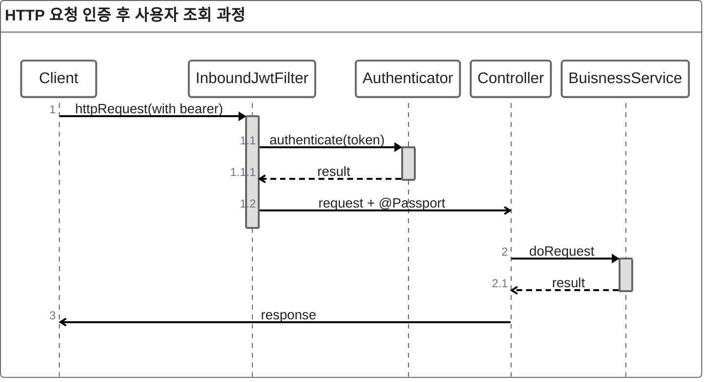

# 들어가며

## 1. 인증모듈

### 1.1 요구사항

1. 다양한 인증방식에 열려 있어야 함
기본적으로 jwt를 포함한 요청에 대한 인증 처리 가능해야함
guset login도 처리해야 함
추후 oauth나 외부 인증에 대해 확장 가능해야 함

2. 인증 기능은 다른 모듈로 분리될 수 있음
인증 기능은 추후 api gateway나 다른 인증 전용 모듈로 분리 될 수 있다. 

### 1.2 authentication 모듈 설계

authentication -> 특정 요청에서 서명이 올바른지 확인해
Authentication 객체 생성

credential을 인증하는 구조

credential 방식에 열려있어야 해.

Authenticator의 인증 방식은 interface로서 구현된다.

### 1.3 jwtAuthentication

#### 1.3.1 RSA를 통한 JWT 서명/검증 

 

**왜 RSA를 사용하는가?**

>**_서버 측에서 서명 전용 비밀키를 보관하고, 검증은 공개키로 어디서든 하게 만든다_**

 

**서명과 검증의 분리**

RSA는 비대칭키 기반이므로, 서명은 Private Key로만, 검증은 Public Key로만 수행된다.
이를 통해 서명 전용 모듈을 별도로 두고, 다른 서비스나 계층은 공개키만으로 검증할 수 있어 보안 경계가 명확해진다.

 

**확장성 있는 인증 구조**

단방향(HMAC) 방식에서는 하나의 비밀키로 서명·검증을 모두 처리해야 한다. 따라서 모든 서비스가 같은 키를 공유해야 하고, 인증 로직도 한 곳에 묶일 수밖에 없다.

반면 RSA를 사용하면, 추후 인증(Auth) 모듈을 독립 서비스나 API Gateway로 분리했을 때, 공개키만 배포하면 외부에서 자유롭게 검증이 가능하다.

이는 마이크로서비스 아키텍처(MSA) 환경에서 토큰 검증 책임을 분리하고, 확장에 따라 역할을 나누는 설계에 대응도 가능하다.

 

**ECC(ECDSA 방식) 고려**

JWT 서명·검증에 사용할 수 있는 대표적인 비대칭키 알고리즘에는 RSA와 ECC(Elliptic Curve Cryptography) 방식이 있다.

- [RSA](https://ko.wikipedia.org/wiki/RSA_%EC%95%94%ED%98%B8)는 큰 소수를 기반으로 한 전통적인 공개키 방식으로, 현재까지 가장 널리 사용되고 호환성이 뛰어나다.

- [ECC](https://ko.wikipedia.org/wiki/%ED%83%80%EC%9B%90%EA%B3%A1%EC%84%A0_%EC%95%94%ED%98%B8)는 타원곡선 수학을 기반으로 하며, 짧은 키 길이로 동일한 보안 수준을 제공하고, 최신 표준에서 점점 채택이 늘어나고 있다.

 

**ECC 장점**
- 보안 수준 대비 키 길이가 짧음 → RSA 2048bit ≈ ECC P-256.
- 서명 속도가 빠름 → 서버 측 토큰 발급 성능 개선 가능.
- 현대적인 알고리즘으로, 동일 보안 수준에서 자원 소모가 더 적음.

**ECC 단점**
- 검증 속도는 RSA보다 느릴 수 있음.
- 키 관리 복잡성 증가: 커브(curve) 선택 필요(P-256, P-384 등), 라이브러리/호환성이 RSA비해 낮음.
- 운영/호환 측면에서 RSA보다 레거시 지원이 덜 풍부함.

 

**결론**

현재 서비스의 규모와 트래픽을 고려할 때 RSA만으로도 충분히 안정적이다.

ECC는 이론적으로 더 짧은 키 길이와 빠른 서명 속도를 제공하지만, 실제 운영 환경에서 체감할 만큼 유의미한 성능 차이가 발생할 가능성은 낮다.

오히려 검증은 RSA가 더 빠르며, 서비스 구조상 서명보다 검증이 훨씬 많이 수행되므로, 굳이 ECC로 전환할 필요성은 크지 않다고 판단한다.

 

### 1.4 시스템과 통합

**1.클라이언트 요청**
- 클라이언트는 Authorization: Bearer <JWT> 헤더를 포함하여 서버로 요청을 전송한다.

**2.인바운드 필터 처리**
- InboundJwtFilter가 요청을 가로채 JWT 토큰을 추출한다.
- 추출한 토큰은 Authenticator로 전달되어 검증 및 사용자 정보 추출이 수행된다.

**사용자 컨텍스트 생성 및 주입**
- 검증에 성공하면 토큰의 memberNo, role 등 클레임을 기반으로 Passport 객체가 생성된다.
- 이후 HttpServletRequest의 속성에 저장되어 이후 컨트롤러에서 주입(`@Passport`) 가능하다.

**컨트롤러 → 서비스 호출**
- 컨트롤러는 Passport를 포함한 요청 객체를 받아 비즈니스 로직을 실행한다.
- BusinessService에서 실제 도메인 로직이 처리된 뒤 결과가 반환된다.

**응답 반환**

- 컨트롤러는 처리 결과를 클라이언트에 HTTP Response로 반환한다.

 

## 2. 요약 batch job 최적화

기존의 batch job에 통합해야해.

### 2.1 방식 선택

### 2.2 정책 선택

