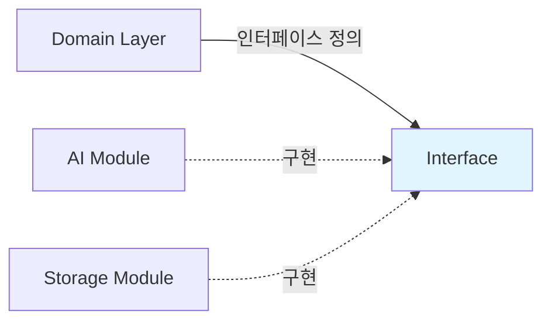
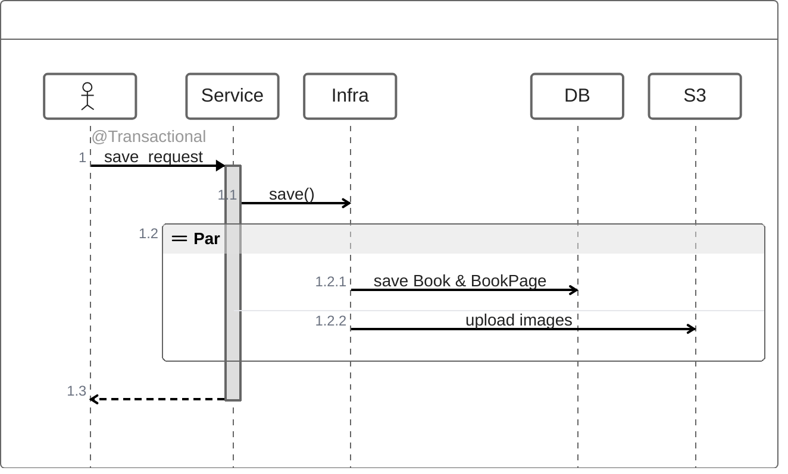
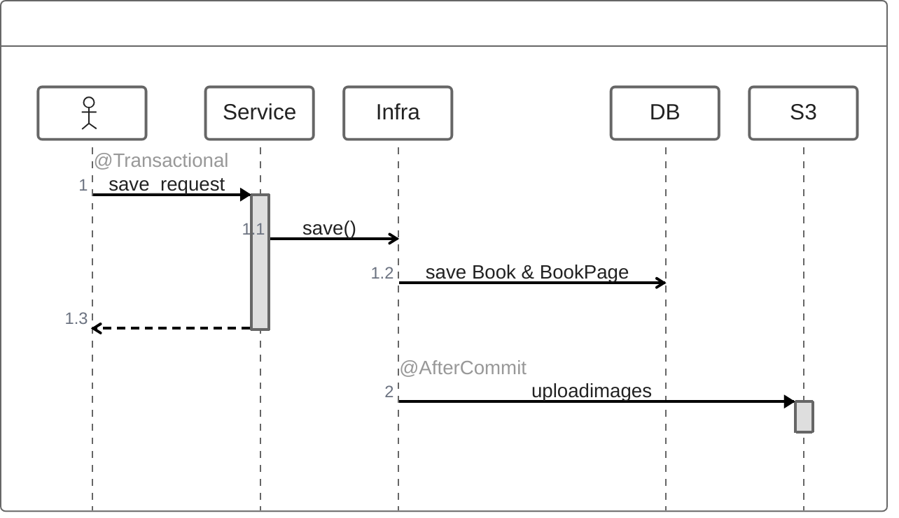
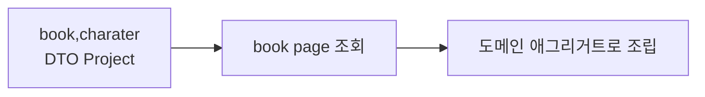

* TOC
{:toc}

## 1 아키텍쳐 변경

### 1.1 변경의 필요성

- 도메인 로직이 특정 AI 서비스(OpenAI)에 강하게 결합
- AI 모델 변경 시 도메인 코드까지 수정 필요
- 핵심 비즈니스 규칙과 기술 구현의 경계가 모호

ai를 사용하며 도메인 계층에 대한 경계가 모호해졌습니다.

`BookInPorgress`(진행중인 책) 과 `Book`(완성된 책)을 도메인 엔티티로 정의합니다.

```
littleWriter/
├── domain/       - 순수 비즈니스 로직 (프레임워크 독립적)
├── api/          - HTTP/REST API 계층
├── storage/      - 데이터 영속성 (JPA, Redis, S3)
├── ai/           - AI 통합 (OpenAI)
└── auth/         - 인증/인가
```



위와 같은 아키텍쳐를 통해 계층을 분리하였습니다.

**의사결정 배경:**
- 생성형 AI 기술의 빠른 변화 (GPT-3 → GPT-4 → GPT-4o)
- 비용 최적화를 위한 AI 모델 교체 필요성
- 테스트 시 실제 AI 호출 비용 문제

Book, BookInProgress 등을 Aggregate로 활용하여 도메인 규칙을 설정.
```java
public record BookInProgress(
    String id,
    Long ownerId,
    String backgroundInfo,
    BookCharacter character,
    List<BookPage> previousPages,  // 리스트는 복사본 반환
    Status status
) {
    // 상태 변경 시 새 인스턴스 반환
    public BookInProgress addBookPage(BookPage page) {
        List<BookPage> newPages = new ArrayList<>(previousPages);
        newPages.add(page);
        return new BookInProgress(id, ownerId, backgroundInfo, character,
                                  newPages, status);
    }

    // 비즈니스 규칙 강제
    public BookInProgress markAsCompleted() {
        if (status == Status.COMPLETED) {
            throw new BookProgressException("Already completed");
        }
        return new BookInProgress(id, ownerId, backgroundInfo, character,
                                  previousPages, Status.COMPLETED);
    }
}

```

---

## 2. 트랜잭션

### 2.1 문제 – 상위 레이어에 노출된 트랜잭션과 IO 작업 포함
Little Writer 서비스에서 `Book`과 `BookInProgress`는 각각 완성된 책과 작성 중인 책을 표현하는 애그리거트로, 도메인 중심으로 설계되어 있습니다. 책 저장 흐름은 다음과 같이 진행됩니다.

1. 클라이언트가 책 저장을 요청
2. 서비스 계층에서 @Transactional이 선언된 메서드 실행
3. 해당 메서드 내부에서
    - Redis에 임시 진행 상태 조회
    - MySQL에 최종 Book/BookPage 저장
    - S3에 이미지 업로드까지 함께 처리
<br>

초기 구조에서는 상위 서비스 계층에 `@Transactional`이 선언되어 있었고, 그 트랜잭션 스코프 내부에 네트워크 IO(S3 업로드)가 포함되어 있었습니다.



이 구조에서는 다음과 같은 문제가 발생합니다.

**1) 트랜잭션 실패 시 IO 롤백 불가**

- DB 트랜잭션이 롤백되더라도 이미 업로드된 이미지나 외부 시스템 호출 결과는 되돌릴 수 없습니다.
- DB 상태와 외부 저장소 상태가 불일치하는 문제가 발생할 수 있습니다.

<br>

**2) 응답 속도 증가 및 병목 가능성**

- 트랜잭션이 길어지면서 DB 커넥션이 필요 이상 오래 점유되어 커넥션 풀이 빠르게 소진(pool exhaustion)되어 동시 처리량 감소합니다.
- 결과적으로 전체 요청의 응답 속도가 증가하고, 순간 부하 시 병목이 발생하여 단일 요청 지연뿐 아니라 서비스 전반의 안정성까지 저하됩니다.

<br>

**3) 트랜잭션 경계가 상위 계층에 노출**

- RDBMS용 `@Transactional` 어노테이션이 서비스 계층에 선언되어 있어, 서비스 레이어가 저장 전략에 종속됩니다.
- 도메인 계층의 역할을 흐리게 하며, 유지보수성과 테스트 용이성도 떨어지는 문제가 있었습니다.

<br>

### 2.2 @Transactional 분리 - 비동기 IO 처리 

`@Transactional` 내부에서 IO 작업을 분리합니다. 트랜잭션 시작 시 EventPublisher를 통하여 이미지 업로드를 위한 이벤트를 발행하고 `@TransactionalEventListener(phase = TransactionPhase.AFTER_COMMIT)`를 통해 이후 비동기적으로 이미지를 업로드합니다.




```java
    @TransactionalEventListener(phase = TransactionPhase.AFTER_COMMIT)
    @Async(value = "transaction-event")
    public void handle(ImageUploadEvent event) {
        for(PreAssignedUrl url : event.jobs()) {
            imageUploader.copyToBookStorage(url);
        }
    }
```

이를 통하여 기존 동화 저장 응답시간을 평균 600ms에서 140ms 정도로 단축 할 수 있었습니다.


### 2.3 트랜잭션 경계 설정

기존 구조에서는 상위 서비스 계층에서 `@Transactional`을 선언하여 트랜잭션을 시작하였으나 이 방식은 여러 문제가 있습니다.
- 구체적인 인프라 정보가 상위 레이어에 노출됩다.
- Redis와 같은 다른 저장소를 함께 사용하는 현재 구조와도 자연스럽게 어울리지 않습니다.
- 향후 트랜잭션 정책을 변경하거나, 저장소 구성을 확장/교체 할 때 도메인·서비스 코드까지 함께 수정해야 하는 높은 결합도를 가지게 됩니다.

이에 따라 다음과 같은 원칙을 세우고 트랜잭션 경계를 재설정하였습니다.

<br>

> **_트랜잭션 경계는 인프라 레이어(infra adapter)에서만 관리한다._**

<br>
**1. Service 계층 → 도메인 로직만 담당**
```java
@Service
public class BookService {

    public Book completeBook(CompleteBookCommand cmd) {
        //동시성 제어를 위한 lock
        return lockExecutor.saveWithLock(cmd.bookInProgressId(), () -> {
            BookInProgress inProgress = getBookInProgress(cmd).markAsPending();

            // 저장 전략은 인프라에 위임
            Book book = bookRepository.saveFrom(inProgress, bip ->
                    Book.completeFromCommand(bip, cmd));

            // 캐시/상태 업데이트 (RDB 트랜잭션과 분리됨)
            bookInProgressRepository.save(inProgress.markAsCompleted());

            return book;
        });
    }
}
```

<br>
**2. Infra 계층에서만 `@Transactional` 선언**

```java
@Component
public class BookRepositoryAdapter implements BookRepository {

    @Transactional("storageTransactionManager")
    public Book saveFrom(BookInProgress bip, Function<BookInProgress, Book> converter) {
        ...
        // 이벤트 발행 (AfterCommit 비동기 처리)
        eventPublisher.publishEvent(new ImageUploadEvent(...));

        // ③ 실제 DB 저장 (MySQL 내부 트랜잭션)
        Book book = converter.apply(updated);
        BookJpaEntity entity = bookJpaRepository.save(BookJpaEntity.from(book));
        pageRepository.saveAll(...);

        return book;
    }
}
```

`BookInProgress`로부터 어떤 방식으로 `Book` 애그리거트를 생성할지는
도메인 규칙이 완전히 책임지며, 인프라 계층(`BookRepositoryAdapter`)은 도메인이 만들어 준 `Book`을 트랜잭션 내부에서 MySQL 테이블에 저장하기만 합니다.

이를 통하여 **“Book을 어떻게 만들지는 도메인에서 결정하고,만들어진 Book을 어떻게 저장할지는 인프라에서 처리하는 구조”**로 역할을 명확히 분리하였습니다.

---

## 3. 책 조회 성능 개선

### 3.1 one to many 와 같은 ORM 관계 설정에 따른 성능 문제 - N + 1

`BookJpaEntity`, `BookCharacterJpaEntity`, `BookPageJpaEntity`는 각각 별도의 테이블로 존재합니다. 
 
 ```mermaid
erDiagram
    BOOK ||--|| BOOK_CHARACTER : "1:1"
    BOOK ||--o{ BOOK_PAGE      : "1:N"

    BOOK {

    }

    BOOK_CHARACTER {

    }

    BOOK_PAGE {

    }
```

이들을 초기에는 JPA 연관관계로 직접 연결하여 사용하였습니다.

- Book – BookCharacter : `@OneToOne`
- Book – BookPage : `@OneToMany`

<br>
하지만 이러한 ORM 기반 연관관계는 다음과 같은 문제를 발생시킵니다.

**N + 1 문제**
- Book 조회 1번
- 각 Book마다 Character, Pages 조회 N번

**조회 형태가 고정되어 유연성 부족**
- 도메인 요구사항이 바뀌면 ORM 매핑 전체를 수정해야 함

**애그리거트 변경 시 영향 범위가 커지는 구조**
- Book 도메인 설계 변경이 JPA/Hibernate 설정까지 전파됨

<br>
결과적으로 ORM 연관관계를 유지하는 구조는 도메인/쿼리 최적화 양쪽에 모두 불리하다고 판단했습니다.

따라서 JPA는 단순하게 `RDBMS 테이블 – Java 객체` 매핑 역할만 담당하도록 축소하고,
조회시 JPQL 기반으로 최적화된 형태로 가져오는 방식으로 변경하였습니다.


### 3.1 JPQL을 사용한 DTO projection

`BookJpaEntity`와 `BookCharacterJpaEntity`는 조회 시점에 JPQL을 사용해 조인하고,
결과를 `BookCharacterProjection`로 Projection 하여 한 번에 가져오도록 변경하였습니다.

```java

    @Query("""
        SELECT new com.pkg.jpa.BookCharacterProjection(
            b.id,
            b.userId,
            b.title,
            b.author,
            c.id,
            c.name,
            c.appearanceKeywords,
            c.personality,
            c.userDescription,
            c.imageUrl
        )
        FROM BookJpaEntity b
        INNER JOIN CharacterJpaEntity c ON b.characterId = c.id
        WHERE b.id = :bookId
    """)
    BookCharacterProjection retrieveBookId(@Param("bookId")String bookId);
```


### 3.2 도메인 애그리거트를 통한 반환

`BookPageJpaEntity`는 `BookJpaEntity`과의 `@OneToMany` 연관관계를 사용하지 않고,
bookId를 기준으로 하는 명시적인 조회 메서드를 사용하여 한 번에 전체 페이지를 조회하도록 변경하였습니다.


```java
    @Override
    public Book retrieveById(String bookId) {
        BookCharacterProjection bookCharacterProjection = bookJpaRepository.retrieveByBookId(bookId);
        if(bookCharacterProjection == null) {
            return null;
        }
        List<BookPageJpaEntity> pages = pageJpaRepository.findAllByBookId(bookId);
        return Book.builder()
                ...
                .build();
    }

```

이 방식의 장점은 다음과 같습니다.

- Lazy 로딩으로 인해 발생하던 암묵적 N+1 문제를 근본적으로 제거할 수 있습니다.
- 불필요한 Eager 로딩을 방지하여, 최소한의 데이터만 선택적으로 조회할 수 있습니다.
- 도메인 구조가 변경되더라도 JPA 연관관계가 얽혀 있는 경우보다 훨씬 유연하게 대응할 수 있습니다.

<br>

결과적으로 Book–Page 관계 역시 Lazy 연관관계에서 발생하는 암묵적인 N+1을 제거하였으며,
`쿼리 설계 → 결과 Projection → 도메인 조립`이라는 흐름으로 재구성하여 DB 접근 방식을 쿼리 수준에서 직접 제어하는 구조로 변경하였습니다.

