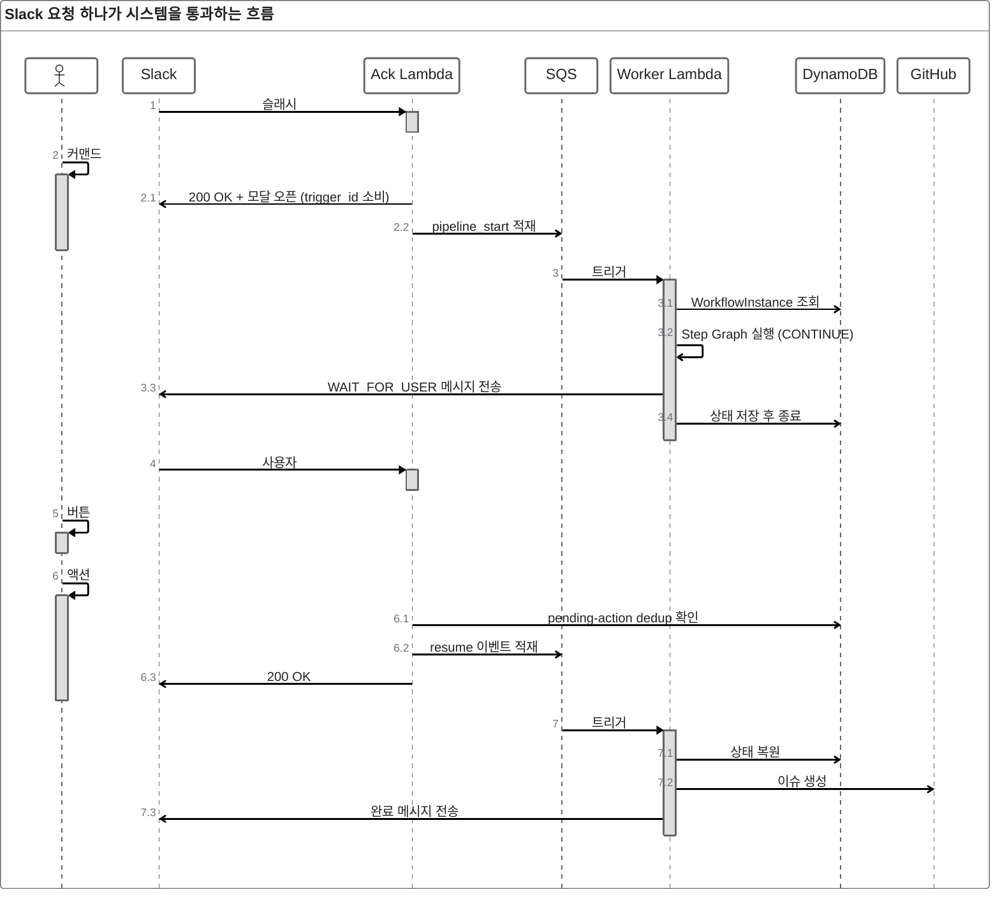
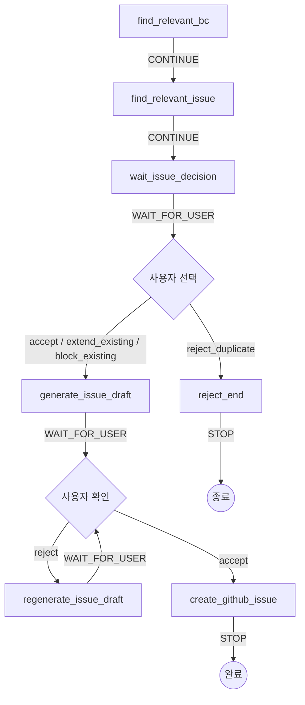
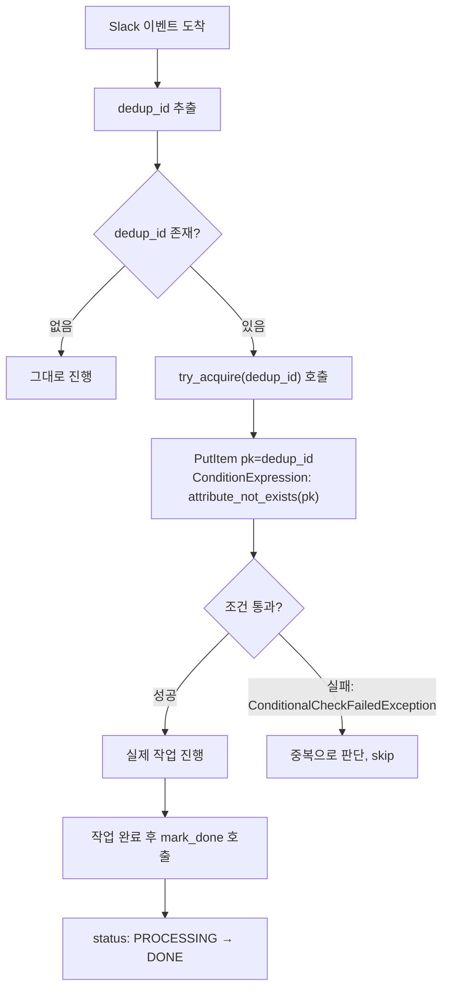

Barlow Automation은 Slack 자연어 요청을 받아 코드베이스 분석, 기존 이슈 검토, 초안 생성, GitHub 이슈 생성까지 수행하는 내부 도구입니다. 핵심 설계는 세 가지로 요약됩니다.

1. **Ack/Worker Lambda 분리** — Slack의 3초 응답 제한과 수십 초 걸리는 AI 작업을 서로 다른 실행 경로로 분리
2. **Step Graph 상태 머신** — `human-in-the-loop`을 확인 버튼이 아니라 `CONTINUE`/`WAIT_FOR_USER`/`STOP` 신호를 가진 명시적 상태로 구현
3. **DynamoDB 기반 dedup구조** — Slack retry와 SQS at-least-once 전달이 겹쳐 발생하는 중복 실행 차단

아래에서 이 세 가지 결정이 실제로 어떤 문제를 풀었는지, 그리고 왜 그 방식이어야 했는지를 설명합니다.

## 0. 전체 흐름

하나의 이슈 생성 요청은 최소 3번의 개별 Lambda 실행에 걸쳐 완결됩니다. 사람의 응답을 기다리는 구간마다 Lambda는 완전히 종료되고, 상태는 전부 DynamoDB에 위탁됩니다.



| 구성요소 | 역할 | 실행 트리거 |
|---|---|---|
| Ack Lambda | Slack 서명 검증, 모달 오픈, SQS 적재, 즉시 200 응답 | Slack Function URL |
| Worker Lambda | AI 분석, 초안 생성, GitHub 이슈 생성, 상태 저장/복원 | SQS |
| DynamoDB (`barlow-workflow`) | 워크플로우 진행 상태와 누적 컨텍스트 저장 | - |
| DynamoDB (`barlow-pending-action`) | 동일 액션 중복 처리 차단 | - |
| DynamoDB (`barlow-active-session`) | 동일 사용자 동시 세션 차단 | - |

## 1. Human-in-the-loop을 시스템으로 구현하기

**결론부터: `human-in-the-loop`은 확인 버튼이 아니라 `WAIT 상태` · `상태 저장` · `재개 이벤트` · `중복 제어`를 포함한 시스템 구조로 구현했습니다.** 장기 세션을 서버리스 환경에 맞게 저장소와 메시지 흐름으로 분해한 것이 핵심입니다.

### 왜 확인 버튼만으로는 부족한가

이슈 생성 자동화의 주요 위험은 잘못된 판단의 확대입니다. 관련 없는 기존 이슈 연결, 중복 이슈 생성, 품질이 낮은 초안의 즉시 등록은 자동화 이점보다 복구 비용을 키웁니다. 그래서 AI는 탐색과 초안만 담당하고, 최종 판단은 항상 사용자가 내리도록 설계 기준을 잡았습니다.

문제는 이 판단 대기 구간이 워크플로우 안에 여러 번 존재한다는 점입니다. 메모리에 상태를 유지한 채 프로세스를 붙잡는 방식은 Lambda 실행 모델과 맞지 않으므로, 워크플로우 자체를 명시적 상태 머신으로 모델링했습니다.

### Step Graph 상태 머신

각 단계는 노드로 표현되고, 노드는 `CONTINUE` / `WAIT_FOR_USER` / `STOP` 중 하나의 제어 신호를 가집니다. 조건문으로 단계 전환을 이어 붙이는 방식도 가능했지만, 그러면 사람 입력 대기·재개 이벤트·종료 조건이 코드 곳곳에 흩어집니다. 상태 머신으로 표현하면 이 세 가지가 그래프 정의 한 곳에 고정됩니다.



| Step | 제어 신호 | 역할 |
|---|---|---|
| `find_relevant_bc` | CONTINUE | 요청과 관련된 Bounded Context 탐색 |
| `find_relevant_issue` | CONTINUE | 기존 이슈 중 관계 후보 탐색 |
| `wait_issue_decision` | WAIT_FOR_USER | 이슈 관계(연장/차단/독립/중복) 선택 대기 |
| `reject_end` | STOP | 중복 판단 시 워크플로우 종료 |
| `generate_issue_draft` | WAIT_FOR_USER | 이슈 초안 생성 후 사용자 확인 대기 |
| `regenerate_issue_draft` | WAIT_FOR_USER | 반려된 초안 재생성 |
| `create_github_issue` | STOP | 실제 GitHub 이슈 생성 후 종료 |

`RESUME_MAP`은 `accept`, `reject`, `extend_existing`, `block_existing`, `reject_duplicate` 같은 사용자 액션을 다음 step 이름으로 매핑합니다. 즉 사용자 입력은 UI 이벤트가 아니라 **상태 전이 신호**로 처리됩니다.

| 사람이 누른 버튼 | 다음 Step |
|---|---|
| `accept` (관계 후보 확정) | `generate_issue_draft` |
| `extend_existing` | `generate_issue_draft` |
| `block_existing` | `generate_issue_draft` |
| `reject_duplicate` | `reject_end` |
| `reject` (초안 반려) | `regenerate_issue_draft` |
| `accept` (초안 확정) | `create_github_issue` |

### "Step Graph"를 구성하는 것들 — 크기가 다른 세 개념

이름 하나에 서로 다른 크기의 개념이 섞여 있어서 헷갈리기 쉽습니다. 실제로는 포함 관계를 가진 세 개의 별개 자료구조입니다.

| 이름 | 코드상 정체 | 역할 |
|---|---|---|
| `ControlSignal` | **Enum** (`CONTINUE`/`WAIT_FOR_USER`/`STOP`) | 칸 하나를 실행한 뒤 나오는 신호 |
| `StepNode` | **클래스** | 칸 하나. 실행 로직 + 신호 + 다음 칸을 담음 |
| `GRAPH` (="Step Graph") | **딕셔너리** (`{step 이름: StepNode}`) | 모든 칸을 모아놓은 보드판 전체 |

즉 `GRAPH`(보드판 전체) ⊃ `StepNode`(칸 하나) ⊃ `ControlSignal`(그 칸이 내는 신호, Enum) 순으로 크기가 다릅니다. "Step Graph"는 이 중 가장 바깥쪽인 `GRAPH`를 가리키는 이름입니다.

### 상태(state)는 한 종류가 아니다

`ControlSignal`과 별개로, 워크플로우 자체의 생애주기를 나타내는 Enum이 두 개 더 있습니다. 세 Enum은 서로 다른 질문에 답합니다 — `ControlSignal`은 "이 칸이 다음에 뭘 지시하는가", `WorkflowStatus`/`StepStatus`는 "지금 이 순간 뭐가 어떤 상태인가".

| Enum | 값 | 무엇의 상태인가 |
|---|---|---|
| `ControlSignal` | `CONTINUE`, `WAIT_FOR_USER`, `STOP` | 칸 실행 직후 나오는 제어 신호 |
| `WorkflowStatus` | `CREATED`, `RUNNING`, `WAITING`, `COMPLETED`, `FAILED`, `CANCELLED`, `EXPIRED` | 워크플로우 전체의 생애주기 |
| `StepStatus` | `QUEUED`, `RUNNING`, `SUCCEEDED`, `FAILED`, `WAITING_FOR_USER`, `CANCELLED`, `TIMED_OUT` | 칸 하나의 실행 상태 |

### 다음 단계는 무엇이 결정하는가

상태 저장소는 DynamoDB로 구성했지만, DynamoDB가 다음 단계를 결정하도록 두지는 않았습니다.

- **다음 step**: SQS 메시지의 `event_type`이 결정
- **DynamoDB**: BC 후보, 기존 이슈 후보, 초안 등 누적 컨텍스트 저장만 담당

역할을 분리한 목적은 재시도 안정성입니다. 같은 메시지가 다시 전달돼도 같은 단계로 복원되고, 상태 저장소와 라우팅 로직이 뒤엉키지 않습니다. 실제 저장 단위는 `WorkflowInstance`이며, `workflow_id`·`status`·`current_step`·`pending_action_token`·Slack 식별자·TTL·워크플로우별 `state`를 함께 저장합니다. DynamoDB의 역할은 캐시가 아니라 **중단 지점과 재개 문맥의 복원**입니다.

### Redis가 아니라 DynamoDB인 이유

필요했던 건 초저지연 캐시가 아니라 세션 상태 저장·TTL 기반 만료·조건부 쓰기·재시도 시 동일 키 보장이었습니다. 기능만 보면 Redis와 DynamoDB 둘 다 가능했지만, 운영 조건이 갈랐습니다.

| 기준 | Redis (ElastiCache / EC2) | DynamoDB (on-demand) |
|---|---|---|
| 과금 방식 | 상시 인스턴스 비용 발생 | 요청 기준 종량제 |
| 운영 부담 | 프로세스 관리·재시작·백업 직접 책임 | 완전관리형 |
| Lambda 결합성 | 커넥션 관리 필요 | SDK 호출만으로 결합 |
| 이 워크로드 적합성 | 저빈도 워크로드엔 과한 선택 | TTL·조건부 쓰기로 충분 |

결론적으로 이 시스템에서 필요했던 건 "가장 빠른 저장소"가 아니라 "필요한 기능을 충족하면서 운영비와 운영 부담이 가장 낮은 저장소"였습니다.

### dedup 레이어

**핵심은 "동일 이벤트 재처리"와 "동일 사용자 세션 충돌"이 서로 다른 문제라는 점입니다.** `pending-action`만으로는 동시 세션을 막을 수 없고, `active-session`만으로는 Slack retry를 정밀하게 차단하기 어렵기 때문에 레이어를 두 개로 나눴습니다.

| 레이어 | 목적 | 키 구성 | TTL | 검증 방식 |
|---|---|---|---|---|
| `pending-action` | Slack retry로 인한 동일 액션 중복 처리 차단 | `pk` = `view_id` 또는 `action_ts` | 1시간 | 조건부 쓰기(`attribute_not_exists`) — **원자적** |
| `active-session` | 동일 사용자의 동시 워크플로우 생성 차단 | `pk` = `{channel_id}#{user_id}` | 24시간 | 기존 세션 존재 여부 확인 후 등록 |

### DynamoDB 스키마

세 테이블 모두 Sort Key와 GSI 없이 단일 PK 구조입니다. 조회 패턴이 "정확한 키로 단건 조회/쓰기"뿐이라 복합키가 필요하지 않았습니다.

| 테이블 | PK | 과금 방식 | TTL |
|---|---|---|---|
| `barlow-workflow` | `workflow_id` (String) | PAY_PER_REQUEST | 생성 시 +24시간 |
| `barlow-pending-action` | `pk` (String) — dedup_id | PAY_PER_REQUEST | 생성 시 +1시간 |
| `barlow-active-session` | `pk` (String) — `{channel_id}#{user_id}` | PAY_PER_REQUEST | 생성 시 +24시간 |

### pending-action의 락: 조건부 쓰기(Conditional Write)

**결론부터: DynamoDB에 별도의 락 기능이 있는 게 아니라, `PutItem`에 조건을 걸어서 락처럼 동작하게 만든 것입니다.** 이게 이 시스템에서 유일하게 진짜 원자적인 락입니다.

```python
await self._table.put_item(
    Item={"pk": key, "status": "PROCESSING", "ttl": int(time.time()) + PENDING_ACTION_TTL_SECONDS},
    ConditionExpression="attribute_not_exists(pk)",
)
```

"이 pk가 테이블에 없을 때만 써라"는 조건이므로, 동일한 `dedup_id`로 두 요청이 동시에 들어와도 DynamoDB 서버 쪽에서 하나만 성공시키고 나머지는 `ConditionalCheckFailedException`으로 실패시킵니다. "조회 후 쓰기"처럼 두 단계로 나뉘어 있지 않고 단일 원자적 연산이라, 두 요청이 정확히 같은 순간에 들어와도 레이스가 발생하지 않습니다.



| 단계 | 코드 위치 | 비고 |
|---|---|---|
| dedup_id 결정 | `controller/handler/slash.py` | 이벤트 종류별로 Slack이 부여한 ID 그대로 사용 |
| 중복 체크 + 락 획득 | `app/handlers/step_worker_handler.py` → `try_acquire()` | 조건부 PutItem, 원자적 |
| 락 해제(완료 표시) | `step_worker_handler.py` → `mark_done()` | 작업 정상 종료 후에만 호출 |
| 자동 만료 | DynamoDB TTL | 1시간 후 레코드 자동 삭제 |

**알려진 트레이드오프**: `try_acquire` 성공 후 Worker Lambda가 처리 도중 에러로 죽으면 `mark_done()`이 호출되지 않아 레코드가 `PROCESSING` 상태로 남습니다. 이후 같은 `dedup_id`로 재시도가 들어와도 TTL(1시간)이 지나기 전까진 계속 중복으로 스킵됩니다 — 실패 시 재시도 창구가 최대 1시간 막히는 대가를 감수한 설계입니다.

### 왜 워크플로우 state를 필드별로 안 쪼개고 JSON으로 통째로 저장하나

`barlow-workflow` 테이블의 `state` 컬럼에는 아래처럼 그 워크플로우가 지금까지 쌓아온 값 전부가 하나의 중첩 구조로 들어갑니다.

```python
@dataclass
class FeatIssueWorkflowState:
    user_message: str
    bc_candidates: str | None = None        # find_relevant_bc의 결과
    relevant_issues: str | None = None      # find_relevant_issue의 결과
    issue_decision: Decision | None = None  # 사람이 고른 값
    issue_draft: str | None = None          # 초안
    github_issue_url: str | None = None     # 최종 결과
    ...
```

정규화해서 여러 아이템/테이블로 쪼개지 않은 이유는 네 가지입니다.

1. **항상 통째로 오간다**: Worker Lambda는 켜질 때마다 이전 스텝들이 쌓은 값 전부를 읽어 다음 스텝을 실행하고, 그 결과를 더한 전체를 다시 저장합니다. 개별 필드만 읽거나 쓰는 경우가 없습니다.
2. **DynamoDB엔 join이 없다**: 여러 아이템으로 쪼개면 복원할 때마다 여러 번 조회해서 애플리케이션이 직접 조립해야 하는데, 얻는 이득 없이 복잡도만 늘어납니다.
3. **워크플로우 타입마다 필드 구성이 다를 수 있다**: `register_state_cls("feat_issue", ...)`처럼 워크플로우 종류별로 다른 state 클래스를 등록하는 구조라, 새 워크플로우 타입이 완전히 다른 필드를 가져도 테이블 스키마를 건드릴 필요가 없습니다.
4. **원자적 저장**: 필드를 여러 아이템에 나눴다면 Lambda 하나가 끝나기 전에 여러 번 쓰기를 해야 하고 중간에 일부만 성공하면 상태가 깨질 위험이 있습니다. 하나의 아이템에 넣으면 `PutItem`/`UpdateItem` 한 번으로 그 순간의 전체 상태가 원자적으로 저장됩니다.

조회 조건이 항상 `workflow_id` 하나뿐이라는 점도 이 선택을 뒷받침합니다 — 개별 필드로 필터링하거나 검색할 일이 없으므로, 정규화의 이점(부분 조회·중복 제거) 자체가 애초에 발생하지 않습니다.

## 2. Slack의 3초 제한 해결하기

**결론부터: 해법은 코드 미세 최적화가 아니라 "즉시 응답 경로와 장기 실행 경로의 분리", "trigger_id의 Ack 내부 처리", "cold start 빈도 자체를 낮추는 아키텍처 대응"이었습니다.**

### 제약 조건

Slack은 이벤트 전송 후 3초 안에 HTTP 200을 받지 못하면 timeout으로 간주하고 재시도합니다. 반면 코드베이스 탐색·AI 호출·초안 생성은 수초에서 수십 초가 걸립니다. 단일 Lambda에서 Slack 응답과 실제 작업을 함께 처리하는 구조는 애초에 성립하지 않았습니다.

### Ack Lambda는 단순 Producer가 아니다

Ack Lambda를 순수 SQS producer로 둘 수 없었던 이유는 `trigger_id` 때문입니다. Slack의 `trigger_id`는 발급 후 3초 안에 사용해야 모달을 열 수 있으므로, `views_open` 호출을 Worker로 넘길 수 없습니다. 그래서 역할을 다음처럼 나눴습니다.

- **Ack Lambda**: 모달 오픈처럼 즉시 처리해야 하는 동기 작업 — Event Controller에 가까움
- **Worker Lambda**: 분석과 초안 생성처럼 시간이 걸리는 작업

실제 이벤트도 이 분리를 따릅니다. 새 워크플로우 시작은 `pipeline_start`로 적재되고, 이후 사용자 버튼 액션은 `accept`/`reject`/`extend_existing`/`block_existing` 같은 resume 이벤트로 다시 적재되어 Worker Lambda가 `WorkflowRuntime.start()` 또는 `.resume()`을 호출합니다.

### cold start와의 싸움

Ack Lambda의 실측값은 다음과 같았습니다.

| 구분 | Init Duration | Handler Duration | 합계 |
|---|---|---|---|
| Cold start | 908ms | 650ms | 1,558ms |
| Warm start | - | 316ms | 316ms |

네트워크 지연 약 150ms를 포함하면 Slack 체감 지연은 warm 상태에서 약 466ms, cold 상태에서 약 1,708ms였습니다. 절대값은 3초 이내였지만, 월 30회 미만의 저빈도 워크로드라 대부분의 요청이 cold start에 가까웠습니다. 즉 실제 위험은 평균 성능이 아니라 **cold start 발생 빈도**에서 왔습니다.

두 가지 시도는 기대만큼 효과가 없었고, 결국 아키텍처 레벨 대응으로 풀었습니다.

| 시도 | 방법 | 결과 | 채택 |
|---|---|---|---|
| 1. Lazy import | 초기화를 handler 내부로 지연 | `Init Duration` 908ms→108ms로 감소했지만 비용이 handler 구간으로 이동, `expired_trigger_id` 발생 | ❌ |
| 2. 패키지 경량화 | Ack 배포 패키지에서 불필요한 의존성 제거 | `Init Duration` 908ms→969ms, 거의 무변화 (애초에 `openai-agents`/`mcp` 미포함) | ❌ |
| 3. EventBridge keep-warm | 5분 주기 ping으로 실행 환경 유지 | cold 1,708ms → warm 466ms 수준으로 지연 안정화, 월 8,640회 호출은 Lambda 무료 티어 내 | ✅ |

시도 1이 실패한 이유는 명확합니다. Lambda는 init phase에서 메모리 설정과 무관하게 2 vCPU를 활용하지만, handler phase는 설정된 메모리(256MB)에 맞춰 CPU가 제한됩니다. 동기 import를 handler의 asyncio 루프 안에서 실행하면 이벤트 루프 전체가 block되어, `Init Duration`만 줄고 전체 작업 시간은 오히려 늘어났습니다. 시도 2가 무의미했던 이유도 명확합니다 — Ack Lambda는 애초에 `openai-agents`, `mcp` 같은 무거운 패키지를 import하지 않으므로 경량화할 대상 자체가 크지 않았습니다.

## 정리

| 문제 | 채택한 해법 | 배제한 대안과 이유 |
|---|---|---|
| 여러 번의 사람 승인 대기를 서버리스로 어떻게 유지하나 | Step Graph 상태 머신 + DynamoDB 컨텍스트 저장 | 조건문 기반 전환 — 대기/재개/종료 조건이 코드 곳곳에 분산됨 |
| 상태 저장소로 무엇을 쓸까 | DynamoDB on-demand | Redis(ElastiCache/EC2) — 이 워크로드엔 상시 비용 대비 효용이 낮음 |
| Slack retry·SQS 중복 전달을 어떻게 막나 | pending-action + active-session 이중 dedup | 단일 dedup 레이어 — 이벤트 재처리와 세션 충돌은 서로 다른 문제 |
| 3초 응답과 수십 초 작업을 어떻게 동시에 만족하나 | Ack/Worker Lambda 분리 | 단일 Lambda — trigger_id 소비와 장기 작업이 실행 모델상 공존 불가 |
| cold start를 어떻게 줄이나 | EventBridge keep-warm | Lazy import·패키지 경량화 — 실측 결과 효과 없음 확인 후 배제 |

이 다섯 가지 결정을 STAR 포맷으로 압축한 글은 [여기](/2026/03/26/agent-star)에서 볼 수 있습니다.
