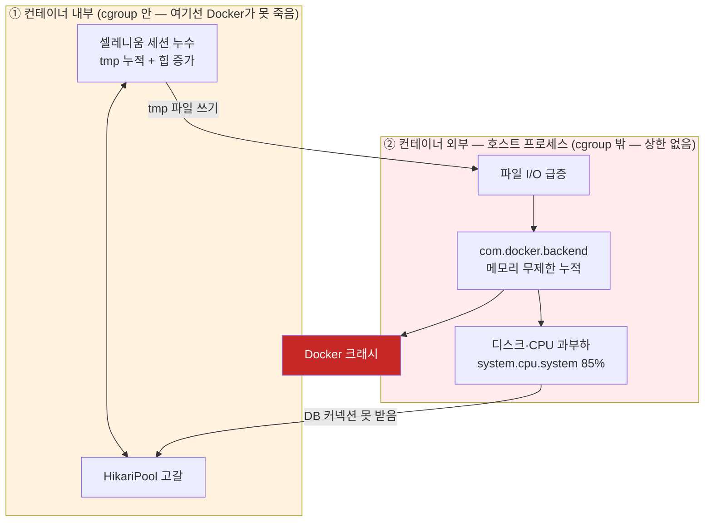

# macOS Docker Desktop 크래시 원인 분석과 재발 방지

---

## Situation (상황)

로컬 macmini (온프렘, Apple Silicon, RAM 32GB)에서 크롤링 배치를 돌리던 Docker Desktop이 크래시하였습니다. oom을 통해 해당 컨테이너만 종료된 것이 아닌 mac os에서 Docker Desktop자체가 크래시되어 작동하지 않는 문제가 발생하였습니다.

| **발생 일자**       | **Load 수치 변화**                                            | **주요 현상 및 분석**                                                             | **조치 및 결과**                       |
| --------------- | --------------------------------------------------------- | -------------------------------------------------------------------------- | --------------------------------- |
| **5/24**        | 8 → 50 (1차 폭등)                                            | Datadog 메모리 지표 확인 결과, 재시작 직후 ~16GB였던 가용 메모리가 매일 0.5~1GB씩 꾸준히 감소하는 누수 패턴 확인 | 5/26 재시작으로 임시 수습 (근본 원인 미조치)      |
| **6/2**         | 14 → 53 (2차 폭등)                                           | 1차 발생 때와 동일한 감소 기울기의 메모리 누수 패턴이 그대로 재현됨                                    | 6/5 재시작으로 임시 수습                   |
| **6/14 ~ 6/16** | 22 → 65 (3차 폭등)<br><br>  <br><br>6/16 낮: 486~555 (임계점 초과) | 앞선 두 번의 재시작으로도 근본 원인이 해소되지 않는다는 것을 확인                                      | 재시작하지 않고 지표를 모니터링하며 근본 원인 추적으로 전환 |

**6/17, 크래시 당일 타임라인**

```
17:38:13.549  HikariPool-1 thread starvation, delta=1m24s179ms385µs331ns
17:41:08.921  HikariPool-2 thread starvation, delta=1m20s207ms252µs954ns
18:01~18:02   batch-app "Unexpected error occurred in scheduled task" 2회
              fetchPressNews 완전 실패
18:10:49.682  HikariPool-2 thread starvation, delta=58s525ms272µs27ns
18:10:52.181  HikariPool-1 thread starvation, delta=47s193ms383µs355ns
18:10         Docker backend kevent 크래시
              runtime: kevent on fd 3 failed with 9
              fatal error: runtime: netpoll failed
```

---

## Task (과제)

컨테이너 메모리가 증가하는 원인을 찾고, 도커 자체가 크래시된 원인을 파악하여 동일한 문제가 반복되지 않게 조치해야 했습니다.

1. 컨테이너 레벨에서의 메모리 누수 원인 파악.
2. 도커 자체가 크래시 된 원인 파악.
3. 지표와 로그를 파악하여 보다 상세한 원인 분석 및 재발 방지.

---

## Action (행동)

Datadog 지표와 애플리케이션 로그를 겹쳐보며 컨테이너 내부와 컨테이너 외부의 원인을 추적하며 원인을 파악했습니다.

### 1) 컨테이너 내부 — 애플리케이션 레벨 원인

| 원인                           | 확인 내용                                                                                                                            |
| ---------------------------- | -------------------------------------------------------------------------------------------------------------------------------- |
| JVM 힙 상한 미설정                 | `-Xmx` 없어서 힙이 OS로 반환되지 않고 선형적으로 증가                                                                                               |
| 셀레니움 세션 누수                   | `SeleniumSessionPool.withDriver()`가 `NonCancellable`로 감싸져 있는데 Selenium 자체의 `pageLoadTimeout`은 미설정 → 세션이 블로킹돼도 힙 기준선이 배치 사이클마다 상승 |
| `/tmp` 프로필 미삭제               | `driver.quit()` 타임아웃 시 Chrome 프로세스는 죽어도 프로필 디렉토리는 안 지워짐 → 컨테이너별 **12,356개 / 14,966개(약 8.8GB)** 개의 빈 크롬 프로필 파일 확인                 |
| `@Transactional`이 크롤링 전체를 감쌈 | 크롤러 클래스가 `@Transactional`이라 메서드 진입 시 DB 커넥션부터 확보하려 함 → HikariPool이 고갈된 상태면 이미 떠있는 크롬 세션이 커넥션을 기다리며 계속 살아있음                       |


### 2) 컨테이너 외부 

```bash
runtime: kevent on fd 3 failed with 9 (Bad File Descriptor)
fatal error: runtime: netpoll failed
```

 컨테이너 내부에서 OOM이 났다면 그 컨테이너만 종료됐어야 했으나 장애 당시 mac os에서 도커 자체(`com.docker.backend`)가 크래시 되었음을 파악했습니다.

 즉 컨테이너 안 누수가 호스트-컨테이너 파일 I/O를 늘려서 vm이 사용하는 메모리를 계속해서 증가시켰고, 호스트인 mac os위의 도커 데스크탑에서 설정한 제한을 넘어 계속해서 증가한 것으로 추정하였습니다. 크래시 직전 macOS 메모리 압축량은 14GB, 여유 메모리는 65MB까지 떨어져 있었습니다.

mac os에서 도커 데스크탑이 설정한 메모리 제한을 넘어 호스트 메모리를 사용하는 [이슈](https://github.com/docker/for-mac/issues/6120)가 있음을 파악하였고, 현재 까지도 관련 이슈가 꾸준하게 보고되고 있다는 사실을 파악했습니다. 

### 3) 정리 — 내부·외부 원인이 어떻게 하나의 크래시로 합쳐졌는가




vm 내부의 컨테이너 메모리 누수만이 문제였다면 docker.backend 까지의 크래시는 일어나지 않았어야 했으나, mac os에서 docker desktop이 가지고 있는 메모리 누수문제와 더해져 도커 자체가 크래시 되어 정상적인 방법으로 복구가 불가능하였습니다.

### 4) 조치

- JVM 힙 상한(`-Xmx`) 설정
	- batch-app 컨테이너의 메모리 상한을 누수 전의 idle 값 정도인 2Gib를 할당하였습니다.
- `@Transactional` 제거 등 코드 수정
	- @Transactional 스코프 내부의 외부 api 통신을 분리하였습니다.
- Docker Desktop → OrbStack 전환
	- mac Os전용의 경량 공유커널을 사용하는 OrbStack으로 변경하여 호스트 계층의 메모리 누수를 방지하였습니다.

---

## Result (결과)

**결론: 장애 당시 load average 486~712였던 서버가 1.97~2.18로 안정화됐고, 디스크 여유 공간은 2배 이상 확보됐으며, 컨테이너 재시작 없이도 시스템이 안정적으로 유지되었습니다

| 지표                 | 6/17 장애 당시       | 8/1 재검증        |
| ------------------ | ---------------- | -------------- |
| Load average       | 486~712          | 1.97~2.18      |
| 디스크 사용률            | 89%              | 44% (108GB 여유) |
| selenium-1/2 연속 가동 | (크래시)            | 정상 동작          |
| `/tmp` 크롬 프로필 잔존   | 12,356 / 14,966개 | 0 / 0          |
