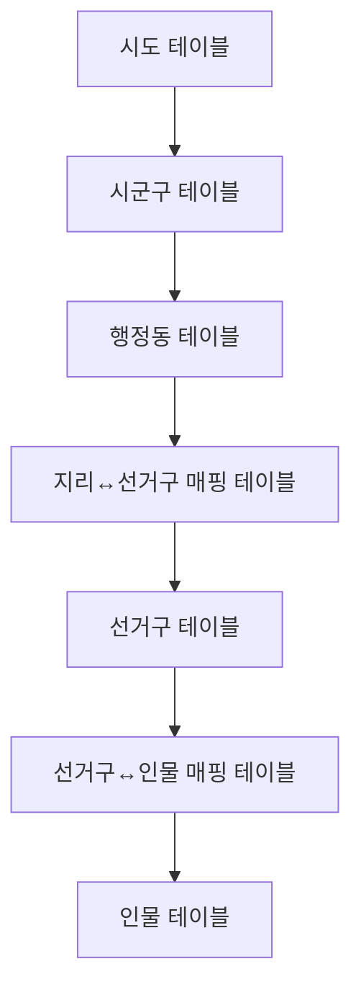
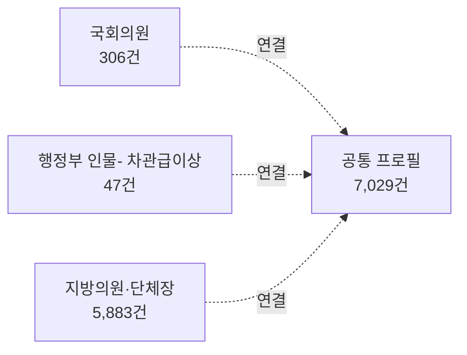
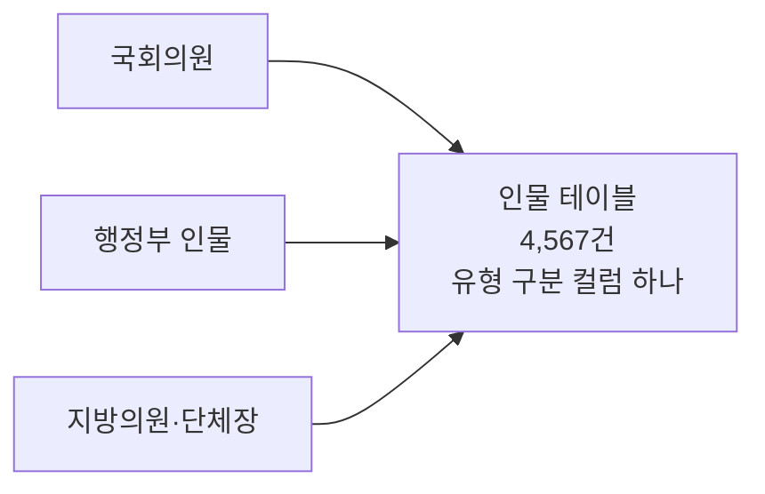
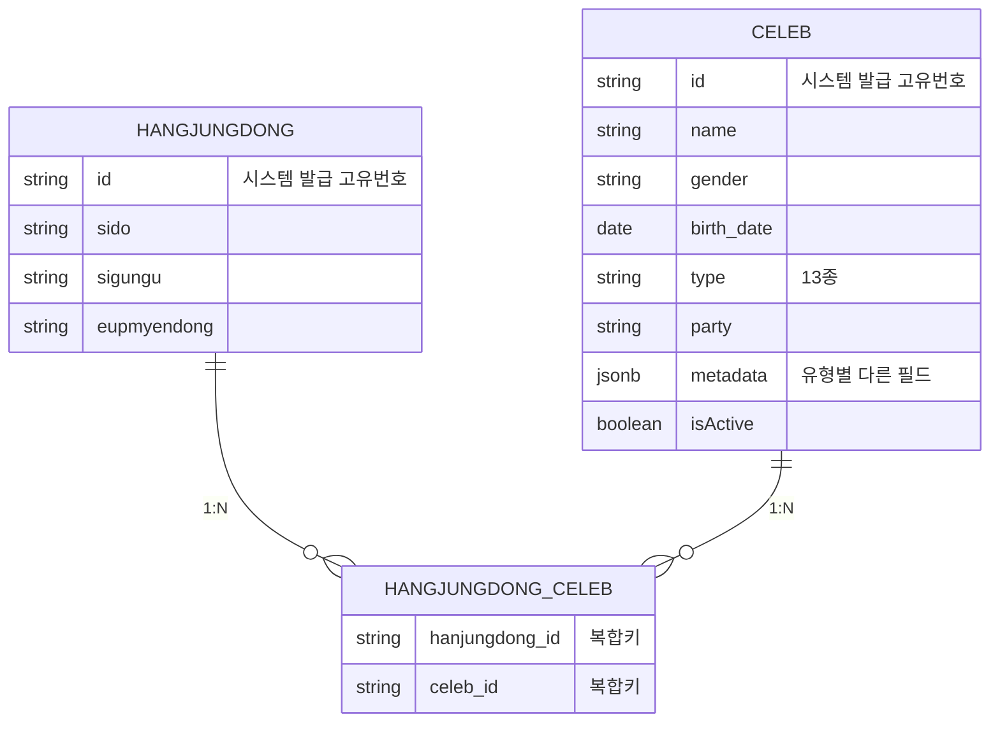

# 지방선거 인물·행정구역 데이터 스키마 재설계

---

## Situation (상황)

"우리 동네 담당 공직자가 누구인지" 보여주는 서비스를 운영하고 있었습니다. 핵심 데이터인 행정구역 정보와 공직자 인물 정보가 여러 테이블에 잘게 쪼개져 있어, 단순한 조회 하나에도 5~6개 테이블을 순서대로 거쳐야 하는 구조였습니다.

**행정구역 정보 (6단계 7개 테이블)**

**인물 정보 (여러 테이블에 분산)**

이 구조의 한계는 다음과 같았습니다.

- 국회의원이 국무총리를 겸임하는 특수한 상황에 대해 중복 프로필로 표현되었습니다.
- 선거구 별 인물 조회시 5단계의 join을 거쳐야 했습니다.

마침 6.3 지방선거 직후 지방자치 선출직 명단을 어차피 전면 갱신해야 하는 시점이었고 이에따라 새로운 스키마를 통해 행정동과 인물 매핑 테이블을 변경하였습니다.

---

## Task (과제)

'인물' 을 중심으로 스키마를 재구성 하였고 구체적으로는 다음의 목표를 세웠습니다.

1. 조회 경로를 단순화하여 성능을 근본적으로 개선할 것
2. 흩어진 인물 데이터를 하나로 통합하되, 살아있는 서비스를 중단하지 않고 전환할 것
3. 스키마 변경 자체를 재현 가능하고 추적 가능한 프로세스로 관리할 것

---

## Action (행동)

### 1) 행정구역 6단계를 2단계로 축소

시도·시군구·읍면동 정보를 한 줄에 담은 단일 행정동 테이블을 설계하고, 여기에 행정동-인물 매핑 테이블 하나만 연결하는 구조로 재설계했습니다. 조회 시 거쳐야 하는 테이블을 6개에서 2개로, 조인 횟수를 5번에서 1번으로 줄였습니다.

행정동 식별자는 지역 코드 대신 시스템이 자체 발급하는 번호로 전환했습니다. 지역 코드는 선거 때마다 재편될 수 있는 불안정한 값이라 식별자로는 부적합하다고 판단했기 때문입니다.

### 2) 인물 5개 테이블을 1개 테이블과 유형 컬럼으로 통합

국회의원·장관·지방의원·후보자 등을 "인물"이라는 본질적으로 같은 데이터로 보고, 테이블 하나와 유형 구분 컬럼으로 통합했습니다. 

#### 2.1) postgres의 jsonb를 통한 속성 관리

도메인 내에서 인물은 다음과 같은 속성을 갖을 수 있습니다.

| 분류        | 명    |
| --------- | ---- |
| 시 도시사     | 16   |
| 시 도 의원    | 922  |
| 교육감       | 16   |
| 국회의원      | 300  |
| 광역 단체 의원  | 3034 |
| 광역 단체 장   | 227  |
| 행정부 장관 차관 | 39   |
| 대통령       | 1    |

 국회의원은 "선거구, 비례대표 여부"가 필요하고, 장관은 "소속 부처"가 필요하고, 대통령은 부가정보가 필요 없습니다. 이런 정보를 전부 개별 컬럼으로 만들었다면 인물의 특정 타입에 해당하지 않는 속성은 모두 null로 채워집니다. 따라서 인물의 type별로 필요한 부가정보를 jsonb형식의 metadata컬럼을 통해 저장하는 방식을 사용하였습니다.

### 3) 스키마 변경 관리 프로세스 개선

SQL을 실행하여 테이블을 변경하는 방식대신, 스키마 변경 이력을 버전 파일로 관리하며 배포 전 체크섬으로 자동 검증하는 방식을 도입했습니다.

#### 3.1) 최종 구조

---

## Result (결과)

| 지표                    | 이전            | 이후            | 개선        |
| --------------------- | ------------- | ------------- | --------- |
| 행정동→인물 조회 시 거치는 테이블 수 | 6개(5번 조인)     | 2개(1번 조인)     | 조인 80% 감소 |
| 조회 속도 (행정동 단위 선출직)    | 37~40ms       | 13~22ms       | 2~3배      |
| 조회 속도 (시/도 단위 선출직 포함) | 2.1~2.7ms     | 0.14ms        | 15~16배    |
| 인물 데이터가 흩어진 테이블 수     | 5개            | 1개            |           |
| 스키마 변경 관리 방식          | 수동 실행, 재현 불가능 | 버전 관리 + 자동 검증 | 배포 안전성 확보 |
