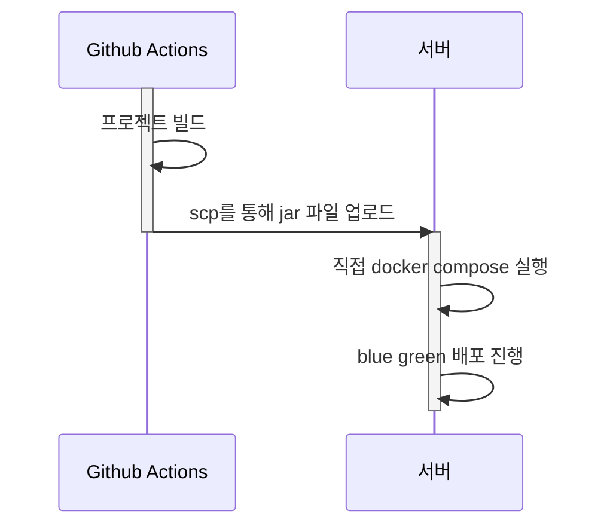
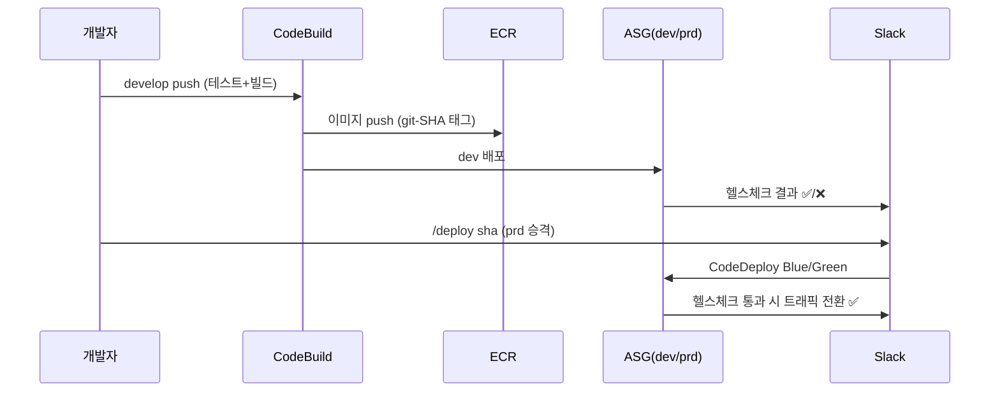
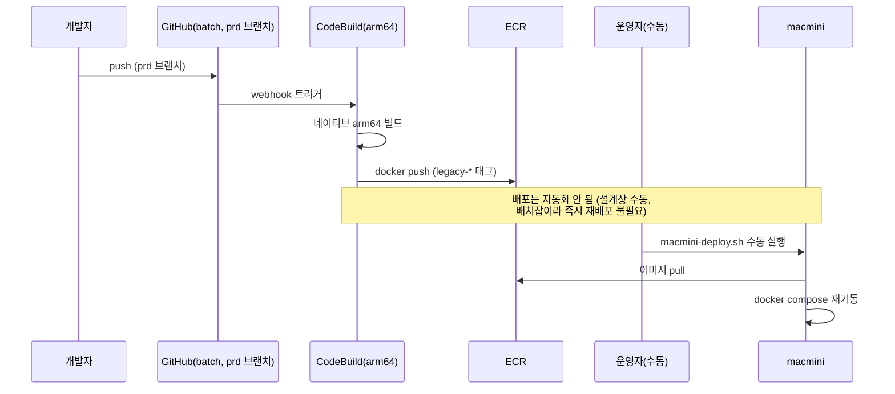

# Dev 환경 CI/CD 개선

---

## Situation (상황)



 Dev 서버(vCPU 2개, 메모리 1GB, Swap 2GB)를 모바일 개발 환경을 운영하고 있었습니다. Dev 서버는 Blue/Green 배포시마다 CPU 사용률 90% 이상, Swap 1.5GiB, 메모리 900MiB를 사용하여 스래싱이 발생하였고 다음과 같은 문제가 발생하고 있었습니다.

- 배포 1회당 **빌드 10분 + Blue/Green 배포 10분 + 안정화 시간**을 합쳐 **20분 이상** 모바일 개발 환경 사용이 불가능했습니다.
- 모바일 앱은 Dev 서버에 직접 의존했기 때문에, 배포 중에는 앱 구동 자체가 막혔습니다.
- Blue/Green 배포시 두 번째 컨테이너가 JVM이 메모리를 요청하는 순간 **Swap Thrashing**이 발생해 CPU 사용률이 100%까지 치솟았고, 심한 경우 Linux OOM Killer가 컨테이너를 강제 종료시켜 "무중단을 위한 배포가 오히려 서비스를 중단시키는" 상황이 반복됐습니다.
- 또한 dev/prd 브랜치가 분리되어 있고 배포가 Git push 트리거에만 의존하다 보니, 인원이 늘고 브랜치가 분기될수록 롤백이나 현재 배포 상태를 파악하기가 점점 어려워졌습니다.

---

## Task (과제)

이러한 문제를 해결하기 위해 다음 세 가지를 목표로 설정했습니다.

1. 저사양 Dev 서버에서도 리소스 경합 없이 안정적으로 배포할 수 있는 아키텍처 설계
2. 현재 dev 서버 인스턴스 비용 유지
3. 배포 리드타임을 단축하여 모바일 개발 환경의 다운타임을 최소화
4. 배포 소스와 상태를 단일 창구(Slack)에서 추적·관리할 수 있는 구조 구축

---

## Action (행동)

### 1) 인프라 구조 전환 — 컨테이너 직접 배포 → ASG 기반 Blue/Green

단일 서버 위에서 컨테이너 2개를 동시에 띄우는 방식 자체가 저사양 환경의 근본적 한계라고 판단하여, 배포 방식을 **CodeBuild → ECR → ASG(Instance Refresh / CodeDeploy Blue/Green)** 구조로 전환했습니다.



- **dev**: `develop` push/PR 시 CodeBuild가 테스트·빌드를 수행하고, push 이벤트에 한해 ECR에 이미지를 push한 뒤 SSM 파라미터를 갱신하고 ASG Instance Refresh를 트리거합니다. 새 인스턴스가 SSM에서 태그를 읽어 `deploy.sh`를 실행하고, 헬스체크를 통과하면 `released-dev-<sha>` 태깅과 Slack 알림이 이루어집니다.
- **prd**: Slack `/deploy` 명령을 Lambda가 받아 `released-dev-<sha>` 존재 여부와 동시 배포 여부를 확인한 뒤 CodeDeploy Blue/Green(임시 ASG 복제)으로 배포합니다. 헬스체크 실패 시에는 트래픽 전환 없이 종료되어 서비스 영향을 차단합니다.

새 인스턴스에서 배포를 진행하는 방식이므로 기존 서버의 리소스 경합·Swap Thrashing 문제가 구조적으로 사라졌습니다.

#### 1.1) 맥미니 배치 서버



배치 어플리케이션이 돌아가는 맥미니의 경우도 동일하게 ECR 을 통해 아티팩트를 관리하고, 수동으로 배포하는 방식을 적용하였습니다.


### 2) 브랜치·배포 관리 단일화 — Slack 봇 도입

dev/prd 브랜치를 분리 운영하던 방식을 **단일 브랜치(dev)** 로 통합하고, prd 배포는 dev 브랜치의 특정 커밋 해시로 빌드된 이미지를 기준으로 승격하는 구조로 변경했습니다. 이 전체 과정을 Slack 봇 명령어로 관리할 수 있도록 구성했습니다.

```
/dev on, off                          — dev 인스턴스 기동/종료 (00:00 KST 자동 종료)
/artifacts [dev|prd|all]              — 헬스체크 통과 빌드 조회
/state [dev|prd]                      — 배포 상태 조회
/deploy sha <sha> | latest | cancel   — prd 배포/취소
/rollback prd|dev sha <sha> | latest  — 롤백
```


---

## Result (결과)

### 배포 리드타임 (push → 서빙 가능 시점)

|구간|레거시(sever)|신규(baro-backend)|개선 배율|
|---|---|---|---|
|테스트|평균 7분 45초 (전체 81파일)|평균 35.5초 (모듈+태그 스코프)|**약 13.1배**|
|JAR 패키징|`clean bootJar` 평균 53초|`bootJar`(no clean) 평균 9초|**약 5.9배**|
|아티팩트 전송|SCP 평균 30초|ECR push 평균 6초|**약 5배**|
|인스턴스 반영(dev)|SSH 동기 실행 평균 6분 36초|앱 헬스체크 1분 44초 / ALB 준비 3분 44초|**약 1.8배 ~ 3.8배**|
|**전체 합계 (dev)**|**16분 5초**|**약 5분 14초 ~ 7분 14초**|**약 2.2배 ~ 3.1배**|

### 성과

- ASG 기반 배포 전환으로 **Swap Thrashing과 OOM Killer로 인한 서비스 강제 중단 리스크를 구조적으로 제거**했습니다.
- 모바일 개발 환경의 배포 대기 시간을 기존 20분 이상에서 **최대 7분대**로 단축하여 개발 생산성 저해 요인을 크게 줄였습니다.
- 배포·롤백·상태 조회를 **Slack 명령어 하나로 통합**하여, 인원 증가와 브랜치 분기로 인해 발생하던 배포 추적 어려움을 해소했습니다.
