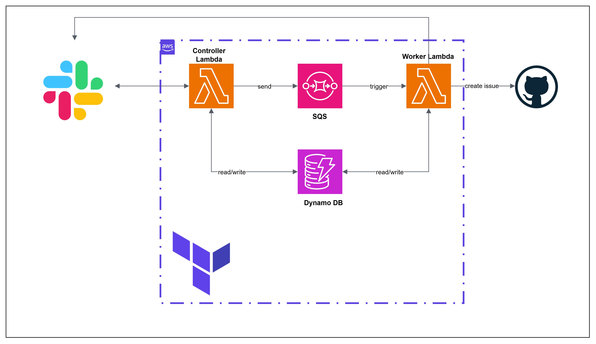

## 학업
> 숭실대학교 글로벌미디어학부 : 2019 ~ 2026.2 졸업

 

## 자격증
> **AWS Solutions Architect Associate** _2025.12 ~ 2028.12_

{: width="100" height="100"}
 
 
 

## 소개

불확실성이 큰 LLM 기술과 비동기 처리 흐름을 실제 서비스 안에서 안정적으로 운영 가능한 구조로 바꾸는 일에 집중해왔습니다.

 LLM과 같은 예측하기 어려운 작업을 어떻게 시스템 경계 안으로 가져와 통제할 것인가에 관심이 있습니다. 꾸준하게 LLM을 시스템 내에 통합하는 설계에 도전하였습니다.

 생성형 AI 서비스에서는 파이프라인과 트랜잭션 경계를 조정해 응답 속도와 품질을 함께 개선했고, 의안 조회 플랫폼에서는 예측 불가능한 생성 작업을 배치 시스템 안에 안전하게 편입시켰습니다. 최근에는 Slack 기반 agentic 시스템을 직접 설계하며, AI 호출을 애플리케이션 로직이 아닌 인프라 수준에서 제어하는 구조까지 확장했습니다.

 
 

# 프로젝트

 

---

 

## [LittleWriter](https://github.com/gzcxadfzc/BE)

> ### 생성형 AI를 사용한 동화 제작 서비스
> - 기간: 2024.1 ~ 2024.6
> - 인원: 3명
> - 현재 상태: 배포 중단
> - 역할: API 서버 개발

## 프로젝트 소개

{: width="1000"}

### 사용 기술
- API 서버: `Java`, `Spring Boot`
- 데이터베이스: `Mysql`, `JPA/Hibernate`, `Redis`

 

---

 

## 주요 개발 내용

LittleWriter는 사용자의 입력을 바탕으로 동화와 삽화를 함께 생성하는 서비스입니다.

핵심 문제는 당시 LLM과 이미지 생성 모델의 성능이 아직 불안정했고, 호출 비용도 높았다는 점이었습니다. 단순히 모델을 연결하는 것만으로는 서비스 품질을 보장할 수 없었기 때문에, 호출 구조와 상태 관리 방식을 함께 설계해야 했습니다.

이 프로젝트에서는 사용자 흐름을 상태 기반으로 재정의하고, 생성형 AI 호출을 파이프라인으로 조직하는 작업에 집중했습니다.

**[캐시 기반 사용자 진행상태 관리 기능](/2024/08/21/littleWriter01#2-생성형-ai-프로젝트에서-사용하기)**
- 동화 생성 과정을 상태 기반 도메인으로 재설계
- Redis를 활용해 사용자별 진행 상태와 문맥을 캐싱 저장

 

**[동화 생성을 위한 생성형 AI 프롬프팅 파이프라인 구현](/2024/08/21/littleWriter01#1-파이프라인-구성)**
- GPT와 이미지 생성 모델을 조합한 파이프라인 구조 설계
- 이전 문맥을 재사용해 연속성 있는 스토리 생성
- 생성 시간 `1분 -> 30초`, 약 `50%` 단축

 

**[트랜잭션 경계 설정을 통한 응답 속도 개선](/2025/11/19/littleWriter02#2-트랜잭션)**
- `@Transactional` 내부 IO 작업 분리
- 저장 요청 응답 속도 `600ms -> 150ms`, 약 `75%` 개선

 

**[JPA 연관관계 제거를 통한 조회 성능 개선](/2025/11/19/littleWriter02#3-책-조회-성능-개선)**
- JPQL Projection 기반 명시적 조회로 재설계
- N+1 문제 제거 및 단일 쿼리 중심 구조로 변경

 

**[Redis를 이용한 사용자 동시 요청 제어](/2025/11/21/littleWriterSetnx)**
- Redis `SETNX` 기반 동시성 제어 구조 설계
- LLM 중복 호출 방지 및 도메인 정합성 확보

 
 

## Barlow _[API서버](https://github.com/ogongchill/barlow)_, _[앱](https://github.com/ogongchill/barlow-front)_

> ### 국회 법안 조회 서비스
> - 기간: 2025.1 ~
> - 인원: 2명
> - [Google Play](https://play.google.com/store/apps/details?id=com.barlow.front) 배포중
> - 역할: API 서버 개발, 앱 개발 및 스토어 관리

## 프로젝트 소개

### 사용 기술
- API 서버: `Java`, `Spring Boot`
- 앱: `Dart`, `Flutter`
- 데이터베이스: `Mysql`, `JPA/Hibernate`
- 배포: `AWS EC2`

 

---

 

## 주요 개발 내용

국회 의안 조회 서비스 바로에서는 예측 불가능한 작업을 기존 서비스와 배치 시스템에 안정적으로 통합하는 문제가 핵심이었습니다. 특히 생성형 AI 기반 요약 기능은 응답 시간 편차와 실패 가능성이 크기 때문에, 일반적인 동기 처리 방식으로는 배치 전체를 흔들 수 있었습니다.

이 프로젝트에서는 생성 작업을 배치 시스템에 안전하게 편입시키는 구조를 설계했습니다.

**API Server - Spring Boot**

**[공통 인증 모듈 구현](/2024/09/16/barlow#1-인증모듈)**
- Credential 기반 `Authenticator` 인터페이스로 전략 패턴 설계
- RSA 기반 암호화로 서명과 인증 책임 분리

 

**[생성형 AI 요약 Batch 작업](/2024/09/16/barlow#2-ai를-통한-법안-요약-기능-추가하기)**
- `AsyncItemProcessor`, `AsyncItemWriter` 기반 비동기 요약 처리
- Polling 정책 및 스레드 최적화
- 처리 시간 `1분+ -> 24초`, 약 `60%` 단축

---

 

## Barlow Automation[저장소](https://github.com/ogongchill/barlow-automation)

> ### Slack 기반 Agentic 이슈 생성 시스템
> - 기간: 2026.3 ~
> - 현재 상태: 개인 프로젝트
> - 역할: 설계 및 구현 전담

## 프로젝트 소개

### 사용 기술
- 백엔드: `Python 3.12`, `AWS Lambda`, `SQS`, `DynamoDB`
- 연동: `Slack Bolt`, `OpenAI Agents SDK`, `GitHub MCP`
- 인프라: `Terraform`, `GitHub Actions`

 

---

 

## 주요 개발 내용

Slack 슬래시 커맨드로 기능 요청을 입력하면, AI가 GitHub 코드베이스와 기존 이슈를 분석해 이슈 초안을 만들고, 사용자 확인 후 실제 GitHub 이슈까지 생성하는 서버리스 개발 도구입니다.

기존 프로젝트의 방식은 AI 호출이 애플리케이션 내부 실행 흐름에 직접 묶여 있어 병목이 발생했고, 재시도, 상태 관리, 사용자 확인 로직도 함께 복잡해졌습니다. 이를 이벤트 기반 구조를 통해 `human-in-the-loop` 워크플로우와 Slack의 3초 응답 제한을 동시에 만족시키는 구조를 만드는 데 집중했습니다. 

**[Human-in-the-Loop 기반 Agentic 워크플로우 설계](/2026/03/26/agent#1-human-in-the-loop을-어떻게-시스템으로-구현했는가)**
- `Step Graph` 기반 상태 머신 설계
- `WorkflowInstance`, `RESUME_MAP`으로 중단 지점과 재개 흐름 명시화
- `pending-action`, `active-session` 이중 dedup 구조로 중복 실행 제어

 

**[Slack 3초 제한 문제](/2026/03/26/agent#2-slack의-3초-제한을-어떻게-해결했는가)**
- Worker Lambda는 SQS 기반 비동기 분석과 이슈 생성 담당
- `trigger_id` 제약 때문에 Ack를 단순 producer가 아닌 Event Controller로 설계
- coldstart 최적화 전략 및 keep-warm 전략 수립을 통한 사용자 응답속도개선 `1,708ms` > `466ms`

