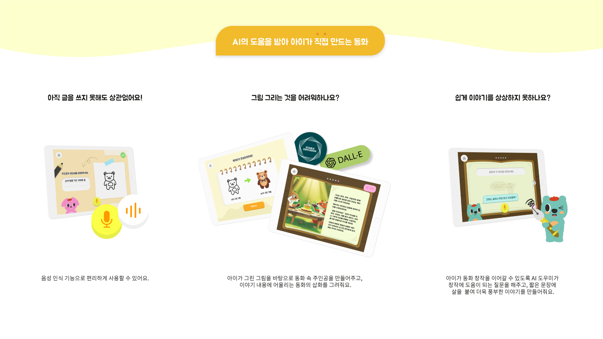
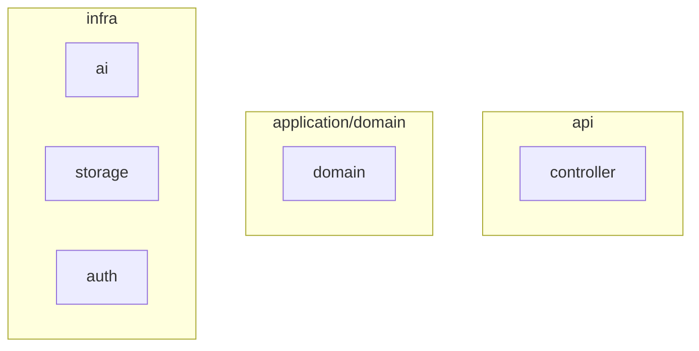
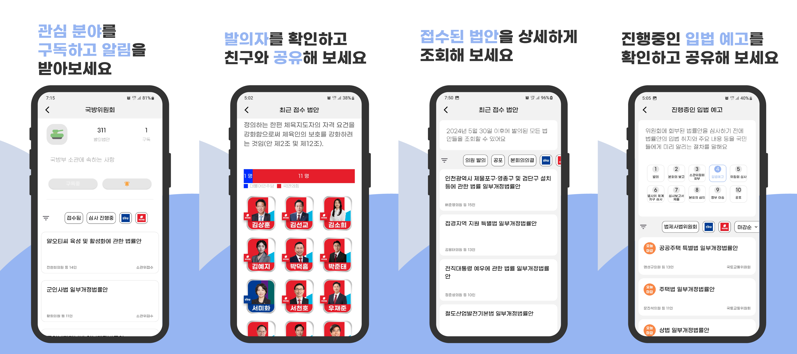
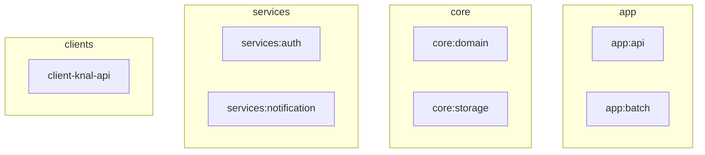

## 학업
> 숭실대학교 글로벌미디어학부 : 2019 ~ 졸업 예정

 
 
 

## 소개

>### 새로운 기술을 배우는 것을 좋아하는 개발자 입니다.
>### Java/Spring 기반의 서버 구축과 Dart/Flutter 를 사용하여 앱 개발 경험이 있습니다.
>### 생성형 AI를 통한 서비스를 제공하는 분야 관심이 많으며 코드 생산성을 높이는 방식에 관심이 있습니다.

 
 
 

# 프로젝트

 

---

 

## [LittleWriter](https://github.com/gzcxadfzc/BE)

> ### 생성형 AI를 사용한 동화 제작 서비스
> - 기간: 2024.1 ~ 2024.6 
> - 인원: 3명
> - 현재 상태: 배포 중단
> - 역할: api 서버 개발

 

## 프로젝트 소개

### 프로젝트 구조

### 사용 기술
- API서버: `Java`, `Spring Boot`
- 데이터베이스: `Mysql`, `JPA/hibernate`, `Redis`

 

---

 

## 기능 개발
**[캐시 기반 사용자 진행상태 관리 기능](/2024/08/21/littleWriter01#2-생성형-ai-프로젝트에서-사용하기)**
- 사용자의 "동화 만들기" 과정의 상태 기반 도메인 설계
- Redis를 도입하여 사용자별 진행 상태를 캐싱 저장

 

**[동화 생성을 위한 생성형 AI 프롬프팅 파이프라인 구현](/2024/08/21/littleWriter01#1-파이프라인-구성)**
- 사용자 입력에 따른 일관된 스토리 구조 + 삽화 + 질문 생성을 동시 생성
- `@Async` 기반 비동기 처리
- Redis에 저장된 이전 맥락(진행 상황)을 함께 전달하여 연속성 있는 스토리 생성
- 파이프라인 최적화를 통해 생성시간을 1+ 분에서 30초 정도로 단축

 

**[트랜잭션 경계 설정을 통한 응답 속도 개선](/2025/11/19/littleWriter02#2-트랜잭션)**
- `@Transactional` 내부 IO 작업 분리
- 응답속도 평균 600ms -> 150ms로 개선 

 

**[JPA 연관관계 제거를 통한 조회 성능 개선](/2025/11/19/littleWriter02#3-책-조회-성능-개선)**
- ORM 수준의 연관관계 제약에서 JPQL 기반 Projection을 통한 명시적 조회로 재설계
- Lazy 로딩으로 발생하던 N+1 문제 제거 및 단일 쿼리로 일괄 조회를 통한 쿼리 최적화

 

---

 
 

## Barlow _[API서버](https://github.com/ogongchill/barlow)_, _[앱](https://github.com/ogongchill/barlow-front)_
> ### 국회 법안 조회 서비스
> - 기간: 2025.1 ~  
> - 인원: 2명
> - [Google Play](https://play.google.com/store/apps/details?id=com.barlow.front) 배포중
> - 역할: api서버 개발, 앱 개발 및 스토어 관리

## 프로젝트 소개

바로 앱 서비스는 관심 분야에 맞춰 법안 정보를 쉽게 받아볼 수 있는 서비스 입니다.

 

### 프로젝트 구조

 

### 사용 기술
- API서버: `Java/Spring Boot`
- 앱: `Dart/Flutter`
- 데이터베이스: `Mysql`, `JPA/hibernate`
- 배포: `AWS EC2`

 

---

 

## 기능 개발

**API Server - Spring Boot**

**[공통 인증 모듈 구현](/2024/09/16/barlow#1-인증모듈)**
- Credential기반 Authenticator 인터페이스로 전략 패턴 설계 
- RSA기반 암호화로 서명/인증 분리 구현

**[생성형 AI요약 Batch 작업](/2024/09/16/barlow#2-ai를-통한-법안-요약-기능-추가하기)**
- AsyncItemProcessor, AsyncItemWriter기반 요약 요청 처리
- Polling 정책과 스레드 설정을 통하여 기존 1+ 분에서 24초 정도로 최적화
- 기존 `TodayBillJob`에 `Step`으로 요약 단계 추가

 

**Mobile Application - Dart/Flutter**

**[Github actions를 통한 Play Store 트랙 자동 배포 환경 구성](https://ogongchill.github.io/posts/PlayStore%EB%B0%B0%ED%8F%AC/)**
- github actions를 사용한 빌드 및 배포 완전 자동화
- 빌드 버전 별 google play 트랙 배포 자동화

**[feature-first 구조에 따른 Clean Architecture구조](https://ogongchill.github.io/posts/%EB%B0%94%EB%A1%9C%EC%95%B1%EC%95%84%ED%82%A4%ED%85%8D%EC%B3%90/)**
- 로컬 환경에서 getIt에 의한 의존성 코드 생성 최적화를 통한 빌드 속도 개선
- mvvm구조를 통한 관심사 분리
 

 
