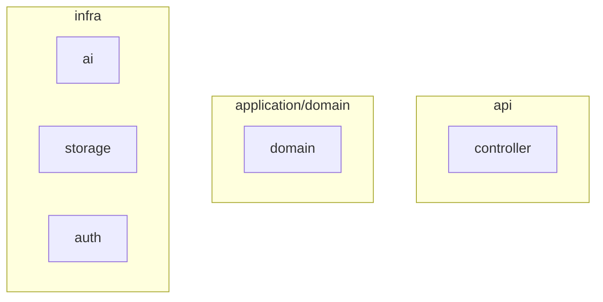
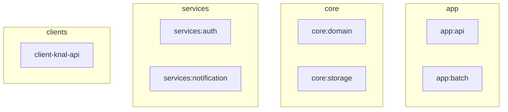

## 학업
> 숭실대학교 글로벌미디어학부 : 2019 ~ 2026.2 졸업

 

## 자격증
> **AWS Solutions Architect Associate** _2025.12 ~ 2028.12_

{: width="100" height="100"}
 
 
 

## 소개

Java/Spring 기반 서버 개발 경험과 실제 서비스 성능 개선 이력을 보유한 신입 개발자입니다

생성형 AI 파이프라인 최적화, 캐시 기반 상태 관리, 비동기 배치 처리 등을 통해 응답 속도 75% 개선, 처리 시간 60% 단축 등의 성과를 달성했습니다.

서버 아키텍처 구축과 비즈니스 로직 설계를 통해 서비스를 개발한 경험이 있으며, Flutter를 사용한 클라이언트 개발도 경험하여, 서버–클라이언트 간 흐름을 전체적으로 이해하며 문제를 바라보는 능력을 갖추고 있습니다.

다양한 기술과 도메인을 스스로 탐색하고 확장하는 것을 즐기며, “육각형 개발자”를 목표로 꾸준히 학습하고 개발하고 있습니다.

협업에서는 팀원들과 문서 공유 하는 것을 중요시 생각하며 이를 위하여 다이어그램이나 시각 자료 등을 적극적으로 사용합니다.

 
 
 

# 프로젝트

 

---

 

## [LittleWriter](https://github.com/gzcxadfzc/BE)

> ### 생성형 AI를 사용한 동화 제작 서비스
> - 기간: 2024.1 ~ 2024.6 
> - 인원: 3명
> - 현재 상태: 배포 중단
> - 역할: api 서버 개발

 

## 프로젝트 소개

{: width="1000"}

### 프로젝트 구조

### 사용 기술
- API서버: `Java`, `Spring Boot`
- 데이터베이스: `Mysql`, `JPA/hibernate`, `Redis`

 

---

 

## 기능 개발
**[캐시 기반 사용자 진행상태 관리 기능](/2024/08/21/littleWriter01#2-생성형-ai-프로젝트에서-사용하기)**
- 사용자의 "동화 만들기" 과정의 상태 기반 도메인 설계
- Redis를 도입하여 사용자별 진행 상태를 캐싱 저장

 

**[동화 생성을 위한 생성형 AI 프롬프팅 파이프라인 구현](/2024/08/21/littleWriter01#1-파이프라인-구성)**
- 사용자 입력에 따른 일관된 스토리 구조 + 삽화 + 질문 생성을 동시 생성
- Redis에 저장된 이전 맥락을 활용하여 연속성 있는 스토리 생성
- 파이프라인 최적화를 통해 생성 시간 1분 → 30초로 50% 단축

 

**[트랜잭션 경계 설정을 통한 응답 속도 개선](/2025/11/19/littleWriter02#2-트랜잭션)**
- `@Transactional` 내부 IO 작업 분리
- 동화 저장 요청 응답 속도 600ms → 150ms로 75% 개선

 

**[JPA 연관관계 제거를 통한 조회 성능 개선](/2025/11/19/littleWriter02#3-책-조회-성능-개선)**
- ORM 수준의 연관관계 제약에서 JPQL 기반 Projection을 통한 명시적 조회로 재설계
- N+ 문제 제거 및 단일 쿼리 일괄 조회로 쿼리 효율 50% 이상 향상

 

**[Redis를 이용한 사용자 동시 요청 제어](/2025/11/21/littleWriterSetnx)**
- '진행중인 동화 책' 단위의 Redis 엔티티를 SETNX 기반으로 동시성 제어
- LLM 중복 호출 방지 및 도메인 엔티티의 정합성 보장

 

---

 
 

## Barlow _[API서버](https://github.com/ogongchill/barlow)_, _[앱](https://github.com/ogongchill/barlow-front)_
> ### 국회 법안 조회 서비스
> - 기간: 2025.1 ~  
> - 인원: 2명
> - [Google Play](https://play.google.com/store/apps/details?id=com.barlow.front) 배포중
> - 역할: api서버 개발, 앱 개발 및 스토어 관리

## 프로젝트 소개

바로 앱 서비스는 관심 분야에 맞춰 법안 정보를 쉽게 받아볼 수 있는 서비스 입니다.

 

### 프로젝트 구조

 

### 사용 기술
- API서버: `Java/Spring Boot`
- 앱: `Dart/Flutter`
- 데이터베이스: `Mysql`, `JPA/hibernate`
- 배포: `AWS EC2`

 

---

 

## 기능 개발

**API Server - Spring Boot**

**[공통 인증 모듈 구현](/2024/09/16/barlow#1-인증모듈)**
- Credential기반 Authenticator 인터페이스로 전략 패턴 설계 
- RSA기반 암호화로 서명/인증 분리 구현

**[생성형 AI요약 Batch 작업](/2024/09/16/barlow#2-ai를-통한-법안-요약-기능-추가하기)**
- AsyncItemProcessor, AsyncItemWriter기반 요약 요청 처리
- Polling 정책 및 스레드 최적화로 처리 시간 1분 → 24초로 60% 단축

 

**Mobile Application - Dart/Flutter**

**[Github actions를 통한 Play Store 트랙 자동 배포 환경 구성](https://ogongchill.github.io/posts/PlayStore%EB%B0%B0%ED%8F%AC/)**
- 빌드 및 배포 완전 자동화로 배포 리드타임 단축
- 빌드 버전별 Google Play 트랙 자동 배포 구현

**[feature-first 구조에 따른 Clean Architecture구조](https://ogongchill.github.io/posts/%EB%B0%94%EB%A1%9C%EC%95%B1%EC%95%84%ED%82%A4%ED%85%8D%EC%B3%90/)**
- Feature-first 구조의 Clean Architecture 적용
- 모듈 분리에 따른 getIt 의존성 코드 생성 최적화를 통한 로컬 빌드 속도 개선

 

